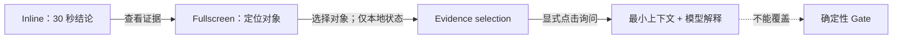
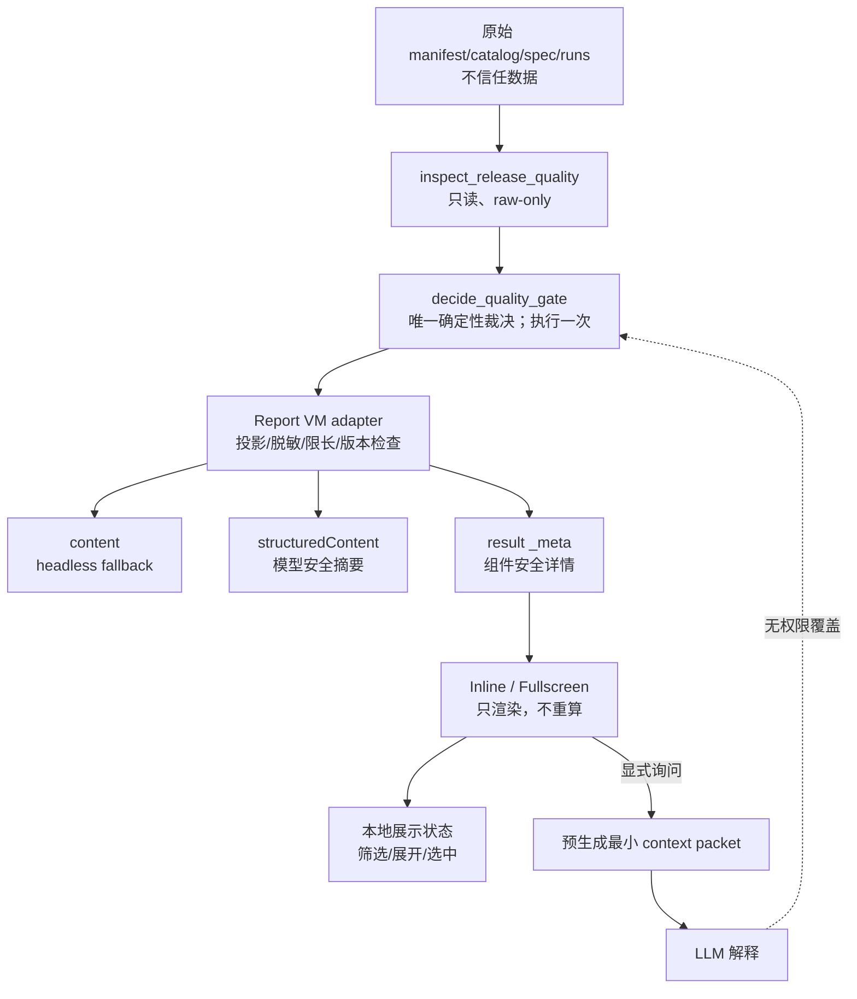

# Quality Gatekeeper 插件内嵌 UI 探索

状态：技术尖峰完成，建议 **Conditional Go**

日期：2026-08-11

范围：只读、低成本、可对话的 Quality Evidence Inspector；不是通用质量 Dashboard

## 1. 探索结论与明确推荐

推荐新增一个且仅一个 UI 入口工具：

```text
inspect_release_quality(manifest, catalog, agent_spec?, agent_runs?)
  -> QualityReportViewModel
```

调用方只能传原始输入。该工具内部调用现有 `qualityctl.gate.decide_quality_gate`
一次，再通过唯一的 Report View Model adapter 生成模型摘要、组件数据和最小对话上下文。
现有五个 MCP 工具不绑定 UI、不改变接口，继续独立支持 CLI 和无 UI MCP 客户端。

结论不是直接 Go，原因不是 Python SDK 或协议缺口，而是目标宿主尚未完成真实验收：

- ChatGPT 官方支持 MCP Apps 的 iframe、`ui/*` bridge、tool-result `_meta` 和
  fullscreen；本插件尚未通过公开 HTTPS/Streamable HTTP 接入 ChatGPT 实测。
- OpenAI 的插件目录同时面向 ChatGPT 与 Codex，但官方也明确不同 surface
  暴露的能力可以不同。当前没有找到 Codex Desktop 对 MCP Apps
  inline/fullscreen 的同等明确承诺，因此不能把“Codex 能加载插件工具”推断为
  “Codex 一定能渲染此 UI”。
- 独立 harness 已验证交互、窄屏和四态，但它不是宿主 bridge 验证。

因此建议：

1. 保留本次隔离尖峰；不立即接入生产 `.mcp.json`。
2. 用 2–3 人日完成 Codex Desktop 与 ChatGPT 至少一个目标宿主的真实验收。
3. 只有 inline 稳定、fullscreen 或可接受降级成立、资源失败不影响工具结果、
   且用户测试证明相对静态 HTML 明显缩短证据定位和提问时间，才进入正式实现。
4. 任一停止条件命中时，对相应宿主 No-Go，继续使用单文件 HTML + headless MCP。

官方依据：ChatGPT UI 是可选增强，客户端不支持 UI 时工具仍应工作；UI 在
iframe 中通过 MCP Apps JSON-RPC over `postMessage` 通信；tool metadata 用
`ui.resourceUri` 绑定 resource；ChatGPT 兼容别名是 `openai/outputTemplate`。
参见 [Build a custom UI](https://developers.openai.com/plugins/build/chatgpt-ui)、
[ChatGPT UI reference](https://developers.openai.com/plugins/reference) 和
[MCP server in plugins](https://developers.openai.com/plugins/concepts/mcp-server)。

## 2. 用户任务与产品形态

### 2.1 核心用户任务

| 用户任务 | 成功标准 | 最合适的形态 |
|---|---|---|
| 30 秒内识别最终结论 | 能读出 Gate、是否允许发布、三个域、首要阻塞 | Inline Gate Card |
| 判断为什么阻塞 | 能从阻塞域进入最小证据，不翻找原始 JSON | Fullscreen + 证据选择 |
| 判断风险是否被覆盖 | 八类风险每类有显式处置，缺口可见 | Fullscreen 风险矩阵 |
| 判断为什么选择某测试 | 每个入选测试显示确定性选择理由 | Fullscreen 测试表 |
| 判断 Agent 失败属于哪一域 | runner、技术、业务断言、语义复核分开 | Fullscreen Agent 表 |
| 组织下一步最小解阻动作 | 只把选中对象的必要事实交给模型 | Conversational Inspector |
| 保存审计引用 | 可选中/复制稳定 digest + source pointer，可打印 | Fullscreen |

### 2.2 三种形态是一条渐进路径

Inline 负责结论，Fullscreen 负责证据定位，对话负责解释。三者读取同一份
View Model，不能分别实现 Gate、风险、选择或统计规则。



## 3. Inline Card、Fullscreen 与对话边界

### 3.1 Inline Card

只显示：

- 最终 `gate` 与 `release_allowed`；
- risk、regression、agent-evaluation 三个必需域；
- 前三个阻塞项；
- policy / report schema / core version；
- evaluation fingerprint 与 decision digest；
- “查看证据”“询问 Codex”两个操作。

Inline 不显示八维矩阵、完整测试列表、逐样本统计、趋势、ROI 或配置入口。
它的唯一决策是“是否需要停止发布或进入证据查看”。

### 3.2 Fullscreen Evidence Inspector

单页、浅层，只有三个 MVP 区块：

1. 发布总览：重复权威结论和版本完整性状态；
2. 风险与回归：八维矩阵、覆盖缺口、入选测试和原因；
3. Agent 评测：失败域、planned/observed/evaluated、pass rate、Wilson 95%、
   样本不足、混跑和高风险单次失败提示。

Fullscreen 可以筛选、展开、选择证据、复制引用和打印。它不引入侧边后台导航、
跨发布钻取、任意查询、实时刷新、批量操作或个性化 Dashboard。

### 3.3 Conversational Inspector

选择只是 UI 状态，不自动改模型上下文。只有用户明确点击“询问”时，组件才发送
server 预生成的对象级 context packet，再发起问题。建议三个问题模板：

- 为什么此对象阻塞或影响 Gate？
- 为什么选择此测试？
- 下一步最小解阻动作是什么？

模型可解释、排序调查步骤和引用事实，不能生成豁免、审批、发布动作，也不能把
FAIL / BLOCKED / REVIEW_REQUIRED 改写为 PASS。

## 4. 两种候选技术设计及取舍

### 4.1 候选 A：直接给 `decide_release_gate` 绑定 UI（不推荐）

```text
raw inputs -> decide_release_gate -> nested domain result -> browser derives display
```

问题：

- 原工具是稳定的 headless 决策入口；绑定后每次原有调用都可能挂载 iframe。
- 现有返回是领域内部嵌套结果，没有稳定的展示版本信封、decision digest、
  完整性状态或经过限长/脱敏的行模型。
- Agent assertion detail 含 actual/expected；把完整 Gate 结果当 UI 合同会扩大泄露面。
- 浏览器若从嵌套结果派生 Gate 或统计，会复制领域规则并产生漂移。
- UI 生命周期、传输 metadata 与领域公共契约被绑死，独立演进困难。

官方一般建议把 data tool 与 render tool 分开，并只给最终 render tool 绑定 UI，
以避免中间工具重复挂载组件。[官方 UI 架构说明](https://developers.openai.com/plugins/build/chatgpt-ui)

### 4.2 候选 B：raw-only Inspector + 服务端 adapter（推荐）

```text
raw inputs
  -> inspect_release_quality
      -> decide_quality_gate exactly once
      -> Report View Model adapter
          -> content fallback
          -> structuredContent model-safe summary
          -> result _meta component-safe detail
  -> versioned UI resource
```

优势：

- 不允许调用方提交 Gate、`release_allowed` 或 domain status，不能伪造 PASS。
- 确定性工具仍是唯一权威；adapter 只做投影、联接、脱敏、限长和版本化。
- UI resource 只绑定到 Inspector，原五工具和 CLI 不受 UI 失败影响。
- 同一 View Model 可服务 embedded UI、单文件 HTML 和未来 CLI report。
- UI 与 View Model 可独立 major 版本化。

一个“render_report(view_model)”工具看似更符合 data/render 分离，但在本项目会接受
调用方构造的裁决，或要求引入 server-side report cache。低成本 MVP 不需要这层状态；
推荐的 Inspector 是一次性、安全的 data+render 边界，仍保持核心与 UI 分离。

## 5. MCP 工具和 UI resource 接口

### 5.1 工具

```python
inspect_release_quality(
    manifest: dict,
    catalog: dict,
    agent_spec: dict | None = None,
    agent_runs: list[dict] | None = None,
) -> Annotated[CallToolResult, QualityReportModelSummary]
```

禁止参数：`gate`、`release_allowed`、`domain_status`、`checks`、任何豁免或审批。

工具 annotations：

```json
{
  "readOnlyHint": true,
  "destructiveHint": false,
  "idempotentHint": true,
  "openWorldHint": false
}
```

工具 metadata：

```json
{
  "ui": {"resourceUri": "ui://quality-gatekeeper/report/v1.html"},
  "openai/outputTemplate": "ui://quality-gatekeeper/report/v1.html"
}
```

标准字段 `ui.resourceUri` 是主合同；`openai/outputTemplate` 只作为 ChatGPT 兼容别名。

### 5.2 UI resource

```text
URI:       ui://quality-gatekeeper/report/v1.html
MIME:      text/html;profile=mcp-app
CSP:       connectDomains=[]; resourceDomains=[]; frameDomains=[]
Visibility: app-only resource
行为:      inline 默认；feature-detect fullscreen；无宿主能力时同 iframe 展开
```

`v1.html` 是资源缓存键。任何破坏 HTML/JS/CSS 兼容性的修改发布 `v2.html`；不要在
同一 URI 下悄悄改变启动协议。View Model `1.x` 与 resource `/v1.html` 独立版本化，
使 UI 补丁不必改变数据合同，也使数据 minor 扩展不必强制刷新资源。

首版 CSP 保持零网络：无 CDN、字体、外部图片、子 iframe 或 API。官方 resource
metadata 支持 `connectDomains`、`resourceDomains` 和 `frameDomains`；嵌套 frame
默认受限。[UI resource 与 CSP](https://developers.openai.com/plugins/build/chatgpt-ui)

## 6. `QualityReportViewModel` 最小字段与版本信封

```text
QualityReportViewModel
├─ contract { name, version }
├─ producer { core_version, adapter_version }
├─ compatibility { status, issues[] }
├─ integrity { status, issues[] }
├─ snapshot
│  ├─ change_id
│  ├─ generated_at
│  ├─ input_schema_versions
│  ├─ input_digests
│  └─ decision_digest
├─ authority
│  ├─ decision_source
│  ├─ gate, release_allowed, policy_version
│  ├─ errors[]
│  ├─ checks[3]
│  └─ blocking_checks[]
├─ provenance { evaluation_fingerprint, data_sources[] }
├─ blockers[]
├─ views
│  ├─ risk_regression { dimensions[8], components, selected_tests, coverage_gaps }
│  ├─ agent_evaluation { identity, run_counts, warnings, cases }
│  └─ automation_roi = null  # P1 placeholder
├─ conversation_contexts { object_id -> ContextPacket }
└─ security { read_only, omitted[] }
```

关键不变量：

- `authority.gate` 只能是 PASS / FAIL / BLOCKED / REVIEW_REQUIRED。
- `release_allowed == (gate == PASS)`。
- `checks` 必须按 risk / regression / agent-evaluation 三域齐全。
- policy、core、contract version 和 decision digest 必须存在。
- UI 只有在 `compatibility=VERIFIED`、`integrity=VALID`、Gate=PASS 且
  `release_allowed=true` 同时成立时才显示“允许发布”。

兼容状态：

| 状态 | 含义 | UI 行为 |
|---|---|---|
| VERIFIED | 所有必需 schema major 已知，完整性通过 | 正常显示权威结论 |
| DEGRADED | 未来 minor/可选区块不完全理解 | 隐藏未知区块；发布依据按策略决定，MVP 预留 |
| LEGACY_UNVERIFIED | 必需输入无 schema version | 显示原始裁决供排查，但 fail-closed，不显示允许发布 |
| UNSUPPORTED | 出现未知 major | 停止详情解释，fail-closed，建议升级 |

完整性状态与 schema 兼容性分轴：`VALID` / `INVALID`。未知 Gate、三域缺失、
Gate 与 release flag 冲突都属于 `INVALID`，不能被 schema `VERIFIED` 抵消。

`generated_at` 是诊断字段，不进入稳定性断言；同输入必须得到同 authority、
input digests 和 decision digest。

## 7. `structuredContent` 与结果 `_meta` 的数据分配

官方语义是：`content` 和 `structuredContent` 同时对模型与组件可见；tool-result
`_meta` 只交付组件、不进入模型 transcript。[Tool result data](https://developers.openai.com/plugins/reference)

### 7.1 `content`

无 UI fallback 的短文本：Gate、release flag、三域、前三阻塞、decision digest、
只读声明。任何 MCP 客户端忽略 UI metadata 后仍能理解结果。

### 7.2 `structuredContent`：模型安全摘要

只放：

- contract version、read-only、decision authority；
- compatibility、integrity、change ID；
- Gate、release flag、release basis status；
- 三域状态、前三阻塞安全摘要；
- policy/schema/core version、decision digest、evaluation fingerprint。

不得把完整 `gate_result`、完整 View Model 或 Agent result 放入
`structuredContent`。当前领域结果中的 assertion detail 会携带 actual/expected，
这正是需要切断的边界。

### 7.3 结果 `_meta`：组件专用的脱敏行模型

放：

- 八维风险行、依赖组件、入选测试和确定性选择理由；
- coverage gaps；
- Agent 冻结身份、聚合计数、case 级状态、Wilson 区间；
- 失败 run ID + outcome（不含 output）；
- UI object index 与预生成 context packet。

即使 `_meta` 对模型隐藏，它也不是密钥仓库；用户可在组件中看到它。以下数据在
server 端直接丢弃，而不是“藏进 `_meta`”：

- 原始 Agent input/output、assertion actual/expected、prompt body；
- knowledge body、stack trace、凭据、令牌、PII；
- URL query/fragment/userinfo、本地绝对路径；
- 无上限自由文本和未分类日志。

普通说明文本最多 500 字符；错误/理由进一步缩短。证据优先显示稳定引用。风险
自由文本只在组件内限长展示；显式对话 packet 默认只发送 dimension/disposition
和安全 source pointer，不发送该自由文本。

## 8. 数据流、信任边界与只读安全模型



信任规则：

1. 原始输入和证据文本均视为不可信数据，不能当指令。
2. adapter 不接受调用方裁决，不调用开放网络，不执行路径或 URL。
3. UI 不从行数据计算 Gate、release flag、pass/fail 或统计区间。
4. UI state 只能包含展开、筛选、选择和可选私有 widget state。
5. 无任何审批、豁免、发布、写回、tool call 或自由参数执行入口。
6. resource 读取失败不影响 Inspector 的 `content`/`structuredContent`，也不影响
   现有五工具；客户端退回结构化文本。

### 8.1 CLI、静态 HTML 与插件 UI 如何保持完全一致

- 生产阶段把本尖峰 adapter 提升为一个共享 application 层模块；CLI report、
  静态 HTML exporter 和 Inspector 都调用它，不能各自拼装。
- adapter 只调用 `decide_quality_gate` 一次；renderer 只读 `authority`。
- 每个输入计算 canonical input digests；`decision_digest` 覆盖 core version、
  input digests 和完整确定性 Gate result。
- 黄金 fixture 对同一输入逐字段比较 Gate、release flag、三域、blockers 和 digest。
- `decision_digest` 不同即明确显示为不同快照，禁止把两个报告混合比较。

本次尖峰保持在插件目录，尚未把 adapter 接入生产 CLI；这项提升是正式实现的第一步，
不是让 CLI、HTML、UI 各复制一份规则。

## 9. 低保真线框图

### 9.1 Inline

```text
┌────────────────────────────────────────────────────────┐
│ Quality Gatekeeper                         只读证据快照 │
│ Gate: FAIL                                             │
│ 不允许发布 · release_allowed=false                    │
│ [risk READY] [regression READY] [agent-eval FAIL]      │
│                                                        │
│ 首要阻塞（最多 3）                                     │
│ 1. agent-evaluation · FAIL — high-risk case failed     │
│                                                        │
│ policy · schema · core · fingerprint · decision digest │
│ [查看证据] [询问 Codex]                                │
└────────────────────────────────────────────────────────┘
```

### 9.2 Fullscreen 与对话选择

```text
┌ 发布总览 ─ 风险与回归 ─ Agent 评测 ───────────────────┐
│ 八维风险矩阵                    │ 已选择对象             │
│ dimension | disposition | why  │ id / status / facts    │
│ ...                             │ safe source pointer     │
│                                 │ [复制引用] [询问 Codex] │
│ 入选测试与原因                                           │
│ test | priority | reasons | dimensions                  │
├──────────────────────────────────────────────────────────┤
│ Agent 失败域：runner | 技术 | 确定性业务 | 语义复核     │
│ case | risk | status | planned/observed/evaluated        │
│      | pass rate / Wilson 95% | domain counts            │
│ ! 高风险单次失败 / 样本不足 / 混跑警告                   │
└──────────────────────────────────────────────────────────┘
```

仓库内可运行原型：`plugins/quality-gatekeeper/embedded_ui/harness.html`。另有会话内
可交互线框，由 `$visualize` 生成，专门展示三种形态的边界。

## 10. 技术尖峰结果与宿主能力矩阵

### 10.1 已实现

- 隔离的 `view_model.py`：raw-only，一次 Gate 调用，版本/完整性信封，稳定 digest；
- `server.py`：版本化 resource、精确 output schema、只读 annotations、tool-result `_meta`；
- Vanilla TypeScript/DOM source：无框架、无图表库、无网络；
- 由现有 examples 派生的 PASS / FAIL / BLOCKED / REVIEW_REQUIRED fixtures；
- Inline、Fullscreen、对象选择、筛选、引用复制降级、打印样式、最小对话 packet；
- 真实 stdio MCP smoke；独立浏览器 harness 验证。

### 10.2 已验证与未验证

| 能力 | 状态 | 证据 / 边界 |
|---|---|---|
| Python SDK 注册 `ui://` resource | 已验证 | list/read resource 通过 stdio MCP |
| `text/html;profile=mcp-app` | 已验证 | descriptor 与读取结果通过 |
| tool `_meta.ui.resourceUri` | 已验证 | list-tools wire contract |
| 四个只读 annotations | 已验证 | SDK descriptor contract test |
| 精确 `outputSchema` + result `_meta` | 已验证 | typed `CallToolResult` 和 smoke |
| 零网络 CSP metadata | 已验证注册 | 三个 domain allowlist 为空；宿主 enforcement 未抓包 |
| 原五工具 headless 可用 | 已验证 | 工具名严格等于原五个 |
| 四态与 core 一致 | 已验证 | examples 派生 fixture 逐状态比对 |
| 同输入稳定摘要/digest | 已验证 | authority/input digests/decision digest 一致 |
| resource 失败 fallback | 已验证 | resource path 缺失时工具结构化结果仍为 PASS |
| 敏感 Agent 值不进入 VM | 已验证 | secret actual、assertion detail、带凭据 URL 均未出现 |
| 高风险单次失败不被平均 | 已验证 | 独立 warning + hard-fail 行 |
| standalone 浏览器渲染 | 已验证 | 四态显式文字、Fullscreen、筛选/选择、无 console error |
| 390px 窄屏 | 已验证 | body 无横向溢出，表格容器内降级 |
| WCAG AA 对比度抽样 | 已验证 | 实测 5.41–15.23（正文、meta、主按钮、FAIL badge） |
| 键盘语义结构 | 部分验证 | 原生 button/select、skip link、focus-visible；自动化焦点回报不可靠，需人工 |
| print stylesheet | 静态验证 | 独立 harness 样式存在；宿主打印未验证 |
| ChatGPT inline/fullscreen | 官方支持、未跑本插件 | 需要 remote Streamable HTTP + developer mode |
| Codex Desktop tool | 官方支持插件、现有工具可用 | 本尖峰未安装到生产 plugin manifest |
| Codex Desktop MCP Apps UI/fullscreen | 未验证 | 官方未找到同等明确承诺；必须真实宿主验收 |
| 无 UI MCP 客户端 | 已验证 | `content`/`structuredContent` 不依赖 resource |

ChatGPT 使用远程 MCP server 需要可达的 HTTPS endpoint；本仓库当前 `.mcp.json`
只启动本地 stdio `qualityctl-mcp`，因此“本地尖峰可用”不等于“可在 ChatGPT Web
部署”。参见 [Connect from ChatGPT](https://developers.openai.com/plugins/deploy/connect-chatgpt)。

### 10.3 当前 Python MCP SDK 能力结论

环境中的 `mcp==2.0.0` 已支持：

- `MCPServer.resource(..., mime_type, meta)`；
- `MCPServer.tool(..., annotations, meta, structured_output)`；
- `CallToolResult(content, structuredContent, _meta)`；
- `TextResourceContents._meta`；
- `Annotated[CallToolResult, TypedDict/Pydantic]` 生成精确 output schema。

因此不需要为了 MVP 迁移 TypeScript SDK，也不需要 SDK major upgrade。最小生产路径：

1. 将 `mcp>=2,<3` 增加可复现的 lock/constraints，并保留 protocol contract test；
2. 用 Pydantic `extra="forbid"` 固化 VM 和不变量；
3. 可选使用 Python SDK 的 Apps helper，基础 resource/meta 注册已足够；
4. ChatGPT 目标另加 Streamable HTTP transport、部署、认证与审查，不混入本地 MVP。

当前五工具的返回注解仍是宽泛 `dict[str, Any]`，output schema 只有
`additionalProperties: true`；这不影响其 headless 功能，但说明它们不适合直接成为
UI 长期合同。

## 11. 兼容性和失败降级策略

| 场景 | 权威处理 | UI 处理 |
|---|---|---|
| manifest/catalog 必需字段缺失 | core 决定 BLOCKED/REVIEW | 显示错误；绝不补默认 PASS |
| 无 schema version | core 结果保留供诊断 | `LEGACY_UNVERIFIED`，fail-closed |
| 未知 schema major | 不假设兼容 | `UNSUPPORTED`，不显示允许发布 |
| 未知 Gate/domain token | adapter `integrity=INVALID` | 只显示无效数据警告 |
| Gate 与 release flag 冲突 | adapter `INVALID` | 以 fail-closed 警告替代发布许可 |
| agent spec 非必需且缺失 | agent-evaluation NOT_APPLICABLE | 正常显示，仍保留三域 |
| planned > observed/evaluated | core BLOCKED 或相应状态 | 显式“样本不足”，三个计数并列 |
| evaluation fingerprint 混跑 | core BLOCKED | 单独 mixed-run 提示，不合并统计 |
| runner invalid | 不进入 evaluated 有效样本 | 独立 failure domain，不能算业务失败 |
| technical failure | 进入 evaluated 但不通过 | 独立技术失败列 |
| 确定性业务失败 | assertion 未满足 | 独立业务失败列；不显示 actual |
| 语义复核失败 | manual review fail | 独立语义失败列 |
| 语义复核缺失 | REVIEW_REQUIRED | 显式 missing，不算 pass/fail |
| UI resource 加载失败 | 工具调用不失败 | 使用 `content`/`structuredContent` fallback |
| fullscreen API 缺失 | 无影响 | 保持 inline，或同 iframe 展开 |
| copy API 受限 | 无影响 | 选中只读引用，提示 Ctrl/Cmd+C |
| print 受限 | 无影响 | 保留 standalone HTML 打印；不宣称宿主支持 |

## 12. 测试策略与关键验收用例

### 12.1 自动化层

1. 领域一致性：adapter spy 证明 core 只调用一次；authority 与原结果逐字段相等。
2. 契约：禁止输入 Gate/release/domain status；版本、三域、不变量严格校验。
3. 四态：同一 examples 基线变体覆盖 PASS、FAIL、BLOCKED、REVIEW_REQUIRED。
4. 安全：secret actual、assertion detail、raw output、敏感 URL 不出现在 VM。
5. 最小上下文：每个 packet 只对应一个对象和一个 snapshot digest。
6. fail-closed：缺版本、未知 major、未知状态、Gate/flag 冲突不能显示发布许可。
7. 统计：runner/technical/deterministic/semantic 分列；高风险单次失败单独警告。
8. fallback：resource 失败时 tool result 正常；原五工具列表不变。
9. 静态 UI：CSP、语义表格、print/narrow CSS、无 fetch/XHR/WebSocket。
10. wire smoke：stdio list tools/resources、read resource、call tool、组件 `_meta`。

本次结果：**47 项 unittest 全通过**（其中新增 15 项）；production MCP smoke、
embedded UI stdio smoke 和独立浏览器 harness 均通过。

### 12.2 宿主验收清单（进入正式实现前必须完成）

- Codex Desktop 和/或 ChatGPT 真实 tool-result 能加载 inline resource；
- fullscreen 请求成功，或产品明确接受 inline-only 降级；
- `_meta` 不进入模型 transcript，并通过实际 trace/对话观察确认；
- 显式选择后只发送一个 context packet；不选择不发送；
- Tab/Shift+Tab、Enter/Space、焦点返回、skip link 可人工走通；
- 200% text zoom、390px、浅色/深色、非颜色状态表达、AA 对比度通过；
- 宿主内复制/打印有可接受结果或明确降级文案；
- resource URI 升版后缓存失效，旧客户端仍能用 headless 结果；
- UI 崩溃、CSP 拒绝、bridge 超时均不改变结构化 Gate。

## 13. MVP / P1 / P2 与明确“不做清单”

### MVP

- raw-only Inspector、共享 VM、版本/完整性 fail-closed；
- Inline 的规定字段和两个操作；
- Fullscreen 三个区块、筛选/展开/选择、引用复制降级、打印样式；
- 对象级显式询问；
- 四态、统计边界、安全和 host fallback 测试；
- Vanilla TypeScript/DOM，无大型图表库。

### P1

- ROI 区块，但只有能回答“此候选是否值得自动化/数据是否充分”时才加入；
- 宿主验证后再考虑 React 或 Apps SDK UI component；
- 可选的可访问性自动扫描和 PDF/打印快照测试；
- 更强的 free-text data classification/redaction policy。

### P2

- 经用户研究证明有价值后才考虑跨发布比较、历史趋势、可分享深链；
- 多语言与更丰富的可视化，但仍保持证据优先。

### 明确不做

- 通用质量 Dashboard、项目组合首页、后台式多层导航；
- 审批、豁免、发布、重跑、编辑 manifest、写回系统；
- 在 UI 重算 Gate、风险、选择、Wilson 区间或失败归类；
- 实时轮询、外部网络、第三方脚本/CDN、远程字体；
- 平均通过率大数字掩盖高风险样本；
- 完整原始 JSON、Agent output、prompt、日志或 assertion actual 展示；
- 为视觉效果而加入无具体决策用途的趋势图、饼图、排行榜、KPI tiles；
- MVP 阶段引入 React、图表库或新的后端状态服务。

每个组件必须回答一个明确问题。风险矩阵回答“哪一维缺少处置”，测试表回答
“为什么选它”，失败域表回答“先修运行环境还是业务行为”，区间与样本提示回答
“证据是否足够”。不能回答决策问题的组件不进入 MVP。

## 14. 实施拆分、预计人日与主要风险

| 工作包 | 人日 | 产出 |
|---|---:|---|
| 共享 VM schema + fail-closed adapter | 3–4 | Pydantic contract、digest、redaction |
| Python MCP 注册与 typed result | 1–2 | Inspector、resource、headless fallback |
| Vanilla TS Inline + Fullscreen + harness | 3–4 | UI、bridge、responsive/print |
| 四态、一致性、安全与资源失败测试 | 2–3 | fixtures、contract tests、smoke |
| Codex/ChatGPT 宿主与可访问性验收 | 2–3 | 真实能力矩阵、退出条件 |
| 合计 | **11–16** | 正式 MVP |

若共享 VM 与静态 HTML 已先产品化，embedded UI 的增量约 7–11 人日。持续维护预计
1.5–3 人日/月，主要来自宿主 bridge/SDK 变化、可访问性和多版本 resource 测试。

主要风险：

- Codex Desktop 的 UI/fullscreen 能力不明确；
- ChatGPT 需要远程 HTTPS transport，扩大部署与安全范围；
- `_meta` 被误认为秘密通道，导致敏感数据进入组件；
- schema/resource 双版本兼容矩阵膨胀；
- fullscreen、clipboard、print 在宿主 iframe 内与 standalone 表现不一致；
- free-text evidence 的语义脱敏无法仅靠截断解决；
- 交互功能没有比静态 HTML 显著缩短决策时间。

价值门槛：若内嵌交互只比静态 HTML 每次节省约 5 分钟，而月维护为 1.5–3 人日，
需要约 144–288 次/月才仅覆盖维护成本。建议正式 Go 至少满足一项：

- 观测到 150–300 次/月的质量证据交互；或
- 用户测试证明每份报告额外节省超过 5 分钟；或
- 维护成本稳定低于 0.5 人日/月。

真正的新增价值不是“在插件里再画一次报告”，而是：从阻塞对象一键构造安全、
可引用的最小模型上下文。如果这一点不能在用户测试中带来明显效率收益，静态 HTML
已经足够。

## 15. Go / Conditional Go / No-Go 结论

### 当前：Conditional Go

协议、Python SDK、单一裁决、数据分层、四态和独立 harness 已证明可行；维护成本
仍可控。继续投入仅限 2–3 人日的真实宿主验收，不扩大到 Dashboard、部署平台或
生产审批工作流。

### 转为 Go 的条件

- 至少一个首要宿主稳定渲染 inline；
- fullscreen 可用，或产品书面接受 inline-only；
- resource 失败时所有 MCP/CLI 结果继续工作；
- 缺字段、旧 schema、未知状态在真实宿主中 fail-closed；
- `_meta`/context packet 的 transcript 行为和最小披露通过验证；
- 真实用户任务显示相对静态 HTML 有显著决策效率提升；
- 维护成本与使用频次达到上述门槛。

### 转为 No-Go 的条件

- 目标宿主不能稳定渲染，且 fullscreen 是不可退让需求；
- UI 必须复制领域规则才能工作；
- UI/resource 故障会影响 MCP 工具结果；
- 无法阻止旧/缺失/不兼容数据被呈现为可发布；
- 对话需要发送 raw output、actual、prompt 或大量敏感文本；
- 相比单文件 HTML，交互不能证明明显的决策效率收益。

No-Go 不是放弃 Quality Gatekeeper：保留确定性五工具、CLI 和单文件 HTML，继续用
结构化 MCP 结果对话；只是不承担嵌入式 UI 的宿主兼容与维护成本。

## 附录 A：本次尖峰文件

```text
plugins/quality-gatekeeper/embedded_ui/
├─ view_model.py          # 唯一 Report VM adapter
├─ server.py              # 独立 MCP spike
├─ report.ts              # Vanilla TypeScript/DOM source
├─ report-shell.html      # CSP 与语义 HTML shell
├─ build_resource.py      # 生成 versioned resource
├─ report-v1.html         # ui://.../report/v1.html
├─ generate_harness.py    # examples -> 四态 fixtures
├─ harness.html           # standalone 模拟宿主
├─ smoke_test.py          # stdio MCP wire smoke
└─ README.md

tests/test_embedded_ui.py # 15 项新增契约/安全/一致性测试
```

尖峰没有改动 `src/qualityctl`、现有 plugin manifest、`.mcp.json` 或五个生产工具，
也没有执行插件重装。这样可以真实验证 SDK/resource/data contract，而不会把未完成的
宿主能力假设带入当前插件。
