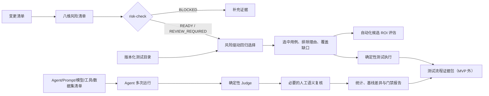

# qualityctl MVP Spec：风险驱动测试智能与 Agent 评测

| 项目 | 内容 |
| --- | --- |
| 文档版本 | v0.1 |
| 状态 | Round 1 可验证原型已实现；Round 2 真实试点待 R2-G0（未启动） |
| 日期 | 2026-08-11 |
| MVP 形态 | Python 3.10+ CLI + JSON/JSONL 契约 + 可审计报告 |
| 目标用户 | 测试工程师、测试负责人、研发、Agent/算法工程师 |
| 规划依据 | 公司 5 份测试规范、`D:\quality_tests_skills` 质量技能组、当前 `qualityctl` 原型 |

## 1. 摘要

MVP 聚焦三个高频、稳定、重复且人工成本较高的环节：

1. 变更风险盘点完整性检查。
2. 风险驱动的最小有效回归选集。
3. Agent 多次运行的确定性判定、失败分域和统计聚合。

MVP 自动化的是结构校验、规则匹配、重复计算、证据归档和候选排序；不自动化阈值批准、业务争议、产品验收、纯语义终审和生产发布动作。

首版不追求“自动化覆盖率”，而以人工净节省、风险召回、结论可信度、维护成本和回本周期决定是否继续投入。

## 2. 问题定义

### 2.1 当前痛点

- 每次需求或版本变更都要人工重复检查业务流程、异常、边界、权限、数据一致性、上下游和副作用，检查质量依赖个人经验。
- 回归范围主要靠人工从用例库筛选，容易在“盲目全量”和“遗漏影响面”之间摇摆，且选择理由难追溯。
- Agent 用例需要重复运行，技术失败、语义失败、runner 无效和重试结果容易混在一起，人工统计成本高且结论口径不稳定。
- 工具选型与自动化建设容易被脚本数量或覆盖率驱动，缺少投入产出核算和退出机制。

### 2.2 根因

- 规范已定义流程与原则，但缺少机器可读的输入契约和确定性执行组件。
- 变更、风险、用例、Agent 清单、阈值和证据没有统一版本绑定。
- 可自动判定的 exact/Schema/规则与必须人工判断的语义问题没有分层。
- 自动化候选缺少频率、稳定性、Oracle、维护成本和回本周期约束。

## 3. 产品原则

1. **风险优先**：优先覆盖核心、高频、历史逃逸、权限、计费、安全、一致性和副作用。
2. **最小有效**：选择能覆盖本次风险的最小集合，而不是默认全量或默认不测。
3. **证据优先**：缺少输入、环境、阈值或运行证据时不推定通过。
4. **确定性优先**：exact、Schema、业务规则和状态判定先于 LLM Judge。
5. **人机分工**：机器处理重复计算，人负责批准、争议和高风险语义判断。
6. **复用优先**：核心引擎保持领域无关，业务差异通过配置、目录和适配器注入。
7. **ROI 约束**：只有稳定、重复、Oracle 清晰且净收益为正的候选才进入自动化。
8. **安全边界**：MVP 不执行生产压测、安全扫描、故障注入、放量、停止或回滚。

## 4. 目标与非目标

### 4.1 MVP 目标

- 将八维风险检查物化为可复用输入契约和 CLI 校验。
- 对每个回归用例给出选中或排除理由，并识别风险覆盖缺口。
- 识别值得自动化的人工用例，同时给出净节省和回本周期。
- 对 Agent 重复运行保留逐次结果，分离 runner、技术、确定性和语义问题。
- 输出稳定、机器可读且可归档的 JSON 报告，可接入 CI 或现有技能。
- 通过影子运行验证实际节省和风险召回，再决定是否扩大范围。

### 4.2 非目标

- 不自动生成完整测试用例库。
- 不做代码级静态依赖分析或自动推断真实业务影响。
- 不建设新的用例管理、缺陷管理、Prompt 管理或可观测平台。
- 不做全页面 UI 录制和自愈。
- 不用 LLM Judge 独立裁决计费、权限、安全、数据写入和核心业务。
- 不自动批准质量阈值、遗留风险或发布结论。
- 不执行任何生产变更或破坏性测试。

## 5. 用户与职责

| 角色 | 主要任务 | MVP 中的权限 |
| --- | --- | --- |
| 测试工程师 | 填写风险清单、维护测试目录、运行评测、复核结果 | 创建输入、运行 CLI、提交证据 |
| 测试负责人 | 评审范围、排除项、自动化候选和质量结论 | 批准试点配置，不批准生产动作 |
| 研发工程师 | 提供变更组件、上下游、修复点和自测证据 | 维护组件映射和技术 Oracle |
| Agent/算法工程师 | 固化模型、Prompt、参数、工具、知识库和 runner | 提供可比清单、协助失败归因 |
| 产品/业务 | 批准业务阈值、推荐合理性和风险接受 | 裁决业务语义，不直接修改运行证据 |
| 发布/运维 | 消费上游质量报告 | MVP 不授予部署、放量或回滚能力 |

## 6. MVP 范围

### 6.0 当前原型与 MVP 差距

当前仓库已经具备三个命令、示例数据和核心单元测试，可作为算法与契约 PoC。2026-08-17
在当前工作区 Python 3.14.6 下记录到 `100/100` 项单元测试通过；这不是业务试点样本，
也不替代 Round 2 的 `R2-G0` 批准记录。进入真实试点前仍需补齐：

- ~~三类输入的统一 `schema_version` 和正式 Schema 校验~~ — Round 1 已完成；真实试点仍须
  对项目目录和每次变更使用同一版本化契约并保存校验输出。
- 输出生成器版本、稳定错误码、敏感字段/生产地址防护。
- 一个真实项目的组件与上下游映射、测试目录和 ROI 基线。
- 一个隔离 Agent runner 的运行记录适配器与人工复核回写（仅在试点批准 Agent 适用时）。
- CI/运行手册的真实演练、受控报告归档和责任人机制；当前 P0 手册已创建，但 R2-G0 仍未满足。

因此当前状态是“可验证原型”，不是“已完成生产门禁”。

### 6.1 能力 A：风险清单校验 `risk-check`

固定覆盖八个维度：

- `business_flow`
- `exception_paths`
- `boundaries`
- `permissions`
- `data_consistency`
- `upstream_downstream`
- `side_effects`
- `recoverability`

状态契约：

| 状态 | 必填信息 | 结果 |
| --- | --- | --- |
| `affected` | 影响证据、至少一个可观察风险场景 | 进入回归选集输入 |
| `not_affected` | 排除原因 | 保留审计记录 |
| `not_applicable` | 不适用原因 | 保留审计记录 |
| `unknown` | 责任人、解决期限 | `REVIEW_REQUIRED` |
| 缺字段或非法状态 | 错误明细 | `BLOCKED` |

关键需求：

- FR-RISK-001：每次变更必须覆盖全部八个维度。
- FR-RISK-002：`affected` 必须提供证据与可观察场景，不能只填“有风险”。
- FR-RISK-003：`unknown` 不得静默转为不受影响。
- FR-RISK-004：权限、一致性和副作用受影响时，缺少对应高风险标记应告警。
- FR-RISK-005：报告必须绑定 `change_id` 和 `version_type`。

### 6.2 能力 B：回归选择与自动化候选 `select`

输入：风险清单、测试目录、版本类型、变更组件、上下游、风险信号和历史标签。

选择规则：

- 所有版本保留 smoke。
- 日常版本保留 CP0 core，并纳入变更、上下游、历史逃逸和风险相关用例。
- Hotfix 保留修复点、smoke 和最小影响面。
- 大版本选择完整目录；排除项另行记录并批准。
- 风险维度只在组件、上下游或 `global_guardrail` 命中后参与选择，避免跨模块过度选择。
- 每个受影响风险维度必须至少有一条选中用例，否则 `REVIEW_REQUIRED`。

关键需求：

- FR-SEL-001：每条选中用例输出一个或多个可解释理由。
- FR-SEL-002：每条排除用例输出排除原因。
- FR-SEL-003：目录行缺失或测试 ID 重复时 `BLOCKED`。
- FR-SEL-004：没有 smoke 时必须输出高严重度覆盖缺口。
- FR-SEL-005：选择结果包含目录数、选中数、排除数、影响组件和风险维度。
- FR-SEL-006：选择器只提出范围，不声称测试已执行或已通过。

### 6.3 能力 C：Agent 评测聚合 `agent-eval`

MVP 支持以下确定性 Judge：

- `equals`
- `number`，且必须显式选择绝对或相对容差
- `required`
- `one_of`
- `matches`

失败分域：

| 类型 | 含义 | 是否进入有效判定 |
| --- | --- | --- |
| `runner_invalid` | runner、采集器或环境失效 | 不进入有效分母，阻塞证据 |
| 技术失败 | Agent、模型、工具、依赖超时或系统错误 | 计入端到端失败 |
| 确定性失败 | 字段、数值、格式或规则不满足 | 计入失败 |
| 语义失败 | 人工复核明确失败 | 计入失败 |
| 待人工复核 | 确定性断言通过但语义证据缺失 | `REVIEW_REQUIRED/BLOCKED` |

关键需求：

- FR-AGT-001：冻结 `agent_version`、`dataset_version` 和 `threshold_profile`。
- FR-AGT-002：采样数超过或少于冻结计划时不得直接 `PASS`。
- FR-AGT-003：高风险用例默认任一次有效失败即 `FAIL`。
- FR-AGT-004：重试成功不得删除首次失败；每次运行保留唯一 `run_id`。
- FR-AGT-005：报告计划数、观察数、有效输出、runner 无效、技术失败、确定性失败、语义失败和通过数。
- FR-AGT-006：报告比例、Wilson 95% 区间、基线百分点变化和相对退化。
- FR-AGT-007：高风险阈值未批准时 `BLOCKED`；其他未批准阈值最多 `REVIEW_REQUIRED`。

### 6.4 能力 D：ROI 评估

自动化候选必须先通过硬条件：

1. 行为稳定。
2. 可独立重复执行并清理副作用。
3. Oracle 属于 exact、Schema、规则、状态或契约。
4. 运行频率和人工耗时有实际记录。
5. 月净节省为正。

计算公式：

```text
月人工毛成本 = 每月运行次数 × 单次人工分钟
月净节省 = 月人工毛成本 - 月维护分钟 - 月残余人工复核分钟
回本月数 = 一次性建设分钟 ÷ 月净节省
要求的月净节省 = 一次性建设分钟 ÷ 已批准的最长回本月数
```

判定：

| 结果 | 条件 |
| --- | --- |
| `CANDIDATE` | 硬条件全部满足，月净节省为正，且满足项目批准的回本周期 |
| `DO_NOT_AUTOMATE_YET` | 不稳定、不可重复、Oracle 不清晰或净收益不为正 |
| `INSUFFICIENT_DATA` | 缺少频率、人工时间、维护或建设成本 |

最长回本周期由项目负责人批准；MVP 不内置通用月份阈值。

## 7. 端到端流程



## 8. 输入输出契约

### 8.1 风险清单

参考实现：[risk-manifest.json](../examples/risk-manifest.json)。

最小顶层字段：

```json
{
  "schema_version": "1.0",
  "change_id": "stable-change-id",
  "version_type": "daily | hotfix | major",
  "changed_components": ["component"],
  "dependencies": {"upstream": [], "downstream": []},
  "risk_signals": [],
  "dimensions": {}
}
```

### 8.2 测试目录

参考实现：[test-catalog.json](../examples/test-catalog.json)。

每条测试至少包含：

- `id`
- `priority`
- `components`
- `dimensions`
- `risks`
- `suites`
- `labels`
- `automated`

需要评估自动化时补充 `automation_fit`：稳定性、可重复性、Oracle、每月频率、人工分钟、月维护分钟和一次性建设分钟。

### 8.3 Agent 用例与运行

参考实现：[agent-cases.json](../examples/agent-cases.json) 和 [agent-runs.jsonl](../examples/agent-runs.jsonl)。

用例绑定：Agent 版本、数据集版本、阈值档案、计划采样、风险、断言和人工复核要求。运行记录绑定：`case_id`、`run_id`、技术状态、输出、错误和人工复核。

### 8.4 输出

- 风险报告：[risk-check.json](../output/risk-check.json)
- 回归选集：[selection.json](../output/selection.json)
- Agent 报告：[agent-report.json](../output/agent-report.json)

输出必须稳定、UTF-8、可版本化，不包含 Secret、未脱敏用户数据或虚构审批。

## 9. 状态语义

| 状态 | 含义 | 后续动作 |
| --- | --- | --- |
| `READY` | 输入契约完整，可进入下一环节 | 继续，但不代表测试通过 |
| `PASS` | 批准范围和阈值下证据满足 | 交给上游流程消费 |
| `REVIEW_REQUIRED` | 有可计算结果，但需人工补充或批准 | 不得自动准出 |
| `BLOCKED` | 输入、环境、阈值或证据不足/不可信 | 修复后重跑 |
| `FAIL` | 已知硬规则或批准阈值失败 | 修复并回归 |

优先级：已知高风险硬失败不能被未知项或总体平均掩盖；runner/环境不可信不能伪造成产品失败。

## 10. 可复用性设计

### 10.1 核心与业务分离

- 核心引擎只处理通用状态、集合、断言、统计和 ROI 公式。
- 物流、支付、会员等业务规则通过测试目录、断言配置和适配器提供。
- 不在代码中硬编码组件名、业务阈值、模型、环境地址或凭据。

### 10.2 可插拔执行器

MVP 核心不直接依赖 Playwright、Schemathesis、Promptfoo 或 DeepEval。后续适配器只需输出统一运行记录，避免锁定单一工具。

### 10.3 版本兼容

- 输入包含 `schema_version`。
- 新增字段默认向后兼容；删除、重命名或改变状态语义必须升级主版本。
- 输出记录生成器版本，确保历史报告可解释。

### 10.4 技能复用

成熟后优先把脚本并入现有技能，而不是创建新的薄技能：

- 风险与选择器 -> `test-scope-case-designer/scripts/`
- Agent 聚合器 -> `agent-nondeterministic-evaluator/scripts/`
- 后续证据门禁 -> `test-process-governor/scripts/`

## 11. 非功能要求

| 编号 | 要求 |
| --- | --- |
| NFR-001 | Python 3.10+；核心运行不依赖外部服务 |
| NFR-002 | 相同输入和版本必须产生相同选集与判定 |
| NFR-003 | 30-50 条目录和数百条 Agent 运行应在普通 CI 节点秒级完成 |
| NFR-004 | 错误消息包含字段路径、用例或运行 ID |
| NFR-005 | 所有输出保留选择理由、分子/分母和逐次失败引用 |
| NFR-006 | Secret 和未脱敏数据不写入输入示例、日志或报告 |
| NFR-007 | CLI 退出码：通过/就绪为 0，待评审为 1，阻塞/失败为 2 |
| NFR-008 | 核心逻辑必须有单元测试，新增状态和规则先补测试 |

## 12. 验收标准

### 12.1 功能验收

| 编号 | 场景 | 预期 |
| --- | --- | --- |
| AC-001 | 八维风险项缺少任一项 | `risk-check=BLOCKED` 且指出字段 |
| AC-002 | 风险项为 `unknown` 且责任人/期限完整 | `REVIEW_REQUIRED` |
| AC-003 | 日常版本包含 smoke、受影响组件和 CP0 core | 全部选中并给出理由 |
| AC-004 | 无关模块仅风险维度名称相同 | 不因维度相同被误选 |
| AC-005 | 受影响高风险维度无用例 | `REVIEW_REQUIRED` 并输出覆盖缺口 |
| AC-006 | 人工用例不稳定或 Oracle 为语义 | `DO_NOT_AUTOMATE_YET` |
| AC-007 | 自动化候选缺成本数据 | `INSUFFICIENT_DATA` |
| AC-008 | 高风险 Agent 三次中一次确定性失败 | `FAIL`，不能被两次成功平均 |
| AC-009 | runner 无效导致有效样本不足 | `BLOCKED`，不计为产品失败 |
| AC-010 | 额外运行超出冻结计划 | `BLOCKED`，防止事后扩样挑结果 |
| AC-011 | 中风险语义复核缺失 | `REVIEW_REQUIRED` |
| AC-012 | 高风险阈值未批准 | `BLOCKED` |

### 12.2 试点成效验收

以下数值必须在试点前由测试负责人和项目负责人批准；MVP 只负责测量：

- 高风险人工基准用例召回不得下降。
- 回归选集人工复核时间相对基线下降。
- Agent 报告整理时间相对基线下降。
- runner 无效、技术失败和语义失败能够 100% 分域记录。
- 自动化候选的实际月净节省为正，并满足批准的最长回本周期。
- 维护工时、误选返工和 flaky 调查成本纳入收益核算。

## 13. ROI 评估方案

### 13.1 基线采集

在启用门禁前连续记录至少两个真实迭代：

- 每次风险盘点用时。
- 每次回归选集用时和参与人数。
- Agent 运行、整理、复核和报告用时。
- 用例月运行次数、人工单次时间、自动化维护时间。
- 漏选、误选、runner 无效和 flaky 调查时间。

### 13.2 投入

MVP 投入分为：

- 一次性产品化：契约稳定、错误处理、报告、打包和 CI 示例。
- 项目接入：组件映射、测试目录整理、Agent runner 适配和阈值评审。
- 持续维护：目录变更、规则升级、脚本修复、失败调查和人工复核。

规划估算在试点选择后按现有资产重新计算，不在 Spec 中虚构统一人日。

### 13.3 收益

- 直接收益：减少重复检查、筛选、聚合和制表时间。
- 风险收益：减少影响面漏选和高风险失败被平均掩盖。
- 复用收益：第二个项目复用同一契约和引擎，只承担配置/适配成本。
- 延迟收益：更快获得可信反馈，但不能以缩短时间为由跳过硬门禁。

### 13.4 继续、调整或停止

| 决策 | 条件 |
| --- | --- |
| 继续 | 风险召回不下降，月净节省为正，回本周期达标 |
| 调整 | 主要问题来自目录质量、组件映射或少量规则误差，且修复成本可控 |
| 停止扩展 | 连续两个评估周期净收益不为正，或维护/误选成本抵消收益 |
| 立即停用硬门禁 | 出现高风险漏选、错误 PASS、证据被覆盖或数据安全问题 |

## 14. 试点与发布计划

### 阶段 0：准备与基线

- 选择一个稳定、重复发布、用例目录较完整的 API/Agent 模块。
- 整理 30-50 条代表性测试目录和一组脱敏 Agent 核心集。
- 记录至少两个迭代的人工基线。
- 批准阈值来源、风险清单责任人和最长回本周期。

退出条件：输入可版本化、业务 Oracle 可解释、无生产写入。

### 阶段 1：影子运行

- `risk-check`、`select` 和 `agent-eval` 与现行人工流程并行。
- 工具结果不自动阻塞发布，由测试负责人对比人工结论。
- 记录漏选、误选、耗时、维护和失败分域准确性。

退出条件：连续两个迭代无高风险漏选或错误 PASS，且解释成本可接受。

### 阶段 2：软门禁

- 风险清单不完整时阻塞进入正式测试设计。
- 回归选集与 Agent 报告仍需人工确认。
- 自动化候选进入待办池，不自动生成或提交脚本。

退出条件：ROI 达到批准标准，团队能维护输入契约。

### 阶段 3：有限硬门禁

- 仅对稳定的输入完整性、Schema、确定性规则和高风险硬失败启用 CI 门禁。
- 语义评分、阈值争议、风险接受和生产动作继续人在环。
- 后续是否接入 Schemathesis、Playwright、Promptfoo/DeepEval 单独立项评估。

## 15. 风险与缓解

| 风险 | 影响 | 缓解 |
| --- | --- | --- |
| 组件映射不完整 | 漏选上下游用例 | 影子运行、研发评审、历史逃逸回流 |
| 用例目录标签失真 | 误选或覆盖缺口 | 目录校验、责任人、版本化 Review |
| 团队追求自动化率 | 脆弱脚本和维护负担 | ROI 硬条件与停止扩展规则 |
| Agent 阈值未经批准 | 虚假 PASS | 高风险 `BLOCKED`，其他 `REVIEW_REQUIRED` |
| runner 故障被当成产品缺陷 | 错误归因 | runner 无效独立分域 |
| 重试覆盖首次失败 | 隐藏 flaky 和稳定性问题 | 保留逐次记录与总尝试数 |
| 输入包含敏感数据 | 隐私和合规风险 | 脱敏、最小化、禁止 Secret、访问控制 |
| 引入过多开源工具 | 工具碎片化 | 核心契约优先，适配器按缺口引入 |

## 16. 交付拆分

### Epic 1：契约与 CLI 产品化

- 固化三类输入的 `schema_version`。
- 补充 JSON Schema 或等价静态校验。
- 输出生成器版本、稳定错误码和 CI 示例。
- 增加敏感字段与生产地址防护检查。

### Epic 2：风险与回归试点

- 建立试点组件/上下游映射。
- 整理 30-50 条测试目录。
- 运行两个迭代影子对比。
- 校准误选、漏选和人工耗时。

### Epic 3：Agent 评测试点

- 适配一个真实但隔离的 Agent runner。
- 固化 Agent、Prompt、模型、工具、知识库和数据集清单。
- 接入人工复核回写。
- 验证采样、失败分域、基线差异和报告。

### Epic 4：ROI 与治理

- 建立人工基线采集表。
- 输出每月净节省、回本周期和维护成本。
- 形成继续/调整/停止决策记录。
- 达标后提出回并 `quality_tests_skills` 的变更。

## 17. Definition of Done

MVP 只有同时满足以下条件才算完成：

- 三个命令及输入输出契约已版本化。
- 本 Spec 的功能验收场景全部通过。
- 至少一个真实试点完成两个迭代的影子运行。
- 无高风险漏选或错误 PASS。
- 人工与工具差异均有可解释记录。
- 实际维护时间和残余人工复核已计入 ROI。
- 自动化候选没有因为覆盖率目标被强制推进。
- 安全、隐私、授权和生产边界通过评审。
- 测试负责人和项目负责人基于实际数据决定继续、调整或停止。

## 18. MVP 前待决策项

1. 选择哪个 API/Agent 模块作为首个试点。
2. 谁维护组件与上下游映射，更新 SLA 是什么。
3. 哪份记录是业务阈值和风险接受的权威来源。
4. 项目批准的最长回本周期是多少。
5. Agent 人工语义复核由谁执行，如何回写结果。
6. 影子运行达到什么证据后允许启用有限硬门禁。
7. 试点结果最终回并 `D:\quality_tests_skills`，还是作为独立工具维护。
