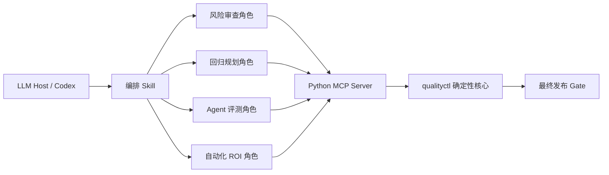

# Quality Gatekeeper 插件开发者指南

本文面向后续维护和二次开发人员，说明插件的目标、架构、核心契约、扩展方式与已知边界。产品规划和投入产出假设见 [插件 MVP Spec](plugin-mvp-spec.md)。

## 1. 一句话理解

Quality Gatekeeper 是一个“LLM 辅助分析 + 确定性工具裁决”的测试质量插件。

LLM 适合阅读需求、发现潜在风险、整理证据和解释结论，但不能直接决定发布是否通过。`READY / PASS / FAIL / BLOCKED / REVIEW_REQUIRED` 均由 Python 规则核心计算。

它优先自动化这些工作：

- 高频重复的变更风险查漏；
- 基于影响范围筛选回归集；
- 聚合 Agent 多次运行并区分失败域；
- 计算测试自动化的真实净收益；
- 汇总证据并形成发布门禁。

它不追求自动生成尽可能多的测试，也不以“自动化率”作为成功指标。

## 2. 核心设计原则

1. **LLM 不做最终裁决**：LLM 可以提出判断，但工具状态不可被文字解释或多 Agent 投票覆盖。
2. **原始证据重算**：最终门禁接收 manifest、catalog、Agent spec/runs 等原始输入，不接收调用方自填的 `PASS`。
3. **失败关闭**：输入缺失、策略未审批、证据混用、样本不足或工具异常均不能自动通过。
4. **风险驱动**：从业务流程、异常路径、边界、权限、数据一致性、依赖、副作用和可恢复性主动找风险。
5. **Agent 单独建模**：技术失败、runner 无效、确定性断言失败、语义复核失败分别统计，不能混成一个成功率。
6. **ROI 先于建设**：只有稳定、重复、判据明确且符合审批策略的场景才推荐自动化。

## 3. 总体架构



系统分为四层：

| 层 | 位置 | 责任 |
|---|---|---|
| 插件包装层 | `plugins/quality-gatekeeper/` | Manifest、MCP 启动配置和可安装结构 |
| LLM 编排层 | `plugins/quality-gatekeeper/skills/` | 说明何时调用什么工具、如何解释结果 |
| 传输适配层 | `src/qualityctl/mcp_server.py` | 使用 Python MCP SDK 暴露工具，不承载业务判定 |
| 确定性领域层 | `risk.py`、`selection.py`、`agent_eval.py`、`gate.py` | 校验、计算、聚合和最终门禁 |

“四个辅助 Agent”在当前 MVP 中实际实现为四个可独立触发的 Skill 角色。宿主支持 subagent 时，可以把角色分别交给不同 subagent；插件本身没有为每个角色创建隔离进程，也没有让它们相互投票。

## 4. Skill 与 MCP 工具

插件包含一个总编排 Skill 和四个专项 Skill：

| Skill | MCP 工具 | 主要职责 |
|---|---|---|
| `quality-gatekeeper` | `decide_release_gate` | 协调专项角色并形成最终结论 |
| `quality-risk-review` | `validate_change_risks` | 检查八类风险和 Agent 评测适用策略 |
| `quality-regression-planning` | `select_regression_scope` | 选择最小有效回归集并暴露覆盖缺口 |
| `quality-agent-evaluation` | `evaluate_agent_evidence` | 评估冻结配置下的重复 Agent 运行 |
| `quality-automation-roi` | `assess_automation_roi` | 计算建设/保留/修复/退役建议 |

MCP 工具只是领域函数的薄适配器。新增规则应优先写进领域模块并补单元测试，不要把业务逻辑直接堆在 `mcp_server.py`。

## 5. 两条典型执行流程

### 5.1 传统软件项目

1. 在 risk manifest 中声明 `agent_evaluation.required=false`，同时提供 `approved_by` 和 `evidence_ref`。
2. LLM 整理八维风险，调用 `validate_change_risks`。
3. 使用通过校验的 manifest 和 test catalog 调用 `select_regression_scope`。
4. 对入选的人工测试按需调用 `assess_automation_roi`。
5. 把原始 manifest 和 catalog 交给 `decide_release_gate`。最终工具会重新计算风险和回归结果，Agent 域记为有审批证据的 `NOT_APPLICABLE`。

### 5.2 Agent 项目

1. 在 risk manifest 中声明 `agent_evaluation.required=true`。
2. 冻结 Agent、Prompt、模型参数、工具集、知识库、数据集、runner 和阈值版本。
3. 为 spec 和每条 run 写入同一个 `evaluation_fingerprint`，防止混跑。
4. 按风险级别执行规定的最小次数；高风险至少 3 次，并强制“一次有效失败即失败”。
5. 需要人工语义复核时，提供结构化 reviewer、rubric、evidence ref 和时间，而不是裸字符串 `"pass"`。
6. 调用 `evaluate_agent_evidence` 查看失败域、通过率与 Wilson 95% 区间。
7. 调用 `decide_release_gate`，由它重新执行风险、回归和 Agent 评测。

## 6. 关键数据契约

### 6.1 Risk manifest

示例：`examples/risk-manifest.json`。

关键字段：

- `change_id`、`version_type`、`changed_components`；
- `dependencies.upstream/downstream`；
- `risk_signals`；
- 八个 `dimensions`；
- `agent_evaluation.required/approved_by/evidence_ref`。

风险维度允许：

- `affected`：必须有 `evidence` 和可观察 `scenarios`；
- `not_affected`、`not_applicable`：必须说明原因；
- `unknown`：必须有 owner 和解决日期，状态为 `REVIEW_REQUIRED`。

### 6.2 Test catalog 与 ROI policy

示例：`examples/test-catalog.json`。

测试通过组件、风险维度、风险信号、suite、历史逃逸标签等信息与变更关联。自动化 ROI policy 必须包含：

- `version`、`source_ref`、`approval_status`；
- `max_payback_months`；
- `min_monthly_net_minutes`。

ROI 会扣除残余人工复核、维护、flaky/误报调查、运行或 LLM 成本等价时间、数据维护，并拒绝负数、布尔值、NaN、无穷值和缺失建设成本。

可能的决策包括：

- `CANDIDATE`；
- `DO_NOT_AUTOMATE_YET`；
- `INSUFFICIENT_DATA`；
- `KEEP`；
- `REPAIR_OR_RETIRE`。

ROI 是投资建议，不参与 MVP 发布 Gate。

### 6.3 Agent evaluation spec/runs

示例：`examples/agent-cases.json` 和 `examples/agent-runs.jsonl`。

Spec 必须具备：

- Agent、dataset 和 evaluation fingerprint；
- Prompt、模型参数、工具集、知识库、runner 版本；
- 带版本、来源和审批状态的 threshold profile；
- 冻结的 cases、planned runs、风险等级、阈值和断言。

支持的确定性断言为 `required`、`equals`、`one_of`、`matches` 和带绝对/相对容差的 `number`。断言 schema 非法会 `BLOCKED`，不会把空断言当作成功。

### 6.4 Final gate

`decide_release_gate` 固定重算三个必需域：风险、回归、Agent 评测适用性/结果。

裁决顺序为：

1. 调用参数或必需策略无效：`BLOCKED`；
2. 有有效失败：`FAIL`；
3. 有证据或执行缺口：`BLOCKED`；
4. 有未知风险或待复核项：`REVIEW_REQUIRED`；
5. 其余情况：`PASS`，此时 `release_allowed=true`。

## 7. 代码目录

```text
plugins/quality-gatekeeper/
├── .codex-plugin/plugin.json    # 插件元数据
├── .mcp.json                    # qualityctl-mcp 启动配置
├── README.md                    # 插件运行说明
├── scripts/smoke_test.py        # 真实 stdio 握手与工具调用
└── skills/                      # 编排 + 四个专项角色

src/qualityctl/
├── risk.py                      # 风险 manifest 校验
├── selection.py                 # 回归选择与 ROI
├── agent_eval.py                # Agent 重复运行评测
├── gate.py                      # 最终发布门禁
├── mcp_server.py                # MCP 传输适配
├── cli.py                       # 本地 CLI
└── io.py                        # JSON/JSONL 输入输出

tests/                           # 领域规则回归测试
examples/                        # 可执行的输入样例
docs/                            # Spec、机会地图和本指南
```

## 8. 本地开发与验证

在仓库根目录执行：

```powershell
python -m pip install -e .
python -m unittest discover -s tests -v
python plugins/quality-gatekeeper/scripts/smoke_test.py
```

验证三组示例：

```powershell
qualityctl risk-check examples/risk-manifest.json
qualityctl select examples/test-catalog.json examples/risk-manifest.json
qualityctl agent-eval examples/agent-cases.json examples/agent-runs.jsonl
```

插件结构校验：

```powershell
python C:\Users\Administrator\.codex\skills\.system\plugin-creator\scripts\validate_plugin.py D:\by56_test_insights\plugins\quality-gatekeeper
```

当前基线是 100 项单元测试、5 个 MCP 工具，以及 smoke test 中真实调用 ROI 和最终
release gate（2026-08-17，工作区 Python 3.14.6）。这只是仓库/示例基线，不是业务试点
证据。修改契约后必须同时更新单元测试、examples、Skill 说明和 smoke test。

## 9. 如何安全扩展

### 新增一个分析维度

1. 在领域模块增加输入校验和确定性规则；
2. 先增加失败测试，再实现规则；
3. 更新示例和对应专项 Skill；
4. 如果它是发布必需域，再显式接入 `gate.py`；不要仅因为新增了工具就自动成为发布阻断项。

### 接入测试管理平台、CI 或 diff 系统

把外部系统实现为 adapter，将数据转换成现有 manifest/catalog/spec。领域核心不应直接依赖 Jira、GitHub、数据库或某个 LLM SDK。

### 更换 LLM 或 Agent 框架

只替换宿主和编排层。只要 MCP 工具输入输出契约不变，领域核心无需修改。

### 增加 LLM Judge

LLM Judge 只能作为带来源的语义证据，不能冒充人工复核，也不能独立放行计费、权限、安全、数据写入和关键副作用。

### 发布新版本

同步检查 `pyproject.toml`、`src/qualityctl/__init__.py`、`mcp_server.py` 和 `plugin.json` 的版本号，更新兼容说明并运行全部验证。后续建议把版本集中到单一来源，避免漂移。

## 10. 当前限制与产品化方向

当前版本是仓库内可验证软门禁，不是企业生产硬门禁：

- `.mcp.json` 依赖 PATH 中已安装的 `qualityctl-mcp`，插件尚未自包含；
- approval、owner 和 source ref 仍是声明式字段，没有连接可信策略注册中心或数字签名；
- MCP 工具入参仍以 `dict[str, Any]` 暴露，但**结构层已由 Pydantic v2 + JSON Schema 收紧**（见 `docs/schemas/v1/README.md`）；未知字段、缺 `schema_version`、非法枚举值、缺必填字段、缺结构化 `manual_review` 等都会被工具边界显式拒绝并进入 model-visible `content`；
- 没有测试环境编排、UI 自动执行、生产发布、自动修复或远程审计服务；
- CI 仅覆盖 Python 单元 + MCP stdio smoke；Linux / macOS 与企业网络下的契约测试仍属后续工作。

产品化优先级建议（Round 1 已落 §1 与 §4；其余待办）：

1. ~~使用 Pydantic 模型和版本化 JSON Schema 收紧 MCP 输入~~ — **Round 1 完成**：`qualityctl.validation` + `qualityctl/schemas/v1/`，工具边界 `ToolError`，CLI 退出码 2；
2. 接入只读策略注册中心，验证 Agent 适用性、阈值和 ROI policy 的审批摘要；
3. 将 MCP 部署为带认证、授权、审计和规则版本的 Streamable HTTP 服务；
4. 完成 8 周影子试点，证明净收益和风险发现效果后再接 CI 硬门禁 — **Round 2 未启动**：`R2-G0` 尚未满足；当前仅有 [P0 试点脚手架](round-2-pilot/README.md)。Round 1 的最小 CI 基线仍由 `.github/workflows/python-qualityctl.yml` 提供（windows-latest + Python 3.11 + pip cache + unittest + MCP smoke；action SHA 已 pin）；
5. 最后再扩展执行器和平台 adapter，避免先做大而全的自动化平台。

### Round 1 落地说明

- 新增 `src/qualityctl/validation.py` 与 `src/qualityctl/schemas/v1/`；详见 [`docs/schemas/v1/README.md`](../schemas/v1/README.md)。
- `mcp_server.py` 在每个工具入口处先调 `validation.*`，结构失败抛 `ToolError`，MCP 返回 `CallToolResult(is_error=true, content=[TextContent(<JSON>)])`，LLM 可直接看到错误。
- `cli.py` 在每个子命令入口显式校验，stderr 输出 `{"ok":false,"command":"...","kind":"structural_validation","input":"...","errors":[...]}`，退出码 `2`。
- 测试夹具更新：`tests/test_risk.py / test_selection.py / test_gate.py / test_agent_eval.py` 中所有手写 manifest/catalog/spec 已带 `"schema_version":"1.0"`。
- 兼容策略：`schema_version` 字段值在结构层不再白名单，未知值（如 `"2.0"`）仍能通过结构校验；major 版本兼容性由 `embedded_ui/view_model.py` 的 `compatibility.status` 单独识别，仍走"原始 gate=PASS、release_basis_status=NOT_VERIFIED、effective_release_allowed=false"的失败关闭路径。
- 变更摘要见 [`docs/changelog-round-1.md`](../changelog-round-1.md)。

## 11. 维护红线

- 不允许 LLM 或辅助 Agent 直接构造最终 `PASS`；
- 不允许通过重试覆盖首次有效失败；
- 不允许把 runner 无效当成 Agent 业务失败或成功；
- 不允许高风险 case 关闭 hard-fail；
- 不允许缺少审批策略、建设成本或残余人工成本时推荐自动化；
- 不允许为了提高自动化率，把低频、易变、无稳定 Oracle 的场景自动化。
