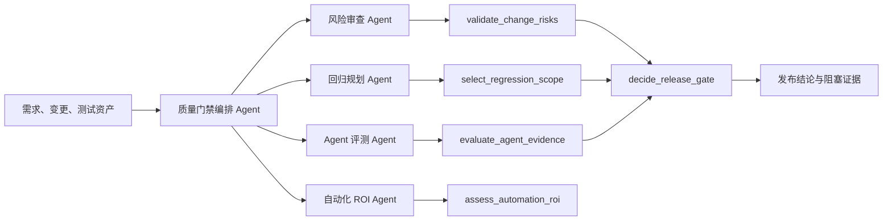

# Quality Gatekeeper LLM 插件 MVP Spec

版本：0.1.0

状态：可运行的仓库内 MVP

日期：2026-08-11

当前验证快照（2026-08-17）：工作区 Python 3.14.6 下 `100/100` 项单元测试通过，五个
MCP 工具 stdio smoke 通过。该快照仅证明仓库基线；Round 2 真实业务试点仍待 `R2-G0`，
不得据此宣称试点启动或产生业务收益。

## 1. 结论

MVP 采用“一个编排 Agent + 四个职责型辅助 Agent + 五个确定性 MCP 工具”。LLM
负责理解业务、发现风险、整理证据和解释结论；规则核心负责 `PASS / FAIL /
BLOCKED / REVIEW_REQUIRED`。任何 Agent 均无权通过投票、置信度或文字解释覆盖
工具结论。

## 2. 为什么选这个设计

比较过三种方案：

| 方案 | 优点 | 主要问题 | 结论 |
|---|---|---|---|
| 单一 `assess_quality` 大工具 | 接入最简单 | 输入巨大、责任不清、难单测、难复用 | 不选 |
| 窄工具 + 编排技能 | 契约稳定、可独立复用、容易审计和替换 LLM | 需要维护少量结构化数据 | 选择 |
| 多 Agent 自主讨论/投票 | 表面上覆盖视角多 | 成本高、非确定性叠加、无法证明投票正确 | 明确不选 |

选择方案把变化快的推理层与稳定的质量规则分开。换模型、换 Agent 框架或改成
远程 MCP 服务时，风险清单、回归选择、评测和门禁契约不需要重写。

## 3. MVP 用户故事

1. 作为测试负责人，我可以给出需求/变更证据，由风险辅助 Agent 主动检查业务
   流程、异常路径、边界、权限、数据一致性、依赖、副作用和可恢复性。
2. 作为回归负责人，我可以基于风险清单和测试目录获得最小有效回归集，并看到
   每条用例的入选原因和覆盖缺口。
3. 作为 Agent 项目负责人，我可以使用冻结数据集、重复运行、确定性断言和审批过
   的阈值评估非确定性结果，不把技术失败混为业务失败。
4. 作为自动化负责人，我可以只挑选稳定、重复、高频、人工昂贵且净收益为正的
   场景进入自动化候选池。
5. 作为发布负责人，我只能在所有必需检查都有证据并通过时获得最终 `PASS`。

## 4. 组件与契约

| MCP 工具 | 主要调用者 | 输入 | 权威输出 |
|---|---|---|---|
| `validate_change_risks` | 风险审查 Agent | risk manifest | `READY / REVIEW_REQUIRED / BLOCKED` |
| `select_regression_scope` | 回归规划 Agent | catalog + manifest | 回归集、缺口、状态 |
| `evaluate_agent_evidence` | Agent 评测 Agent | frozen spec + repeated runs | `PASS / FAIL / BLOCKED / REVIEW_REQUIRED` |
| `assess_automation_roi` | ROI Agent | 候选成本参数 + 已审批 ROI policy | BUILD/KEEP/修复退役建议、净节省、回收期 |
| `decide_release_gate` | 编排 Agent | 原始 manifest、catalog、spec/runs | 按 manifest 中 Agent 适用策略重算最终 gate |

总门禁不接受调用方自填状态或 evidence ref，而是重算三个固定必需域。规则：输入非法或证据缺失为 `BLOCKED`；存在 `FAIL` 为 `FAIL`；其次为
`BLOCKED`、`REVIEW_REQUIRED`；其余必需检查为 `PASS / READY /
NOT_APPLICABLE` 时才返回 `PASS`。非必需的 Agent 意见不参与发布裁决。

## 5. 投入产出与自动化准入

MVP 不以“自动生成更多用例”为目标，先替代四类高频人工操作：风险维度查漏、
回归集筛选、Agent 重复结果聚合、自动化候选经济性计算。

单个自动化候选的月净节省：

`月净节省分钟 = 月次数 × (原人工分钟 - 残余复核分钟) - 月维护 - flaky/误报调查 - 运行/LLM 成本等价分钟 - 数据维护`

`回收月数 = 首次建设分钟 / 月净节省分钟`

只有稳定、可重复、具有确定性 oracle、达到已审批最小月净节省且不超过已审批
回收期的候选才进入 `CANDIDATE`。MVP 示例 policy 使用 3 个月，但核心不内置
通用月份；策略必须带 version、source ref 和审批状态，且不影响发布门禁。已自动化
资产也按实际成本复算为 `KEEP` 或 `REPAIR_OR_RETIRE`。

在已有 `qualityctl` 核心基础上，仓库内插件 MVP 的新增投入约为 3–5 人日；团队
接入、目录映射和阈值审批预计另需 2–4 人日。试点是否继续按真实数据判断：

- 每月节省的风险复核、回归筛选和结果汇总工时；
- 覆盖缺口在执行前被发现的比例；
- 工具误报导致的额外复核工时；
- 插件与规则月维护工时；
- 8 周（约 60 天）内的累计净节省和预计回收期。

若连续两个迭代净节省不为正、或维护时间超过节省时间的 30%，暂停扩面并复盘；
不为了维持“自动化率”继续投入。若出现错误 PASS、高风险漏检、敏感数据泄露或
未经审批的豁免，立即退出硬门禁并回到影子模式。

## 6. 范围与非目标

MVP 包含本地 stdio MCP、五个工具、五个技能、示例数据和可测试的 Python 核心。
不包含 UI 自动执行器、测试环境编排、缺陷自动修复、生产发布操作、LLM-as-judge
单独放行、以及多个 Agent 的自由辩论或多数表决。

## 7. 验收标准

- 插件清单通过校验，MCP 服务可注册并列出五个工具。
- 所有工具输出为结构化数据，同样输入得到同样门禁结果。
- 缺风险维度、缺 Agent 适用性审批证据、阈值未审批、评测指纹混用或运行数不足时不能自动通过。
- 高风险 Agent 用例的一次有效失败不能被平均值或其他 Agent 意见掩盖。
- 不稳定、不可重复、弱 oracle 或净收益非正的场景不会被推荐自动化。
- 规则单元测试全部通过，并保留失败域拆分和 ROI 计算的回归测试。

## 8. 后续演进

1. 先选一个发布频繁、测试目录较完整的业务线以影子模式运行 8 周。
2. 用真实变更/执行数据校准目录标签和阈值，不先增加 Agent 数量。
3. 证明净收益后，将 MCP 改为受控的 Streamable HTTP 服务，接入统一认证、审计
   和版本化规则包。
4. 再考虑变更 diff 适配器、测试管理平台适配器和 CI 门禁；这些属于接口适配，
   不进入确定性领域核心。

当前仓库内 MVP 的 owner、source ref 和 approval 状态仍是声明式审计字段，未接
企业策略注册中心或签名校验，因此定位为“可验证软门禁”。升级为硬发布门禁前，
必须把 Agent 适用性、阈值与 ROI policy 接到只读可信策略源，并验证审批摘要。
