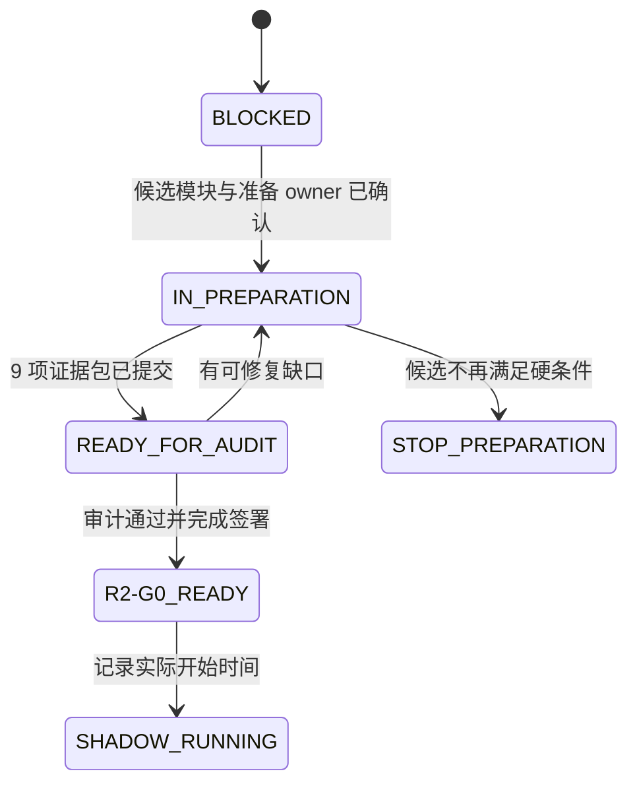

# qualityctl Round 2 G0 Execution Spec：试点启动准备与证据准入

| 项目 | 内容 |
| --- | --- |
| 文档版本 | v0.1 Draft |
| 状态 | 待评审；`R2-G0 BLOCKED` |
| 日期 | 2026-08-17 |
| 书面基线 | `origin/main@ddad399`，`qualityctl 0.1.0` |
| 上位文档 | [Round 2 真实业务影子试点 Spec](round-2-shadow-pilot-spec.md) |
| 执行材料 | [Round 2 P0 试点脚手架](round-2-pilot/README.md) |
| 当前审计 | [R2-G0 启动条件审计](round-2-pilot/r2-g0-audit.md) |
| 阶段输出 | `R2-G0_READY / REMAIN_BLOCKED / STOP_PREPARATION` |

## 1. 执行摘要

Round 2 总体 Spec 已定义真实业务影子试点的目标、8 周观测期、指标、停止红线和最终
决策，但当前 9 项 `R2-G0` 启动条件均没有达到 `READY`。仓库已经具备可运行的规则、
Schema、CLI、五个 MCP 工具、单元测试和 smoke 基线；缺口集中在真实业务输入、责任人
批准、数据控制、人工基线和旁路演练，而不是继续扩展规则核心或 Embedded UI。

本 Spec 把 `R2-G0` 启动条件转化为有依赖顺序的工作包、证据合同、验收场景和最终签署
流程。它只约束“如何准备并证明可以启动影子试点”，不授权启动试点、不自动填充业务
字段，也不把模板、examples、仓库测试或工具 `PASS` 当作真实业务证据。

阶段完成后必须给出且只能给出一个结果：

- `R2-G0_READY`：9 项启动条件全部有当前、可定位、已批准的证据，可以记录实际影子
  开始时间并启动 8 周时钟；
- `REMAIN_BLOCKED`：至少一项条件未完成，保留缺口、owner、下一动作和复核日期；
- `STOP_PREPARATION`：候选模块无法满足安全、数据、样本或责任条件，停止本次准备并
  重新选择候选，不能通过降低安全门槛继续。

## 2. 当前事实与问题定义

### 2.1 已验证的仓库基线

- Python 3.14.6 本地工作区 `100/100` 项单元测试通过；
- 五个生产 MCP 工具可注册，现有 stdio smoke 通过；
- Embedded UI smoke 通过，但 UI 扩展不属于本阶段；
- GitHub `python-qualityctl` 的最近一次已知运行成功；
- v1 JSON Schema、Pydantic v2 校验器和现有 CLI 可复用。

上述事实只能证明仓库和示例链路可运行，不能证明真实业务风险召回、ROI、数据安全或
发布准入效果。

### 2.2 当前阻塞

截至本文日期，[R2-G0 审计](round-2-pilot/r2-g0-audit.md)的 9 项业务启动条件为
`0/9 READY`：[责任人审批清单](round-2-pilot/decisions-to-approve.md)中的 10 项决策均未
批准，8 周影子时钟未启动。

当前最重要的问题不是“工具能否运行”，而是能否用责任清晰、数据受控、人工基线先冻结、
证据可复算的方式，证明一个真实模块适合进入非阻塞影子试点。

本次 2026-08-17 启动准备复核未收到候选模块、责任人、受控存储、Agent 适用性或计划复核
日期等业务输入；因此当前阶段输出为 `REMAIN_BLOCKED`。该结论只反映启动条件未满足，
不构成安全事件或试点结果。

## 3. 目标与非目标

### 3.1 目标

1. 选择并批准一个同时满足频率、目录、Oracle、隔离和责任条件的试点模块。
2. 让 9 项 `R2-G0` 条件分别具备唯一 owner、版本化交付物、验收证据和批准记录。
3. 形成 30–50 条真实、脱敏、唯一 ID 的测试目录及组件/上下游/历史逃逸映射。
4. 冻结 Agent 适用性、阈值、ROI policy 及其权威来源；不适用时保留批准依据。
5. 建立至少两个历史或前置迭代的合格人工基线，并完成一次非分母采集演练。
6. 在隔离环境演练完整旁路流程，证明工具失败不会阻塞或改变正式发布结论。
7. 完成数据控制、最小权限、保留/删除和紧急停止流程的批准与演练。
8. 产出可审计的 `R2-G0` 最终决定和实际影子开始条件。

### 3.2 非目标

- 不在本阶段收集或报告真实试点收益、风险召回率或阶段 Gate 结果；
- 不启用 required check、自动发布、自动豁免、自动回滚或生产写入；
- 不新增远程 MCP、策略注册中心、Agent runner 平台或测试管理平台；
- 不扩展 Embedded UI、Fullscreen 或可视化能力；
- 不用 LLM、仓库提交者或工具调用者推断 owner、阈值、风险接受和批准状态；
- 不提前编写或实施 Round 3 正式硬门禁方案；只有 Round 2 产出
  `GO_LIMITED_GATE` 后，才允许进入该设计阶段。

## 4. 阶段状态模型



状态约束：

- `IN_PREPARATION` 不代表任何 `R2-G0` 条件已经完成；
- 只有证据齐全且经指定角色批准，单项状态才能从 `MISSING/BLOCKED` 改为 `READY`；
- `READY_FOR_AUDIT` 只是提交审计，不允许提前运行真实影子分母；
- `R2_G0_READY` 只允许启动影子期，不代表 Round 2 成功或允许硬门禁；
- 实际开始时间写入前仍不得把准备期、基线期或演练计入 8 周时钟。

## 5. 工作流与依赖

### 5.1 工作包总览

| 工作包 | 对应 G0 条件 | 主要交付物 | 主责角色 | 前置依赖 |
| --- | --- | --- | --- | --- |
| `WP-01` 候选与治理 | 1、9 | 批准的 Charter、RACI、升级/停止路径 | 项目负责人 | 无 |
| `WP-02` 数据控制 | 8 | 受控存储回执、权限、脱敏、保留/删除批准 | 安全/合规接口人 | `WP-01` |
| `WP-03` 目录与映射 | 2、3 | 30–50 条 catalog、组件依赖映射、八维风险评审 | 测试负责人 | `WP-01`、`WP-02` |
| `WP-04` 策略冻结 | 4 | Agent 适用性、threshold profile、ROI policy | 测试负责人 | `WP-01`、`WP-02` |
| `WP-05` 人工基线 | 5、6 | 两个迭代基线、资格复核、非分母采集演练 | 测试负责人 | `WP-01`、`WP-02` |
| `WP-06` 旁路演练 | 7、9 | 影子运行、失败隔离、通知/停止/恢复演练记录 | 发布负责人 | `WP-02` 至 `WP-05` |
| `WP-07` 启动审计 | 全部 | 更新后的 G0 审计、签署记录、启动决定 | 项目负责人 | `WP-01` 至 `WP-06` |

### 5.2 关键依赖规则

1. 候选模块、业务 owner、测试 owner 和研发 owner 未确认前，不得用虚拟业务数据推进
   目录、映射或人工基线验收。
2. 受控存储、数据分级和脱敏规则未批准前，不得收集真实业务输入或基线记录。
3. 人工范围和耗时必须在展示工具结果前冻结；顺序错误的演练只能作为失败记录，不能
   进入人工基线。
4. catalog、映射、policy 和工具版本必须在旁路演练前冻结并记录摘要。
5. `WP-06` 必须覆盖工具进程失败或 `BLOCKED` 的路径，证明正式发布流程不受影响。
6. 任一安全红线被触发时立即执行 `STOP_PREPARATION`，保留原始证据并按安全流程处置。

## 6. 执行工作包与验收合同

### 6.1 `WP-01`：候选模块、Charter 与责任治理

使用 [Pilot Charter](round-2-pilot/pilot-charter.md)、
[Owner/RACI](round-2-pilot/owner-raci.md) 和
[责任人审批清单](round-2-pilot/decisions-to-approve.md)。

必须完成：

- 对每个候选记录变更频率、目录规模、Oracle、隔离环境、数据级别和现行人工流程；
- 选择唯一首个试点模块和 `pilot_id`，记录未选候选及理由；
- 指定项目、测试、研发、业务裁决、发布、安全和适用时的 Agent owner；
- 填写可执行的工作时间升级通道、紧急通道、停止 owner 和恢复批准人；
- 明确影子期不改变正式发布结论，并由发布负责人确认。

验收证据：

- Charter 与 RACI 无关键 `TBD`；
- 每项批准含 `decision_id`、版本、批准人、角色、时间、来源和结论；
- owner 的权限边界无冲突，裁决人与原始证据修改者分离；
- 候选预计能在 8 周内提供至少 8 个合格变更，否则给出停止或替换决定。

### 6.2 `WP-02`：数据控制与受控证据存储

使用 [数据控制计划](round-2-pilot/data-control-plan.md)。真实证据必须位于批准的受控
存储，不得放入本仓库的 `docs/`、`examples/`、`output/` 或普通日志。

必须完成：

- 确认数据分级、允许字段、禁止字段和脱敏规则版本；
- 建立最小权限访问组，区分写入者、复核者、审计者和删除责任人；
- 确认 append-only 或等效防覆盖机制、审计日志、保留周期和删除流程；
- 记录 Secret、用户数据或生产地址误入证据时的通知和隔离流程；
- 验证仓库忽略规则不能替代受控存储和访问控制。

验收证据：

- 存储位置、权限回执、审计日志位置、脱敏规则、保留和删除批准均可定位；
- 使用一个无业务敏感信息的演练包验证创建、读取、追加、拒绝未授权访问和删除流程；
- 演练不在仓库留下真实业务证据、凭据或未脱敏数据。

### 6.3 `WP-03`：测试目录、依赖映射与八维风险

使用 `round-2-pilot/templates/` 下的 test catalog 和 component dependency map 模板。

必须完成：

- 建立 30–50 条真实、脱敏、唯一 ID 的代表性测试目录；
- 覆盖 smoke、核心链路、高风险标签、组件、依赖和历史逃逸引用；
- 记录组件、上游、下游、数据副作用、恢复路径和映射来源；
- 由测试与研发至少双人评审目录和映射；
- 使用 v1 Schema/CLI 验证 catalog，并保存输入摘要、工具版本、退出码和输出。

验收证据：

- 条目数在 30–50，ID 唯一，没有空 Oracle、未知来源或未解释的高风险缺口；
- catalog 结构校验成功，映射评审记录包含版本和批准人；
- 八个风险维度都有评审口径；`UNKNOWN` 必须有 owner 和期限，不能静默改为未影响；
- examples 和模板未进入真实目录分母。

### 6.4 `WP-04`：Agent、阈值与 ROI policy 冻结

使用 agent applicability、threshold profile 和 ROI policy 模板。

必须完成：

- 确定 Agent 域为 `APPLICABLE` 或 `NOT_APPLICABLE`，并给出批准依据；
- 适用时冻结 Agent、Prompt、模型、工具、知识库、数据集、runner 和样本计划指纹；
- 记录阈值、风险接受和 ROI policy 的权威来源、版本、批准人和生效时间；
- 批准最长回本周期、效率指标和差异裁决 SLA；
- 明确任何工具或 LLM 都无权修改、批准或补全这些策略。

验收证据：

- 三类策略记录均没有关键 `TBD/PENDING_APPROVAL`；
- `NOT_APPLICABLE` 不是缺省值，且最终报告不得宣称 Agent 收益；
- 适用时，runner/数据集冻结方式可重复定位，重试不会覆盖首次尝试；
- 任何安全硬门槛均未被效率或 ROI 指标放宽。

### 6.5 `WP-05`：人工基线与采集演练

使用 manual baseline 和 manual scope 模板。

必须完成：

- 提供至少两个历史或前置迭代的人工记录；历史数据不合格时前瞻采集；
- 为每条记录保留流程阶段、开始/结束、暂停、有效分钟、操作者和来源；
- 记录 eligible change 台账以及所有排除原因，避免只保留成功样本；
- 用一个明确标记为非分母的变更演练“先人工冻结、后工具解盲”；
- 由独立复核者确认时间计算、冻结顺序和字段完整性。

验收证据：

- 两个迭代的基线均可追溯，且没有被工具结果污染；
- 采集演练包含冻结时间、工具首次可见时间和解盲时间，顺序可以验证；
- 无法证明顺序或时间可信的记录被保留但明确排除；
- 基线只用于启动资格，不提前产生 Round 2 收益结论。

### 6.6 `WP-06`：非阻塞旁路与紧急停止演练

按 [影子运行手册](round-2-pilot/shadow-runbook.md)执行一次非分母演练。

必须覆盖：

- 正常路径：人工冻结、输入冻结、CLI/MCP 旁路、解盲、差异、裁决、正式流程继续；
- 输入非法或策略不完整：保留结构化 `BLOCKED`，正式发布仍由现有流程决定；
- 工具进程、资源或 runner 失败：失败被隔离，正式发布关键路径不等待工具恢复；
- 停止红线：通知、证据隔离、停止、恢复批准与后续复盘；
- 唯一 `pilot_id/change_id/run_id` 和禁止覆盖已有运行目录。

验收证据：

- 演练记录包含参与人、时间、环境、版本、输入摘要、退出码、原始输出和裁决；
- workflow/check 不是 required，工具无发布凭据、写回权限或正式 Gate 修改权限；
- 至少一个故障场景证明工具失败不阻塞正式发布流程；
- 停止与恢复只能由 Charter/RACI 指定角色执行。

### 6.7 `WP-07`：最终审计与启动签署

更新 [R2-G0 审计](round-2-pilot/r2-g0-audit.md)，逐项把模板声明替换为真实证据引用。

审计规则：

1. 审计者从原始证据复核，不接受仅有汇总、口头批准或聊天“同意”。
2. 每项必须给出状态、证据位置、版本、批准人和复核时间。
3. 任何过期、不可访问、字段缺失或无法验证顺序的证据都不能标记为 `READY`。
4. 9 项全部 `READY` 后，项目负责人、测试负责人和业务/产品裁决人完成最终签署。
5. 签署后才在 Charter 写入实际影子开始时间，并将时钟状态改为 `RUNNING`。

## 7. 可拆票执行清单

| Ticket | 内容 | 完成判据 | 主要依赖 |
| --- | --- | --- | --- |
| `G0-001` | 候选模块评分与唯一选择 | 候选记录完整，唯一模块获批 | 无 |
| `G0-002` | Charter 与 `pilot_id` | 范围、周期、非目标和签署责任明确 | `G0-001` |
| `G0-003` | Owner/RACI 与升级路径 | 必需角色、通道、停止/恢复 owner 获批 | `G0-001` |
| `G0-004` | 数据控制和受控存储 | 权限、脱敏、审计、保留/删除演练通过 | `G0-002`、`G0-003` |
| `G0-005` | 真实 test catalog | 30–50 条，Schema 通过，双人评审 | `G0-004` |
| `G0-006` | 组件/依赖/逃逸映射 | 来源、版本和八维评审完整 | `G0-004` |
| `G0-007` | Agent 适用性与冻结 | 适用或不适用均有批准证据 | `G0-003`、`G0-004` |
| `G0-008` | Threshold 与 ROI policy | 权威来源、版本、阈值和回本周期获批 | `G0-003` |
| `G0-009` | 两个迭代人工基线 | 资格、时间和排除记录可复核 | `G0-004` |
| `G0-010` | 人工采集非分母演练 | 冻结早于工具可见，独立复核通过 | `G0-009` |
| `G0-011` | 非阻塞旁路/故障/停止演练 | 三类路径有证据，正式流程不受影响 | `G0-005` 至 `G0-010` |
| `G0-012` | G0 最终审计和签署 | 9/9 `READY` 或记录唯一阻塞决定 | 全部 |

每张票必须包含 owner、due date、证据目标、验收人和当前状态；只完成文档模板、创建
空目录或运行 examples 不满足完成判据。

## 8. `R2-G0` 决策合同

### 8.1 输入

- 已批准的 Charter 与 RACI；
- 真实 catalog、映射、策略和人工基线的版本化引用；
- 数据控制批准和存储回执；
- 非分母采集、旁路、故障隔离和停止/恢复演练记录；
- 更新后的 9 项审计表及全部签署。

### 8.2 计算规则

```text
if safety_event or unauthorized_release_effect:
    STOP_PREPARATION
elif any(g0_condition != READY):
    REMAIN_BLOCKED
else:
    R2-G0_READY
```

不得使用多数票、平均分或“总体看起来可用”覆盖未完成条件。任一项非 `READY` 时，最终
状态只能是 `REMAIN_BLOCKED` 或 `STOP_PREPARATION`。

### 8.3 输出

最终记录至少包含：

- `pilot_id`、候选模块和决定；
- 9 项状态与证据引用；
- 决定时间、签署人、角色和适用版本；
- 未完成项的 owner、动作和复核日期；
- `R2-G0_READY` 时的实际影子开始时间与首个计划变更；
- `STOP_PREPARATION` 时的停止原因、证据隔离和候选重选条件。

## 9. 验收场景

| 编号 | 场景 | 预期 |
| --- | --- | --- |
| `G0-AC-001` | Charter 完整但业务 owner 未签署 | `REMAIN_BLOCKED` |
| `G0-AC-002` | catalog 只有 29 条或 ID 重复 | 条件 2 非 `READY` |
| `G0-AC-003` | catalog 使用 examples 补足到 30 条 | 拒绝进入真实目录和分母 |
| `G0-AC-004` | 映射有未知依赖但无 owner/期限 | 条件 3 非 `READY` |
| `G0-AC-005` | Agent 不适用但没有批准依据 | 条件 4 非 `READY` |
| `G0-AC-006` | 两轮基线在看过工具结果后补录 | 记录排除，条件 5 非 `READY` |
| `G0-AC-007` | 正常旁路演练通过但未覆盖工具失败 | 条件 7 非 `READY` |
| `G0-AC-008` | 受控目录存在但权限/保留未批准 | 条件 8 非 `READY` |
| `G0-AC-009` | 停止 owner 有姓名但无可执行通道 | 条件 9 非 `READY` |
| `G0-AC-010` | 9 项均有证据但最终签署缺一方 | `READY_FOR_AUDIT`，不得启动时钟 |
| `G0-AC-011` | 准备期发现 Secret 进入证据 | `STOP_PREPARATION`，执行安全处置 |
| `G0-AC-012` | 9/9 `READY` 且完成签署 | `R2-G0_READY`，允许记录实际开始时间 |

## 10. 非功能与安全要求

| 编号 | 要求 |
| --- | --- |
| `G0-NFR-001` | 所有批准、输入和演练记录必须版本化、可定位、可复核 |
| `G0-NFR-002` | 真实证据不得进入本仓库、普通日志或未批准的协作工具 |
| `G0-NFR-003` | 准备流程不得持有生产发布、回滚或业务写入权限 |
| `G0-NFR-004` | 同一 `pilot_id/change_id/run_id` 的原始证据不得覆盖 |
| `G0-NFR-005` | 人工冻结、工具可见、解盲和裁决时间必须可验证顺序 |
| `G0-NFR-006` | 审计结论必须能从原始证据复算，不依赖手工修改的汇总数字 |
| `G0-NFR-007` | `TBD`、空表、examples、模板和口头批准一律不视为完成证据 |
| `G0-NFR-008` | 工具失败、网络失败或 runner 无效不得阻塞现有正式发布关键路径 |
| `G0-NFR-009` | 任何安全红线优先于进度、效率、ROI 和计划日期 |

## 11. 推荐执行节奏

本阶段不预设日历开始日期，实际日期由 owner 批准；建议按以下依赖波次推进：

1. **Wave A：治理与候选** — `G0-001` 至 `G0-003`；
2. **Wave B：受控输入** — `G0-004` 至 `G0-008`，可在依赖满足后并行；
3. **Wave C：基线与演练** — `G0-009` 至 `G0-011`；
4. **Wave D：独立审计** — `G0-012`。

每次状态复核只报告三类变化：新完成的证据、仍阻塞的决定、触发的安全/停止事件。
不得用完成百分比掩盖关键条件仍未 `READY`。

## 12. 变更控制

- 本 Spec 的需求或安全门槛变更必须记录版本、原因、影响和批准人；
- 放宽效率指标需要来源和批准，但不能放宽错误 `PASS`、高风险漏选、未授权放行和
  敏感数据事件的零容忍门槛；
- 更换候选模块会使 catalog、映射、基线、策略和相关演练重新进入评审，不能沿用不匹配
  的旧批准；
- 工具、Schema 或 policy 版本变化时，受影响证据必须重新验证；
- 本 Spec 与 Round 2 总体 Spec 冲突时，安全边界以总体 Spec 为准，执行细节通过评审
  修订本文，不得现场口头覆盖。

## 13. Definition of Done

本阶段只有同时满足以下条件才算完成：

- `G0-001` 至 `G0-012` 均有完成或明确停止记录；
- 9 项 `R2-G0` 条件均有当前证据、owner、版本、审计结论和批准记录；
- 所有关键 `TBD/PENDING_APPROVAL` 已被真实批准值替换；
- 数据控制、人工采集、旁路失败隔离和紧急停止均至少演练一次；
- 最终决定唯一且符合第 8 节规则；
- 若为 `R2-G0_READY`，Charter 已记录实际影子开始时间，首个计划变更可定位；
- 若为 `REMAIN_BLOCKED`，每个缺口都有 owner、下一动作和复核日期；
- 若为 `STOP_PREPARATION`，原始证据已隔离，停止和候选重选条件已签署；
- README、Round 2 Spec、P0 索引和 G0 审计状态一致。

完成 `R2-G0` 只表示可以进入 Round 2 影子运行；它不表示业务收益已证明，不授权正式
硬门禁，也不解除人工发布责任。
