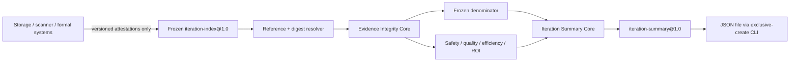

# qualityctl Round 2 P1b Execution Spec：证据完整性闭环与冻结迭代汇总

| 项目 | 内容 |
| --- | --- |
| 文档版本 | v0.1 Draft |
| 状态 | fixture 本地 DoD 已验证；`P1B_FIXTURE_VERIFIED=PENDING_PY311_CI`；真实运行 `BLOCKED_BY_R2_G0` |
| 日期 | 2026-08-19 |
| 仓库基线 | `codex/record-desktop-inline-proof@ff11ddb`，`qualityctl 0.1.0` |
| 上位文档 | [Round 2 P1 Evidence Pipeline Spec](round-2-p1-evidence-pipeline-spec.md) |
| 入场门禁 | [R2-G0 Execution Spec](round-2-g0-execution-spec.md) |
| 下一阶段设计 | [Round 2 P1c Stage Recommendation Harness Spec](round-2-p1c-stage-recommendation-harness-spec.md) |
| 本阶段范围 | P1 单变更证据完整性硬化 + `iteration-summary@1.0` |
| 本阶段不含 | `decide-round2`、G1–G3 自动决策、required check、正式发布动作 |

## 1. 结论先行

提交基线已经实现 Pilot Evidence v1、单变更验证、差异草稿、人工裁决校验、冻结
ledger，以及四个 `qualityctl evidence` CLI 子命令；当时本地 Python 3.14.6 验证为
`124/124` 项单元测试通过，PRE 后工作区快照为 `148/148`。真实业务治理状态仍是
`R2-G0 = REMAIN_BLOCKED`，9 项启动
条件尚未取得批准证据，8 周影子时钟未启动。

下一增量不直接实现完整阶段决策，也不接远程存储、MCP、CI required check 或发布平台。
本 Spec 推荐一个更小且更深的 **Evidence Integrity + Iteration Summary Core**：

1. 先把 change report、adjudication、ledger 的 identity、digest、attestation 和版本关系
   变成可验证的不变量；
2. 再从冻结 ledger 和不可覆盖的原始引用确定性生成 `iteration-summary@1.0`；
3. 对零分母、未观测、不可计算和证据缺失使用不同状态，不把缺数据补成 `0/100%`；
4. 所有输出继续保持 `formal_release_effect = NONE`；
5. 只有 `R2-G0_READY` 后，才允许真实业务 index 进入汇总。

本阶段完成只表示“单变更证据可被安全聚合，迭代结果可从 raw 复算”，不表示 G1/G2/G3
通过，不产生 `GO_LIMITED_GATE`，也不授权任何硬门禁。

## 2. 当前事实与已验证缺口

### 2.1 已具备能力

- `verify_change_bundle(...)` 验证单个 Pilot Evidence bundle，并固定
  `formal_release_effect=NONE`；
- `draft_difference(...)` 只生成差异草稿，不代替授权人填写语义分类；
- `validate_adjudication_record(...)` 检查裁决完整性和高风险差异关闭状态；
- `freeze_ledger(...)` 保留 eligible、excluded、out-of-plan 和 attempt，阻止重复分母；
- `canonical_digest(...)`、`write_json_exclusive(...)` 提供稳定 digest 和不覆盖写入；
- CLI 已暴露 `verify-change / draft-diff / validate-adjudication / freeze-ledger`；
- 现有五个 MCP 工具保持独立，Evidence Pipeline 未扩权到 MCP 或发布系统。

### 2.2 当前缺口

| 缺口 | 当前风险 | P1b 要求 |
| --- | --- | --- |
| adjudication identity 未与 bundle 强绑定 | 其他 change/run 的裁决可能被误用 | `pilot_id/change_id/run_id` 必须逐项一致 |
| `difference_draft_digest` 未与本次重算草稿强绑定 | stale 裁决可能关闭新的差异 | 必须等于本次 draft 的 canonical digest |
| attestation 只拒绝若干失败字符串 | `PENDING/UNKNOWN` 可能被当作成功 | v1 必须使用按类型批准的成功 allowlist；其他值 fail-closed |
| `core_version/core_commit` 未进入 pinned matrix | 未批准 core 可能进入分母 | 与批准的 exact version/commit/digest 匹配 |
| change report / ledger 输出契约较宽 | 聚合器可能接受未知或伪造字段 | 严格 Pydantic + JSON Schema，默认拒绝额外字段 |
| 没有 iteration index/summary 契约 | 无法证明分母、指标和 ROI 可复算 | 新增严格 `iteration-index@1.0` 与 `iteration-summary@1.0` |
| CLI 没有迭代汇总入口 | 迭代报告仍依赖手工模板 | 新增本地、薄的 `summarize-iteration` |
| CLI I/O 失败覆盖不完整 | 自动化调用方需解析自由文本 | 缺文件、坏 JSON、权限、冲突统一结构化错误 |

上述缺口在真实主分母出现前必须关闭。由于当前 `R2-G0` 未启动，现有生成物仅是代码、
测试和脱敏 fixture，不存在需要原地迁移或改写的真实业务记录。

## 3. 目标与非目标

### 3.1 目标

1. 严格绑定 bundle、difference draft、adjudication、change report 和 ledger 的身份与 digest。
2. 对 Secret scan、受控存储、正式结果和最小权限 attestation 使用明确成功状态。
3. 将 core、policy、catalog、mapping、Schema 和 canonicalization 版本纳入批准矩阵。
4. 让 change report、ledger、iteration index/summary 的 Pydantic 与 JSON Schema 对同一
   组正反 fixture 得出一致结论。
5. 从冻结 index 和 raw 引用复算分母、安全、质量、效率和 ROI 指标。
6. 用统一的 metric state 表达 `OBSERVED / NOT_OBSERVED / NOT_COMPUTABLE / BLOCKED`。
7. 新增一个本地纯核心接口和一个薄 CLI，不增加远程或生产权限。
8. 保持同输入、同策略、同 core 和同 canonicalization 版本产生相同 decision digest。

### 3.2 非目标

- 不实现 `decide_round2(...)` 或生成 G1/G2/G3 最终建议；
- 不把 `VALID` summary 解释为 `PASS`、发布批准或阶段 Gate 通过；
- 不启动真实影子试点、不补写 G0 业务字段、不创建真实分母；
- 不新增 remote MCP、HTTP API、证据服务、策略注册中心或测试管理平台；
- 不扩展 Embedded UI、Fullscreen、Desktop Inline 或静态可视化；
- 不自动裁决差异、接受风险、排除样本、修改阈值或批准 policy；
- 不启用 required check，不触发发布、回滚、部署或生产写入；
- 不引入新的 Agent runner、OpenAPI runner、安全扫描器或第三方平台适配器。

## 4. 权威边界与不变量

| 信息 | 权威来源 | P1b 可做 | P1b 不得做 |
| --- | --- | --- | --- |
| 原始输入和工具运行 | 不可覆盖的 bundle/raw 引用 | 验证、重算、引用 digest | 修改、补造或覆盖 |
| change 资格 | `verify_change_bundle` 重算结果 | 生成严格 report | 接受调用方自填 `ELIGIBLE` |
| 差异分类 | RACI 指定裁决人 | 验证身份、digest、完整性 | 自动填分类或关闭高风险项 |
| ledger 分母 | 冻结候选台账 | 去重、保留排除和 attempt | 事后删除失败样本 |
| 阈值和 ROI policy | 已批准、版本化的 policy | 校验版本并按公式计算 | 补默认阈值或放宽安全门槛 |
| 正式结果/安全/存储 | 批准系统的 attestation | 校验状态、版本、引用和 digest | 调用外部系统或信任自由文本 |
| 阶段建议和批准 | 后续 P1c + 三方签署 | 提供可复算 summary | 声称 G1/G2/G3 已通过 |

全阶段必须保持：

1. `formal_release_effect = NONE`，`formal_release_allowed = false`。
2. 真实原始证据 append-only；任何修正使用新文件、新版本和新 digest。
3. 人工冻结严格早于首次工具运行、结果可见和解盲。
4. 全部 eligible、excluded、out-of-plan、attempt 和冲突均进入冻结索引。
5. `ELIGIBLE` 只表示有资格进入指标分母，不表示工具、测试或发布通过。
6. 未知 Schema/core/policy、digest 不一致、证据缺失和未批准状态一律 fail-closed。
7. 四项安全红线优先于样本、效率和 ROI：错误 `PASS`、高风险漏选、未授权自动放行、
   敏感数据事件必须为 `0`；未观测不能写成 `0`。
8. 机器汇总不替代人工裁决、风险接受和阶段批准。

## 5. 设计两次：三个候选契约

### 5.1 方案 A：直接聚合当前宽松输出

调用方把现有 change report 和 ledger 数组直接传给一个 `summarize(reports)` 函数。
函数负责求和、计算比例和输出 Markdown/JSON。

- 调用方可见接口：reports 数组，无明确版本、引用或 policy；
- 隐藏职责：简单统计；
- 依赖：纯内存；
- 优点：实现最快；
- 失败模式：无法证明 report 与 raw、裁决、ledger、policy 属于同一 pilot/iteration；
- 迁移成本：低，但会把当前完整性缺口固化成公共契约。

结论：拒绝。浅接口虽然短，但把身份、版本和分母复杂度泄漏给所有调用方。

### 5.2 方案 B：一次建设完整 Round 2 编排器

新增 `pilot-run`，由它连接存储、CI、scanner、正式发布结果、人工审批、迭代汇总和
`decide-round2`。

- 调用方可见接口：一个远程运行命令和大量凭据/配置；
- 隐藏职责：采集、执行、存储、审批、聚合、阶段决策；
- 依赖：远程存储、CI、scanner、发布和身份系统；
- 优点：常见路径表面简单；
- 失败模式：权限过大、部分失败难恢复、外部状态和业务裁决混入核心；
- 迁移成本：高，且当前没有 G0 批准的真实系统可作为适配目标。

结论：拒绝。它违反非阻塞、最小权限和人在环边界。

### 5.3 方案 C：完整性硬化 + 冻结 index 聚合（推荐）

保留并收紧 `verify_change_bundle(...)`，新增一个只接受版本化冻结 index 的深接口：

```python
summarize_iteration(
    index: Mapping[str, Any],
    *,
    base_dir: str | Path | None = None,
) -> dict[str, Any]
```

代表性调用：

```python
summary = summarize_iteration(iteration_index, base_dir=evidence_root)
```

调用方只需理解 iteration identity、版本化引用、批准 policy 和输出状态。核心内部负责：

- 严格结构/语义验证；
- 安全解析本地引用并验证 bytes digest；
- 重验 change report 与 raw/draft/adjudication 的绑定；
- 校验 ledger 分母、重复和 mixed identity；
- 按稳定 ID 顺序聚合指标和 ROI；
- 生成结构化错误、provenance 和稳定 decision digest。

依赖策略：

- Pydantic、canonicalization 和计算为 in-process 依赖；
- filesystem 是 local-substitutable dependency，通过 `base_dir` 注入并用临时目录集成测试；
- clock 只用于 `generated_at`，不进入 decision digest；
- scanner、受控存储、CI 和正式结果是外部依赖，只接受版本化 attestation，不在核心构造客户端；
- CLI 只负责读取 input、调用核心和 exclusive-create 输出。

迁移成本中等，但复杂度集中在一个可测试边界内，不扩展远程权限。推荐采用。

### 5.4 方案比较

| 维度 | A 当前输出求和 | B 全量编排器 | C 完整性 + 冻结聚合 |
| --- | --- | --- | --- |
| 接口深度 | 低 | 中 | 高 |
| 身份/版本完整性 | 弱 | 依赖远程系统 | 强、可本地复算 |
| 权限面 | 小 | 过大 | 小 |
| 测试表面 | 分散 | 大量集成环境 | 公共核心 + 本地 I/O |
| 当前可执行性 | 高但不安全 | 低 | 高 |
| 故障恢复 | 调用方自理 | 复杂 | 新文件重试、原证据不变 |
| 推荐 | 否 | 否 | **是** |

## 6. 数据流与模块边界



建议代码边界：

```text
src/qualityctl/evidence.py
    existing change-level verification, hardened contracts

src/qualityctl/iteration.py
    iteration models, resolver, metrics, ROI, summarize_iteration

src/qualityctl/cli.py
    thin summarize-iteration adapter

src/qualityctl/schemas/v1/
    strict report / ledger / iteration-index / iteration-summary schemas
```

`iteration.py` 不 import plugin、Embedded UI、MCP server 或远程客户端；CLI 和未来适配器
都只能调用同一公共核心，不能复制指标公式。

## 7. Pilot Evidence v1 完整性闭环

### 7.1 身份和 draft 绑定

`adjudication.identity` 必须与 bundle 的 `pilot_id/change_id/run_id` 完全一致。
`adjudication.difference_draft_digest` 必须等于本次从冻结 manual/tool scope 重算得到的
draft decision digest。以下任一情况返回 `BLOCKED`：

- identity 缺失、额外或不一致；
- draft digest 缺失、不一致或使用未批准 canonicalization 版本；
- 裁决引用了本次 draft 不存在的 difference ID；
- 本次 draft 有差异但裁决缺项；
- 高风险差异未关闭或关闭证据缺失。

### 7.2 attestation 成功 allowlist

v1 必需 attestation 为：

| 类型 | 唯一成功状态 | 额外要求 |
| --- | --- | --- |
| `secret_scan` | `PASS` | scanner version/ref/digest；不得包含 Secret 原文 |
| `controlled_storage` | `PASS` | storage control version/ref/digest |
| `formal_result` | `RECORDED` | 权威系统 ref/digest；正式结果值另存，`release_effect=NONE` 只描述本流水线 |
| `least_privilege` | `PASS` | 权限策略 version/ref/digest |

`PENDING/UNKNOWN/SKIPPED/NOT_RUN`、空值和未批准同义词都不是成功。失败状态保持原有
安全优先级；Secret 或未授权发布证据触发 `STOP_TRIGGERED`，其他不完整状态为 `BLOCKED`。
若业务系统无法产生表中状态，必须在 G0/P1 policy 中批准一个新契约版本，不得在运行时
扩充 allowlist。

### 7.3 exact compatibility matrix

真实分母必须同时记录并匹配：

- Pilot Evidence、manifest、catalog、agent spec/run 的 Schema 版本；
- `qualityctl` exact version 和 exact `core_commit` 或构建 artifact digest；
- catalog、mapping、threshold、ROI policy 和 canonicalization 版本/digest；
- Python 支持版本；
- writer/reader matrix 的批准人、批准时间和有效期。

`0.1.x`、`latest`、分支名或调用方自填 fingerprint 不能替代 exact commit/artifact digest。
fixture 可以使用明确的 synthetic version，但必须标记 `evidence_class=FIXTURE`，不得进入真实
index。

### 7.4 严格输出合同

以下 Pydantic model 与 JSON Schema 必须一一对应，顶层和嵌套对象默认
`extra=forbid / additionalProperties=false`：

- `ChangeEvidenceReportV1`；
- `EvidenceLedgerV1`；
- `IterationIndexV1`；
- `IterationSummaryV1`；
- 公共 `ArtifactRefV1 / MetricResultV1 / PolicyRefV1`。

错误、显示文本和 `generated_at` 不影响 decision digest；身份、状态、分母、数值、policy、
引用 digest 和 canonicalization 版本必须影响 digest。

## 8. `iteration-index@1.0` 输入契约

index 是冻结引用清单，不是调用方自填汇总。至少包含：

| 字段组 | 必需内容 |
| --- | --- |
| identity | `pilot_id/iteration_id/evidence_class` |
| freeze | `frozen_at/frozen_by/freeze_ref/freeze_digest` |
| activation | `r2_g0_status/approval_ref/approval_digest/day0` |
| versions | Schema/core/policy/canonicalization pinned matrix |
| ledger | 唯一 frozen ledger ref/digest |
| changes | 每个候选的 change report、bundle、draft、adjudication refs/digests |
| formal evidence | 正式结果、耗时、失败、重试和成本 refs/digests |
| policy | metric/ROI policy ref/digest/approved_by/approved_at/valid_until |
| attestations | scanner、storage、least-privilege、authority refs/digests |

约束：

1. index 本身使用 exclusive-create，冻结后不得改写；
2. `base_dir` 下的相对路径必须解析后仍位于 `base_dir` 内；绝对路径、`..` 越界、symlink
   越界或 digest 不一致均 `BLOCKED`；
3. 同一 `pilot_id/change_id/run_id` 或 evidence digest 不得重复；
4. 不同 pilot/iteration 的记录不得混合；
5. ledger 中每个候选都必须有可定位状态，不能只列成功项；
6. `evidence_class=REAL` 时必须是 `R2-G0_READY` 且批准未过期，否则 summary 状态为
   `BLOCKED`、code 为 `BLOCKED_BY_R2_G0`；
7. `evidence_class=FIXTURE` 只能产出 fixture summary，并显式包含
   `business_evidence=false`。

## 9. `iteration-summary@1.0` 输出契约

### 9.1 顶层状态

| 状态 | 含义 | 是否为阶段 Gate |
| --- | --- | --- |
| `VALID` | index、证据、分母和全部必需指标可复算 | 否 |
| `BLOCKED` | 缺证据、零主分母、冲突、不兼容或 policy 无效 | 否 |
| `STOP_TRIGGERED` | 存在安全停止红线或不可覆盖证据被破坏 | 否；需立即人工处置 |

优先级固定为：`STOP_TRIGGERED > BLOCKED > VALID`。正向 ROI、足够样本或 raw Gate
`PASS` 不得覆盖更高优先级状态。

### 9.2 顶层字段

```text
contract / schema_version
status / code / errors
identity / evidence_class / business_evidence
versions / policy
denominator
metrics
roi
stop_triggers / conflicts / missing_evidence
source_refs / source_digests
formal_release_effect / formal_release_allowed
decision_digest / generated_at
```

`denominator` 至少报告 candidate、eligible、excluded、blocked、stop-triggered、out-of-plan、
attempt 和 retry group 数量，以及稳定排序的 ID 引用。

### 9.3 统一 metric 形状

每个指标使用：

```json
{
  "state": "OBSERVED | NOT_OBSERVED | NOT_COMPUTABLE | BLOCKED",
  "numerator": null,
  "denominator": null,
  "value": null,
  "unit": "ratio | minutes | months | count",
  "evidence_refs": []
}
```

语义：

- `OBSERVED`：数值和分母均有完整证据；
- `NOT_OBSERVED`：该事件在完整计划中确实没有发生，例如无失败或无重试；
- `NOT_COMPUTABLE`：输入完整，但公式定义域不成立，例如净节省 `<= 0` 时无法计算回本月数；
- `BLOCKED`：缺证据、policy、分母或版本，不能计算。

禁止用字符串 `100%`、`N/A` 或数值 `0` 混淆这些状态。

## 10. 指标与 ROI 复算

| 指标 | 公式/口径 | 特殊状态 |
| --- | --- | --- |
| 证据完整率 | 完整 eligible / ledger eligible | 主分母 0 或任一 report 缺失为 `BLOCKED` |
| 运行可用率 | 无 runner/environment 无效的计划运行 / 全部计划运行 | 计划运行未记录为 `BLOCKED` |
| 失败归因率 | 已分域有效失败 / 全部有效失败 | 无失败为 `NOT_OBSERVED` |
| 重试保留率 | 完整保留全部 attempt 的 retry group / 全部 retry group | 无重试为 `NOT_OBSERVED` |
| 工具误报率 | `TOOL_FALSE_POSITIVE` / 工具新增项 | 无工具新增项为 `NOT_OBSERVED` |
| 高风险漏选数 | `TOOL_FALSE_NEGATIVE_HIGH` 数量 | 任何确认值 `>0` 触发 `STOP_TRIGGERED` |
| 错误 PASS 数 | 已确认错误 PASS 数 | 任何确认值 `>0` 触发 `STOP_TRIGGERED` |
| 净节省 | 毛节省 - 维护/误报/flaky/runner/LLM/运行/数据成本 | 任一必需成本缺失为 `BLOCKED` |
| 回本月数 | 一次性建设分钟 / 月净节省 | 月净节省 `<=0` 为 `NOT_COMPUTABLE` |

所有时间和成本单位必须由批准 policy 固定；不得隐式换算。summary 必须保留 numerator、
denominator、公式版本和 evidence refs，使独立审计者无需信任手工表格即可复算。

## 11. 状态算法

```text
validate index structure and safe paths
resolve every referenced artifact and verify bytes digest
validate exact compatibility and approval validity
revalidate change reports from bound raw evidence
verify ledger identity, completeness and uniqueness

if any safety stop or immutable evidence violation:
    STOP_TRIGGERED
elif evidence_class == REAL and r2_g0_status != R2-G0_READY:
    BLOCKED(code = BLOCKED_BY_R2_G0)
elif any contract/digest/identity/policy/denominator error:
    BLOCKED
else:
    calculate metrics and ROI from frozen raw evidence
    if any required metric is BLOCKED:
        BLOCKED
    else:
        VALID
```

`VALID` 后续可以作为 G1/G2 审计的一项输入，但不能被 P1b CLI 映射成
`R2-G1_HEALTHY`、`R2-G2_ITERATION_VALIDATED` 或 `GO_LIMITED_GATE`。

## 12. CLI 与错误合同

新增：

```text
qualityctl evidence summarize-iteration <iteration-index.json> \
  --output <new-summary.json>
```

CLI 行为：

- input 只读；output 必须 exclusive-create；
- 已存在路径、目录路径、权限拒绝或中途写入失败不改变原文件；
- 结构/语义失败也生成可审计 summary；仅无法读取 input 时输出结构化错误到 stderr；
- `VALID` exit `0`；`BLOCKED/STOP_TRIGGERED` 和所有 I/O/结构失败 exit `2`；
- 所有错误保留 `ok/kind/code/message/paths/errors`；
- 自由文本只能用于人类显示，不得作为自动化唯一判断依据。

P1b 不新增 MCP 工具。未来若需要 adapter，只能调用同一 `summarize_iteration` 核心并保留
相同状态和 digest，另立 Spec 评审权限与传输边界。

## 13. 兼容矩阵与迁移

### 13.1 当前与目标矩阵

| 生产者/读取者 | 当前 | P1b 目标 | 兼容规则 |
| --- | --- | --- | --- |
| Pilot bundle writer | draft `1.0` | hardened `1.0` | 激活前收紧；不改写真实记录 |
| change verifier | 宽松部分语义 | strict report `1.0` | 旧 report 不直接进分母，必须从 raw 重验 |
| ledger writer | 宽松 output | strict ledger `1.0` | 从重验 report 重建新 ledger，不原地改写 |
| iteration index writer | 不存在 | strict `1.0` | 只写新文件 |
| iteration summary reader/writer | 不存在 | strict `1.0` | 未知 major/minor fail-closed |
| 旧 CLI / 五 MCP | v1 + 当前语义 | 保持 | 不改命令签名或 MCP 数量 |
| Embedded UI | 独立只读能力 | 冻结 | 不成为 P1b consumer |

P1b 对 draft `1.0` 做语义收紧的前提是：`R2-G0` 未启动、没有真实业务 writer/reader 或
持久记录依赖当前宽松行为。若在实现前发现外部 consumer 或真实记录，必须停止收紧 `1.0`，
改用新 minor/major 和独立兼容计划。

### 13.2 Expand → Migrate → Observe → Contract

1. **Expand readers**：增加 strict models/schema 和兼容诊断；先不改变旧 CLI/MCP。
2. **Migrate writers**：`verify-change` 与 `freeze-ledger` 只在新 output path 生成严格产物；
   fixture 以新 run ID 重建，不覆盖旧文件。
3. **Observe**：对 initial、当前宽松、strict、部分失败、重试和回退 fixture 运行双复算，
   比较 status、denominator 和 digest；差异进入 error ledger。
4. **Contract**：只有 Schema/Pydantic parity、全量测试和独立复算通过后，strict report/ledger
   才成为 P1b 唯一可聚合输入；旧产物保留但不进入真实分母。

不得 dual-write 到两个权威 store。唯一权威仍是 append-only raw；report、ledger 和 summary
都是可从 raw 重建的派生产物。

## 14. 工作包与可拆票

| Ticket | 内容 | 完成判据 | 依赖 |
| --- | --- | --- | --- |
| `P1B-001` | 冻结 error code、attestation allowlist 和 exact matrix | 评审记录 + 正反 fixture | 无 |
| `P1B-002` | strict report/ledger Pydantic + JSON Schema | parity 测试；拒绝 extra/缺失字段 | `001` |
| `P1B-003` | 绑定 adjudication identity/draft digest | stale/跨 change/run 全部 `BLOCKED` | `001–002` |
| `P1B-004` | attestation/core/policy fail-closed | `PENDING`、未知 core/policy 均阻塞 | `001–002` |
| `P1B-005` | iteration index/summary 契约 | strict model/schema/fixtures | `001–004` |
| `P1B-006` | safe resolver 和 denominator builder | 越界、digest、重复、mixed identity 测试 | `005` |
| `P1B-007` | metrics/ROI 聚合核心 | 零分母、未观测、成本和 STOP 优先测试 | `006` |
| `P1B-008` | `summarize-iteration` 薄 CLI | E2E + stable JSON/exit + exclusive-create | `007` |
| `P1B-009` | 脱敏全链路 smoke 和兼容观察 | initial/mixed/final/rollback fixtures 全绿 | `002–008` |
| `P1B-010` | 实际迭代双人复算 | 仅 `R2-G0_READY` 后；summary/digest 一致 | G0 + `009` |

`P1B-001`–`P1B-009` 可在 G0 阻塞期执行，但只能使用脱敏 fixture。
`P1B-010` 必须等待真实业务输入、受控存储、批准 policy 和 `R2-G0_READY`。

## 15. 功能验收场景

| 编号 | 场景 | 预期 |
| --- | --- | --- |
| `P1B-AC-001` | adjudication identity 指向其他 change/run | `BLOCKED/ADJUDICATION_IDENTITY_MISMATCH` |
| `P1B-AC-002` | adjudication 使用 stale draft digest | `BLOCKED/ADJUDICATION_DIGEST_MISMATCH` |
| `P1B-AC-003` | 四项 attestation 都是 `PENDING` | `BLOCKED/ATTESTATION_NOT_APPROVED` |
| `P1B-AC-004` | core version/commit 不在批准矩阵 | `BLOCKED/UNSUPPORTED_CORE` |
| `P1B-AC-005` | report/ledger 有未知字段 | strict Pydantic/JSON Schema 同时拒绝 |
| `P1B-AC-006` | index 混合两个 pilot 或 iteration | `BLOCKED/MIXED_ITERATION_IDENTITY` |
| `P1B-AC-007` | 重复 identity 或 evidence digest | 不重复计分母，summary `BLOCKED` |
| `P1B-AC-008` | index 引用越出 `base_dir` | `BLOCKED/UNSAFE_EVIDENCE_PATH` |
| `P1B-AC-009` | 引用 bytes 与登记 digest 不同 | `BLOCKED/ARTIFACT_DIGEST_MISMATCH` |
| `P1B-AC-010` | eligible 主分母为 0 | summary `BLOCKED`，必需比率 `value=null` |
| `P1B-AC-011` | 完整计划中没有失败 | 失败归因率 `NOT_OBSERVED`，不是 100% |
| `P1B-AC-012` | 完整计划中没有重试 | 重试保留率 `NOT_OBSERVED`，不是 100% |
| `P1B-AC-013` | 任一必需成本缺失 | ROI `BLOCKED`，不补 0 |
| `P1B-AC-014` | 月净节省 `<=0` | 回本月数 `NOT_COMPUTABLE` |
| `P1B-AC-015` | 正 ROI 同时有高风险漏选 | `STOP_TRIGGERED`，STOP 优先 |
| `P1B-AC-016` | 只有 `generated_at` 变化 | decision digest 不变 |
| `P1B-AC-017` | output 已存在 | exit `2`，原字节不变 |
| `P1B-AC-018` | input 缺失/坏 JSON/权限拒绝 | 稳定结构化错误 + exit `2` |
| `P1B-AC-019` | `FIXTURE` index 全部有效 | `VALID` 但 `business_evidence=false` |
| `P1B-AC-020` | `REAL` index 且 G0 未 READY | `BLOCKED/BLOCKED_BY_R2_G0`，不启动时钟 |
| `P1B-AC-021` | 旧 report 自称 ELIGIBLE 但无 raw | 不信任旧状态，summary `BLOCKED` |
| `P1B-AC-022` | full raw 可重验且全部指标完整 | summary `VALID`，仍 `formal_release_effect=NONE` |

## 16. 非功能与安全要求

| 编号 | 要求 |
| --- | --- |
| `P1B-NFR-001` | 同 input/policy/core/canonicalization 产生相同 decision digest |
| `P1B-NFR-002` | writer 全部 exclusive-create，不提供 silent overwrite 参数 |
| `P1B-NFR-003` | core 不访问网络，不持有发布、审批、回滚或生产写入凭据 |
| `P1B-NFR-004` | 真实证据只在批准受控存储；仓库只保留 Schema/脱敏 fixture/模板 |
| `P1B-NFR-005` | 引用解析限制在显式 `base_dir`，并防止 path/symlink escape |
| `P1B-NFR-006` | 聚合按稳定 ID 排序；文件枚举顺序和本地绝对路径不影响 digest |
| `P1B-NFR-007` | 所有 RFC 3339 时间带时区；clock 可注入，显示时间不进入 digest |
| `P1B-NFR-008` | Python 支持保持 3.10+，Python 3.11 CI 为必验环境 |
| `P1B-NFR-009` | 不减少或改写现有五 MCP、旧三 CLI 与四 evidence CLI 的公开语义 |
| `P1B-NFR-010` | 单个批准规模 index 的本地核心聚合 p95 小于 5 秒，不含 CI 排队 |
| `P1B-NFR-011` | 失败不留下可被误认作完整 summary 的半写文件 |
| `P1B-NFR-012` | 报告只保留 scanner 状态/version/ref/digest，不复制 Secret 原文 |

## 17. 验证策略

### 17.1 测试层

- Pydantic 与 JSON Schema 对同一 positive/negative fixture 结果一致；
- 单元测试覆盖状态优先级、identity/digest、attestation allowlist、compatibility、路径、
  分母、metric state、ROI 和 decision digest；
- property/fuzz-style 测试覆盖输入顺序、重复、额外字段和时间字段变化；
- 临时目录集成测试覆盖 safe resolver、exclusive-create、权限和中途失败；
- CLI E2E 覆盖成功、`BLOCKED`、`STOP_TRIGGERED` 和全部 I/O 错误；
- 兼容测试覆盖 initial、宽松 draft、strict mixed、strict final 和 forward-fix；
- 保留 risk/selection/agent/gate/MCP/Embedded UI 回归，证明旧边界不变。

JSON Schema parity 若需要 `jsonschema`，只加入 test extra，不增加运行时依赖。

### 17.2 必运行命令

```powershell
python -m unittest discover -s tests -v
python plugins/quality-gatekeeper/scripts/smoke_test.py
python plugins/quality-gatekeeper/scripts/p1_evidence_smoke.py
python plugins/quality-gatekeeper/embedded_ui/smoke_test.py
git diff --check
```

现有基线为 `124/124`；新增测试后总数应增长，不能只维持数字而删除现有覆盖。

## 18. 运行节奏、暂停与恢复

| 阶段 | 允许动作 | 出口条件 |
| --- | --- | --- |
| G0 阻塞期 | `P1B-001`–`009`、脱敏 fixture、非分母 dry-run | `P1B_FIXTURE_VERIFIED` |
| `R2-G0_READY` 后 | 新 run ID 采集真实 raw，生成首个冻结 index | G0 批准仍有效 |
| 首完整迭代 | 双人从 raw 独立复算 summary/digest | `P1B_REAL_SUMMARY_READY` |
| 完整性/安全异常 | 停止新聚合，隔离受影响 refs | 根因、影响分母、forward-fix 和恢复批准 |

暂停不删除 raw、不重置 Day 0、不把失败样本改成 excluded。恢复必须使用新 artifact、
新 digest 和适用时的新 run ID；不允许原地修补已冻结 summary。

## 19. 风险与缓解

| 风险 | 影响 | 缓解 |
| --- | --- | --- |
| 先聚合后补完整性 | 错误分母被确定性放大 | `P1B-001`–`004` 为聚合前置 |
| 收紧 draft 1.0 影响未知 consumer | 兼容中断 | 实施前盘点 consumer；发现即升新版本并暂停 contraction |
| attestation 字符串语义漂移 | `PENDING` 被当成功 | exact allowlist + 版本化 adapter contract |
| 旧 report 自称 ELIGIBLE | 伪造/过期状态进分母 | 从 raw 重验，不信任旧派生状态 |
| 手工汇总与机器 summary 漂移 | 审计结论冲突 | 机器 JSON 为计算权威；Markdown 只引用 digest |
| path traversal/symlink escape | 读取越权文件 | `base_dir` containment + digest + 临时目录测试 |
| 零分母被显示成 0/100% | 虚假成功 | metric state 与 numeric value 分离 |
| 正 ROI 覆盖安全失败 | 错误继续试点 | `STOP_TRIGGERED` 最高优先级 |
| P1b 被误当阶段决策器 | 越权声明 G1/G2/G3 | 无 `decide-round2`，输出固定非授权字段 |

## 20. Definition of Done

P1b 工程实现只有在以下条件同时满足时达到 `P1B_FIXTURE_VERIFIED`：

- strict report/ledger/index/summary Pydantic 与 JSON Schema parity 通过；
- adjudication identity、draft digest、attestation allowlist 和 exact core/policy matrix 已绑定；
- read-only 探针中的跨 identity、stale digest、`PENDING` attestation 和未知 core 全部
  fail-closed；
- `summarize_iteration(...)` 和 `summarize-iteration` CLI 已实现；
- 零分母、`NOT_OBSERVED`、`NOT_COMPUTABLE`、缺成本和 STOP 优先场景全覆盖；
- safe path、digest、重复、mixed identity 和 exclusive-create 场景全覆盖；
- 同输入稳定 digest，raw 和旧产物未被修改；
- 现有 124 项回归、全部新增测试、三个 smoke、Embedded UI smoke 和格式检查全通过；
- README/Schema 文档记录准确的能力边界和测试快照；
- 没有新增 remote MCP、发布权限、真实业务证据或硬门禁配置；
- `R2-G0` 仍按真实批准证据报告，不因 P1b 完成而自动改变状态。

`P1B_REAL_SUMMARY_READY` 还要求 `R2-G0_READY`、首个完整真实迭代、受控存储、批准 policy、
完整 raw 和两名授权人独立复算一致。它只允许进入 P1c 的 G1–G3 阶段建议设计/实现，
仍不授权 Round 3 或有限硬门禁。

2026-08-19 的 PRE 审计已补齐四类 raw artifact 的统一 resolver、scope duplicate guard、
test extra 与文档快照。本地 Python 3.14.6 全回归及 smoke 通过；当前 revision 的 Python 3.11
CI 尚未运行，因此严格状态为 `P1B_FIXTURE_VERIFIED=PENDING_PY311_CI`，不能表述为
`P1B_REAL_SUMMARY_READY`。详见 [P1c Spec 评审记录](round-2-p1c-spec-review.md)。

## 21. 待评审决策

1. exact core identity 使用 commit、构建 artifact digest，还是二者都要求；
2. 四类 attestation 的权威系统、有效期和 adapter version；
3. metric/ROI policy 的 owner、公式版本、单位和必需成本字段；
4. iteration index/summary 的批准存储位置、保留周期和访问组；
5. JSON Schema parity 是否采用 test-only `jsonschema` 依赖；
6. 首个真实 summary 的两名独立复算人和差异升级路径；
7. P1c 是否只实现 stage recommendation，还是先增加一个迭代观察窗口；
8. draft `1.0` 是否存在仓库外 consumer；若存在，必须确定新版本和迁移窗口。
9. P1c §2.3 的门槛拆分是否批准；当前为 `PENDING_APPROVAL`，批准前继续要求
   `P1B_REAL_SUMMARY_READY` 才能进入 stage core/CLI 实现。

## 22. 结论与操作提示词

推荐按 `P1B-001 → P1B-009` 顺序完成 fixture 范围工程闭环，先把当前证据完整性缺口变成
失败测试，再实现冻结迭代汇总。`P1B-010` 和所有真实业务动作继续等待
`R2-G0_READY`；完整 `decide-round2`、remote adapter 和有限硬门禁都不属于本阶段。

可直接用于下一步执行的提示词：

> 请依据 `docs/round-2-p1b-iteration-summary-spec.md`，采用测试优先方式执行
> `P1B-001` 至 `P1B-009`：先为 adjudication identity/draft digest、attestation 成功
> allowlist、exact core/policy matrix 和严格 Schema/Pydantic parity 建立失败测试，再实现
> `iteration-index@1.0`、`iteration-summary@1.0`、`summarize_iteration(...)` 与
> `qualityctl evidence summarize-iteration`。仅使用脱敏 fixture，不读取或生成真实业务
> 证据，不启动 8 周时钟，不新增 remote MCP、required check 或发布权限。完成后运行全量
> unittest、MCP smoke、P1 evidence smoke、Embedded UI smoke 和 `git diff --check`，逐项
> 报告验收证据、兼容矩阵、未决风险和当前 `R2-G0` 状态。
