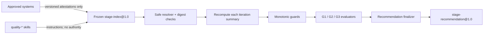

# qualityctl Round 2 P1c Execution Spec：可回放阶段建议 Harness 与 G1–G3 审计

| 项目 | 内容 |
| --- | --- |
| 文档版本 | v0.2 Draft |
| 状态 | `REVIEWED_WITH_BLOCKERS`；§2.3 门槛拆分 `NOT_APPROVED`；按 `BLOCKED_BY_P1B_REAL_SUMMARY` 停在 PRE/评审/catalog |
| 当前实施许可 | `SPEC_REVIEW_ONLY`；stage Schema/core/CLI 为 `NOT_AUTHORIZED` |
| 日期 | 2026-08-19 |
| 提交基线 | `codex/record-desktop-inline-proof@a603f2e`，`qualityctl 0.1.0` |
| 工作区验证快照 | 当前提交已包含 P1b/PRE 增量；Python 3.14.6 下 `153/153` unittest 通过；当前精确 revision 的 Python 3.11 CI 待绑定；该数字不是业务证据 |
| 本轮评审记录 | [P1c Spec 评审记录](round-2-p1c-spec-review.md)；[脱敏 fixture catalog](round-2-p1c-fixture-catalog.md) |
| 上位文档 | [Round 2 P1 Evidence Pipeline Spec](round-2-p1-evidence-pipeline-spec.md) |
| 直接输入契约 | [Round 2 P1b Iteration Summary Spec](round-2-p1b-iteration-summary-spec.md) |
| 业务入场门禁 | [R2-G0 Execution Spec](round-2-g0-execution-spec.md) |
| 本阶段范围 | `stage-index@1.0`、`stage-recommendation@1.0`、确定性 `decide_round2(...)` 与薄 CLI |
| 本阶段不含 | Agent runner、远程 adapter、动态插件加载、MCP 扩权、required check、阶段批准、发布/回滚或有限硬门禁 |

## 1. 结论先行

当前工作区已经基本具备从冻结 raw 证据生成 `iteration-summary@1.0` 的 P1b 能力，但真实
业务治理仍为 `R2-G0 = REMAIN_BLOCKED`，9 项启动条件尚无 `READY`，8 周影子时钟未启动。
P1b 的 `VALID` 只说明迭代证据可以复算，不能自动解释为 G1、G2、G3 或
`GO_LIMITED_GATE`。

下一工程增量应是一个小而深的 **Stage Recommendation Harness**：

1. 只接受冻结、版本化且可从 raw 重验的 `stage-index@1.0`；
2. 对每个迭代引用重新调用 P1b 核心并核对 summary digest，不信任调用方自填状态；
3. 以固定顺序执行完整性、激活、时间/样本、安全、质量/ROI 和批准就绪检查；
4. STOP 与拒绝型检查是单调的，后续效率、ROI、人工文字或 skill 不得反转；
5. 生成唯一 `stage-recommendation@1.0`，但始终保持
   `formal_release_effect=NONE`、`formal_release_allowed=false`、
   `formal_stage_decision_made=false`；
6. fixture 可以验证算法，但 `business_evidence=false`，不得成为真实阶段建议；
7. 人工三方决定必须在外部批准载体中引用 recommendation digest，P1c 不签署、不批准。

本 Spec 参考 DeepSeek Harness 的追加式事实源、guarded pipeline、capability seam 和 skill
分层，但不复制其通用 Agent runtime，也不依赖其 TypeScript/Cordis 内部 API。原因是本项目
当前的真实变化点只有“冻结阶段输入如何被确定性复算并形成建议”，尚无第二个 runner、远程
存储或策略引擎实现足以证明通用插件接口的必要性。

## 2. 当前事实、缺口与入场条件

### 2.1 已验证事实

- 提交态 `a603f2e` 已提供单变更 evidence verifier、差异草稿、人工裁决校验、冻结 ledger
  和四个 evidence CLI；
- 当前工作区新增 P1b iteration index/summary、严格 Schema/Pydantic、safe resolver、指标/ROI
  聚合和 `summarize-iteration`，PRE 后全量 unittest 为 `153/153`；
- 生产 MCP 仍恰好为五个工具；新增第六个工具属于公开契约变化；
- evidence writer 使用 exclusive-create；普通 `risk-check/select/agent-eval` 的旧输出行为不属于
  P1c 可修改范围；
- `iteration-summary@1.0` 已分离 `OBSERVED / NOT_OBSERVED / NOT_COMPUTABLE / BLOCKED`，
  并固定非发布效果；
- `R2-G0` 仍为 `REMAIN_BLOCKED`、0/9 `READY`，不存在真实 Day 0、真实完整迭代或已批准
  阶段 policy；
- P1/P1b 文档与 P1b 增量当前仍在工作区，不能把未提交状态或单元测试数量包装成阶段完成。

### 2.2 P1c 要关闭的缺口

| 缺口 | 风险 | P1c 目标 |
| --- | --- | --- |
| 没有 stage index/recommendation 契约 | G1–G3 仍靠人工拼接摘要 | 新增严格、可复算的两个 v1 契约 |
| G1/G2/G3 规则散落在总体 Spec | 时间、样本和状态口径可能漂移 | 固化唯一状态算法和优先级 |
| summary 可被调用方直接提交 | stale、伪造或混合 pilot 可能进入阶段结论 | 每个 summary 必须绑定 index，并从 index 重算 |
| 当前时间会改变阶段结果 | 同输入在不同执行时刻得到不同 digest | 决策只使用冻结 `evaluation_cutoff_at`；运行时 clock 只写显示时间 |
| 阶段 policy/阈值载体未定义 | 默认阈值或事后改阈值可能制造 GO | 版本化、批准、带 digest 的 `stage-policy@1.0` |
| 三方批准与机器建议未分离 | recommendation 可能被误当批准 | 输出固定 `formal_stage_decision_made=false` |
| skills 与证据边界未写清 | 指令文本可能被当权威事实 | skill 只指导调用；只有冻结工具产物能进 index |
| 失败检查可被后续结果覆盖 | 正 ROI 或多数成功可能掩盖红线 | 单调 STOP/deny，后续检查只能增加阻塞 |

### 2.3 实现前安全前置

P1c fixture 实现开始前必须先达到以下条件：

1. `P1B_FIXTURE_VERIFIED` 的全量测试、三个 smoke、Embedded UI smoke、Schema 文档和格式检查
   均有可定位证据；
2. `agent_runs` 外部引用与 manifest/catalog/agent_spec 使用同一个受限 resolver，拒绝绝对路径、
   `..` 和 symlink escape；当前 `evidence._load_raw_inputs` 的 `agent_runs` 分支尚未证明该不变量；
3. manual/tool scope 中重复 test ID 必须显式 `BLOCKED`，不得通过 map 的 last-write-wins 静默折叠；
4. `jsonschema` 等 test-only 依赖进入可复现的 test/dev dependency 声明；
5. P1b 公开契约、导出函数和五个 MCP 工具数量冻结为回归基线。

这些是 P1c 的前置修复票，不授权真实试点。P1b §20 当前写明只有
`P1B_REAL_SUMMARY_READY` 才允许进入 P1c 设计/实现，而 P1b §21 又把 P1c 范围列为待决策项。
本 Spec 建议把门槛拆为：现在允许 Spec 评审；`P1B_FIXTURE_VERIFIED` 后允许脱敏 fixture
实现；`P1B_REAL_SUMMARY_READY` 后才允许真实激活。该拆分必须与 P1b 同步评审；在批准前
按 P1b 的更严格门槛执行，不得由实施者自行放宽。

2026-08-19 工程评审未找到同步批准证据，结论为 `NOT_APPROVED`。本轮只完成
`P1C-PRE-001/002` 范围内的现有 P1b/PRE 最小验证器修复、本地 focused checks、
[Spec 评审](round-2-p1c-spec-review.md) 和 [脱敏 fixture catalog](round-2-p1c-fixture-catalog.md)；
严格门禁仍受 `P1C-REV-001/002/006` 阻塞，没有开始 stage core/CLI。

真实业务运行还必须同时满足：

- `R2-G0_READY` 和不可回写 Day 0；
- `P1B_REAL_SUMMARY_READY`，包括受控存储、批准 policy 和双人独立复算；
- `stage-policy@1.0`、writer/reader matrix 和三方批准载体已获批准；
- 至少一个真实 G1 checkpoint index 可从受控 raw 重新生成。

## 3. 目标与非目标

### 3.1 目标

1. 为 G1、G2、G3 建立一个确定性的公共核心和一个薄 CLI。
2. 让阶段结果可从 stage index、iteration index 和 append-only raw 逐层重放。
3. 固定时间、样本、迭代、安全、证据完整性、ROI 和批准就绪的检查顺序。
4. 让 STOP/deny 型结果具备单调性，任何后续 hook 或 check 不得降级。
5. 用稳定 error code、check result 和 provenance 解释每个 Gate 为什么通过、延长、重复或停止。
6. 对 fixture、真实证据、未到期、未观测、缺失和停止使用不同状态。
7. 保持相同输入 bytes、policy、core、check profile 和 cutoff 得到相同 decision digest。
8. 为未来 adapter 保留一个窄边界，但只在真实第二实现出现后才公开 provider 注册。

### 3.2 非目标

- 不执行 Agent turn/step/tool loop，不接入或启动 DeepSeek Harness 进程；
- 不新增 `execution-attempt`、AgentRun 字段、runner、subagent、模型 adapter 或 sandbox；
- 不实现通用事件总线、Cordis runtime、热卸载、profile patch 或动态插件市场；
- 不允许调用方通过任意 Python callback、entry point 或配置脚本修改安全检查；
- 不连接远程对象存储、数据库、scanner、CI、审批、发布或回滚系统；
- 不增加生产 MCP 工具，不扩展 Embedded UI 或可视化；
- 不自动签署 G1/G2/G3，不接受风险，不关闭差异，不修改 policy；
- 不把 `GO_LIMITED_GATE` 建议解释为已批准，更不在本阶段启用有限硬门禁；
- 不用 LLM、LLM Judge、skill 文本或多数票计算阶段状态。

## 4. DeepSeek Harness 参考基线与取舍

研究基线固定为 DeepSeek Harness
[`99f6f02`](https://github.com/deepseek-ai/deepseek-harness/tree/99f6f02fecdb7dff40c3fbc9470f5907c29f74ca)
（2026-08-17，`dsh@0.1.0-rc.7`）。上游 README 明确其仍为 developer preview，存在
兼容性破坏风险，因此本项目只借鉴稳定的设计约束，不建立源码或运行时依赖。

| 上游设计 | P1c 采用方式 | 明确不采用 |
| --- | --- | --- |
| “Everything is a Plugin” 与 capability seam | 把 stage core、local resolver、CLI consumer 的职责分开；内部 check 单元有固定契约 | 不开放任意第三方 check/plugin 加载 |
| append-only SessionEvent log 是事实源 | 以 append-only raw → iteration index/summary → stage index/recommendation 形成可回放 artifact graph | 不新建通用 session/event runtime |
| tool pre/guard/execute/post/final pipeline | 使用 preflight → monotonic guards → gate evaluation → immutable finalization | 不允许 hook 改写已冻结参数或反转 deny |
| profile/bundle 的显式组合和可 dump 配置 | recommendation 记录完整 check profile、policy 和 compatibility digest | 不支持 home/CLI overlay 或未批准 patch |
| skill catalog 与 durable facts 分离 | 仓库 skills 只负责指导人/Agent 调用确定性工具 | SKILL.md 内容不直接进入决策公式或批准状态 |
| provider 不支持能力时 fail loud | 未知 check、Schema、policy、role 或版本返回稳定 `UNSUPPORTED_*` | 不做 silent ignore 或降级 |

参考资料：

- [DeepSeek Harness README（固定提交）](https://github.com/deepseek-ai/deepseek-harness/blob/99f6f02fecdb7dff40c3fbc9470f5907c29f74ca/README.md)
- [Architecture：plugin tree、durable log、capability seams（固定提交）](https://github.com/deepseek-ai/deepseek-harness/blob/99f6f02fecdb7dff40c3fbc9470f5907c29f74ca/docs/architecture.md)
- [Tool Execution Pipeline：monotonic guards 与 immutable result（固定提交）](https://github.com/deepseek-ai/deepseek-harness/blob/99f6f02fecdb7dff40c3fbc9470f5907c29f74ca/docs/tool-execution-pipeline.md)
- [Skills：provider/catalog 与 instruction body 分层（固定提交）](https://github.com/deepseek-ai/deepseek-harness/blob/99f6f02fecdb7dff40c3fbc9470f5907c29f74ca/docs/subsystems/skills.md)

## 5. 权威边界与不变量

| 信息 | 权威来源 | P1c 可以做 | P1c 不得做 |
| --- | --- | --- | --- |
| 变更、attempt、差异和正式结果 | P1/P1b append-only raw | 通过 P1b core 重验、引用 digest | 修改、补造或覆盖 |
| iteration status/metrics | 重算后的 `iteration-summary@1.0` | 复算、聚合 numerator/denominator | 信任调用方自填 `VALID` 或百分比 |
| Day 0 与 G0 | 已批准 activation attestation | 校验 ref/digest/status/时序 | 推断、补录或重置 |
| stage policy | 三方批准的版本化 policy | 校验约束并执行公式 | 生成默认值或放宽上位硬门槛 |
| evaluation cutoff | 冻结 stage index | 用于时间和 digest | 使用墙钟改变业务结果 |
| G1–G3 建议 | P1c deterministic core | 生成可解释 recommendation | 把建议写成批准决定 |
| 阶段批准 | 外部三方批准载体 | 验证其 readiness/ref/digest | 代签、审批或授予发布权限 |
| skills | repo/plugin 中的协作说明 | 指导输入收集和工具调用 | 覆盖确定性结果或成为证据源 |

必须始终成立：

1. `formal_release_effect = NONE`、`formal_release_allowed = false`、
   `formal_stage_decision_made = false`。
2. raw、index、summary 和 recommendation 均 exclusive-create；修正使用新 artifact、新 digest，
   必要时使用新 checkpoint ID。
3. stage recommendation 必须从 iteration index 重算 summary；只提供 summary 而无 index 时 fail-closed。
4. 所有窗口共享唯一 `pilot_id`、evidence class 和批准 compatibility line。
5. `evaluation_cutoff_at` 必须在 index freeze 之前或相等、在 Day 0 之后，并进入 decision digest。
6. `generated_at` 只用于显示，不影响 decision digest。
7. 四项安全红线——错误 `PASS`、高风险漏选、未授权自动放行、敏感数据事件——最大值为 0，
   不得配置放宽。
8. `STOP_TRIGGERED` 优先于 `BLOCKED`、样本不足、正 ROI 和批准就绪；一旦触发不可降级。
9. 未观测不是观测值 0；缺必需证据不是通过；不完整 snapshot 不可缓存为权威结果。
10. fixture 可输出同形状预览，但必须标记 `business_evidence=false`、
    `outcome_scope=FIXTURE_ONLY`。

## 6. 设计两次：三个候选契约

### 6.1 方案 A：CLI 直接读取 summary 列表

```python
decide_round2(summaries: list[dict], policy: dict) -> dict
```

- 调用方负责 identity、时间窗口、重复、summary/raw 绑定和批准；
- 优点是实现快；
- 失败模式是 stale summary、混合 pilot、重复 eligible 或人工修改百分比被直接聚合；
- 删除该模块后复杂度只会回到调用方，接口没有真正隐藏证据完整性。

结论：拒绝。它是浅聚合器，不满足可回放与 raw 重算。

### 6.2 方案 B：完整 DeepSeek 风格通用插件 Harness

公开 plugin registry、event bus、profile/bundle、runner、skill、tool、subagent、存储 provider，
再把 Round 2 作为一个 profile 运行。

- 优点是扩展性高，可统一未来多种 Agent runtime；
- 调用方需理解 plugin lifecycle、scope、provider、事件、patch 和大量配置；
- 当前没有真实第二 provider，P1c 也不执行 Agent loop；
- 权限面、依赖和迁移成本远超阶段建议问题，且上游 API 仍处 developer preview。

结论：拒绝。它会把阶段建议工作变成通用平台建设。

### 6.3 方案 C：冻结 Stage Index + 固定 Guarded Pipeline（推荐）

公共接口保持一个：

```python
decide_round2(
    stage_index: Mapping[str, Any],
    *,
    base_dir: str | Path | None = None,
) -> dict[str, Any]
```

代表性调用：

```python
recommendation = decide_round2(stage_index, base_dir=evidence_root)
```

调用方只需理解冻结 stage identity、窗口 refs、stage policy 和批准 attestation。核心隐藏：

- strict Schema/Pydantic 校验；
- safe local reference resolution、bytes digest 和 identity 检查；
- 对每个 iteration index 重新调用 `summarize_iteration(...)`；
- summary/index 配对、重复 eligible、窗口重叠和 complete-iteration 判定；
- 固定、单调的 check pipeline；
- G1/G2/G3 状态和唯一 recommendation；
- provenance、stable error code 和 decision digest。

依赖分类：

- Pydantic、计算和 canonical JSON 是 in-process；
- filesystem 是 local-substitutable，只通过显式 `base_dir`；
- wall clock 仅生成 `generated_at`，不参与决定；
- scanner、批准、受控存储和正式结果是 external，只接受版本化 attestation；
- CLI 是 consumer；未来远程 reader 只有出现真实第二 provider 后才能另立 Spec。

结论：推荐。它把复杂度集中在一个可测试边界内，保持最小权限和本地复算。

### 6.4 方案比较

| 维度 | A summary 列表 | B 通用插件 Harness | C 冻结 index + guarded core |
| --- | --- | --- | --- |
| 接口深度 | 低 | 中 | 高 |
| raw 可回放 | 弱 | 可做但成本高 | 强 |
| 权限/依赖面 | 小 | 过大 | 小 |
| STOP 单调性 | 调用方自理 | 依赖插件配置 | 核心固定 |
| 当前可实施 | 快但不安全 | 低 | 高 |
| 兼容迁移 | 隐式 | 大规模 | 新增契约、旧接口不变 |
| 推荐 | 否 | 否 | **是** |

## 7. 模块边界与数据流



建议代码边界：

```text
src/qualityctl/stage.py
    strict stage models, resolver orchestration, private checks, decide_round2

src/qualityctl/iteration.py
    unchanged public summarize_iteration core

src/qualityctl/cli.py
    thin decide-round2 adapter only

src/qualityctl/schemas/v1/
    stage-index.schema.json
    stage-policy.schema.json
    stage-recommendation.schema.json

tests/test_stage.py
    public-contract, monotonicity, replay, parity and CLI tests
```

依赖方向只能是 `CLI → stage → iteration → evidence → existing core`。`iteration`、`evidence`
和已有 risk/selection/agent/gate 模块不得反向 import `stage` 或 adapter。

内部可以把检查实现为私有 `StageCheck` 单元，但 P1c 不暴露注册 API。固定 check profile 为：

```text
integrity@1
activation@1
timeline-and-sample@1
safety-stop@1
evidence-quality@1
roi-and-maintainability@1
approval-readiness@1
```

check profile 的 ID、版本、顺序和 digest 必须进入输出。未知、缺失、重复或重排都
`BLOCKED/UNSUPPORTED_CHECK_PROFILE`。`safety-stop@1` 是不可移除的单调 guard。

固定 profile 的 canonical material 是 UTF-8、无 BOM、无尾随换行、对象 key 按字典序、
数组保持上述执行顺序、无额外空白的 `canonical-json@1.0`：

```json
{"checks":[{"check_id":"integrity","version":"1"},{"check_id":"activation","version":"1"},{"check_id":"timeline-and-sample","version":"1"},{"check_id":"safety-stop","version":"1"},{"check_id":"evidence-quality","version":"1"},{"check_id":"roi-and-maintainability","version":"1"},{"check_id":"approval-readiness","version":"1"}],"profile_id":"round2-stage@1"}
```

独立 SHA-256 向量固定为
`sha256:e6be92b2e9663b4927c48764e7c6b82fbf37249000016ecebaa8e466354c020c`。
实现必须同时验证 canonical bytes 和 digest；不得仅比较调用方提交的 profile ID。

## 8. `stage-index@1.0` 输入契约

### 8.1 顶层字段

| 字段 | 要求 |
| --- | --- |
| `contract/schema_version` | 固定 `stage-index@1.0` / `1.0` |
| `identity` | `pilot_id/checkpoint_id/evidence_class`；evidence class 为 `FIXTURE/REAL` |
| `freeze` | `frozen_at/frozen_by/ref/digest`，append-only；digest 使用 §8.3 的非自引用投影 |
| `evaluation_cutoff_at` | 冻结业务观察截止时间；进入 decision digest |
| `activation` | G0 status、Day 0、启动批准 ref/digest/有效期 |
| `versions` | qualityctl/core/commit、全部 Schema、canonicalization、check profile、writer/reader matrix |
| `windows` | 一项或多项 iteration index + expected summary 配对 |
| `stage_policy` | `stage-policy@1.0` artifact ref + bytes digest |
| `attestations` | 受控存储、Secret、最小权限、正式结果、非阻塞隔离和批准能力 |
| `formal_release_effect` | 固定 `NONE` |

### 8.2 Window contract

每个 `windows[]` 项必须包含：

| 字段 | 说明 |
| --- | --- |
| `window_id` | pilot 内唯一稳定 ID |
| `kind` | `G1_CHECKPOINT` 或 `COMPLETE_ITERATION` |
| `ordinal` | 同 kind 严格递增；不由文件枚举顺序推断 |
| `period_start/period_end` | 带时区 RFC 3339；不得晚于 cutoff |
| `iteration_index` | 受 `base_dir` 约束的 artifact ref |
| `expected_summary` | exclusive-created P1b summary artifact ref |
| `expected_summary_status` | 冻结的 P1b summary status；必须与落盘和重算值一致 |
| `expected_summary_decision_digest` | 冻结的 P1b decision digest；与文件 bytes digest 分离 |
| `freeze_ref/freeze_digest` | 证明窗口边界已冻结 |

规则：

1. `G1_CHECKPOINT` 只证明 Day 14 checkpoint，不计入完整迭代数；
2. `COMPLETE_ITERATION` 必须有批准的迭代边界和唯一 ordinal；
3. 先校验 `expected_summary.digest` 等于落盘文件 bytes 的 SHA-256，再 strict parse summary；
4. 落盘 summary 的 status/decision digest 必须等于窗口冻结的
   `expected_summary_status/expected_summary_decision_digest`；
5. P1c 从 `iteration_index` 重算 summary，重算 status/decision digest 必须同时等于落盘 summary
   和窗口冻结值；三个视图任一不一致都 fail-closed；
6. 同一 `change_id/run_id` 不得跨窗口重复进入 eligible 分母；重复即 `BLOCKED`；
7. complete iteration 可相邻但不得时间重叠；checkpoint 与 iteration 重叠允许，但 G3 聚合时
   checkpoint 不重复计数；
8. 所有 refs 都验证相对路径、containment、symlink、size、media type 和 SHA-256 bytes digest。

### 8.3 Stage Index freeze digest 投影

`freeze.digest` 不是 stage-index 文件自身的 bytes digest。它是 stage-index 语义内容的冻结
digest，固定算法如下：

1. strict parse 完整 `stage-index@1.0`；
2. 深拷贝后仅删除顶层 `freeze.digest`，保留 `freeze.frozen_at/frozen_by/ref` 和所有其他字段；
3. 按 `canonical-json@1.0` 生成 UTF-8、无 BOM、无尾随换行的 canonical bytes；
4. 计算 SHA-256，并写成 `sha256:<lowercase-hex>`；
5. reader 重算后做 constant-time equality；缺字段、未知字段或不一致均
   `BLOCKED/STAGE_FREEZE_DIGEST_MISMATCH`。

说明性算法向量（用于 digest 单元测试，不是完整 Schema fixture）的 canonical material 为：

```json
{"contract":"stage-index@1.0","evaluation_cutoff_at":"2026-09-01T00:00:00Z","freeze":{"frozen_at":"2026-09-01T00:01:00Z","frozen_by":"fixture-owner","ref":"fixture://freeze/001"},"identity":{"checkpoint_id":"fixture-checkpoint-001","evidence_class":"FIXTURE","pilot_id":"fixture-pilot-001"}}
```

预期 digest 为
`sha256:106dd1346e6273f1e503b5fb615e2ddec5873d35a3467f1a80c6f9572ffe3e30`。
Stage Index 文件落盘后的 bytes digest 由其外部 artifact ref 记录；不能回填到同一文件制造第二个
自引用字段。

## 9. `stage-policy@1.0` 契约

policy 必须由批准角色签署并固定 `version/ref/digest/approved_by/approved_at/valid_until`。
核心不得补默认值。以下是上位 Spec 的不可放宽下限：

| Policy 项 | 约束 |
| --- | --- |
| `g1_min_elapsed_days` | `>=14` |
| `g1_min_eligible` | `>=2` |
| `g3_min_elapsed_days` | `>=56` |
| `g3_min_complete_iterations` | `>=2` |
| `g3_min_eligible` | `>=8` |
| 四项 safety maximum | 全部严格 `0`，不可配置为更大 |
| `evidence_completeness_min` | 严格 `1.0` |
| `failure_attribution_min_when_observed` | 严格 `1.0` |
| `retry_retention_min_when_observed` | 严格 `1.0` |
| `run_availability_min` | 必填、0–1、由批准 policy 给出 |
| `tool_false_positive_max` | 必填、0–1、由批准 policy 给出 |
| `min_monthly_net_savings` | 必填；上位要求不得为负收益 |
| `max_payback_months` | 必填正数，由批准 policy 给出 |
| `required_approval_roles` | 恰好覆盖项目、测试、业务/产品三类角色 |

更严格的新 policy 必须使用新 version/digest 和新 checkpoint；不得改写已冻结结果。policy
过期、批准人角色不符、digest 不匹配或试图放宽上位门槛时 fail-closed。

## 10. `stage-recommendation@1.0` 输出契约

### 10.1 顶层状态

| 字段 | 允许值/语义 |
| --- | --- |
| `status` | `VALID / BLOCKED / STOP_TRIGGERED` |
| `outcome_scope` | `FIXTURE_ONLY / BUSINESS_ADVISORY` |
| `business_evidence` | fixture 固定 `false`；只有 REAL + 全部激活证据有效才可为 `true` |
| `recommendation` | `null / GO_LIMITED_GATE / ADJUST_AND_REPEAT / STOP` |
| `approval_readiness` | `NOT_DUE / INCOMPLETE / COMPLETE`；不等于批准 |
| `formal_stage_decision_made` | 固定 `false` |
| `formal_release_effect` | 固定 `NONE` |
| `formal_release_allowed` | 固定 `false` |

fixture 可以计算 gate preview 和 recommendation，但必须同时满足：

- `outcome_scope=FIXTURE_ONLY`；
- `business_evidence=false`；
- `formal_stage_decision_made=false`；
- 人类渲染第一屏明确写“不可作为业务 Gate/批准证据”。

### 10.2 Gate 状态

```text
gates.g1 = PENDING_NOT_DUE | R2-G1_HEALTHY | EXTEND_G1 | STOP | BLOCKED
gates.g2 = BLOCKED_BY_G1 | PENDING_ITERATION | R2-G2_ITERATION_VALIDATED |
           REPEAT_ITERATION | STOP | BLOCKED
gates.g3 = BLOCKED_BY_G2 | CONTINUE_OBSERVATION | R2-G3_DECISION_READY |
           STOP | BLOCKED
```

输出还必须包含：

- 每个 check 的 `check_id/version/outcome/code/evidence_refs/details`；
- `elapsed_days`、checkpoint/complete iteration/eligible/candidate 的明确分母；
- stage 级安全、质量、效率和 ROI metric，保留 numerator/denominator/state/formula version；
- `stop_triggers/conflicts/missing_evidence`；
- 所有 source refs/digests 和重算后的 iteration decision digests；
- compatibility/check profile/policy digest；
- `evaluation_cutoff_at`、`decision_digest`、`generated_at`。

### 10.3 Digest

decision digest 必须覆盖所有能改变建议的字段，包括：

- stage identity、cutoff、Day 0；
- window identity/order/kind/period 和重算 summary digests；
- policy、compatibility 和 check profile；
- check outcomes、Gate 状态、recommendation 和 approval readiness。

`generated_at`、绝对本地路径、人类 message、展示排序缓存和自由文本 errors 不进入 digest；
stable error code、受影响 ID 和证据 digest 必须进入。

P1c 明确区分三类 digest：

| 名称 | 覆盖内容 | 用途 |
| --- | --- | --- |
| artifact bytes digest | 文件原始 bytes，包含格式与换行 | resolver 证明读到的文件未变 |
| source decision digest | P1b summary 的稳定业务投影 | 证明重算语义未变 |
| stage decision digest | P1c recommendation 的稳定业务投影 | 绑定 check/Gate/建议与外部批准 |

Stage recommendation 的 decision projection 固定为：从 strict output 深拷贝中递归删除
`generated_at/local_root/display_text/message/errors`，删除顶层 `decision_digest`，保留 stable
code、paths 中的稳定逻辑 ID、source bytes/decision digests、cutoff、policy、profile、checks、
Gates、recommendation 和 approval readiness；随后按 `canonical-json@1.0` 计算 SHA-256。
任何绝对路径不得先进入输出。测试必须证明只改显示字段 digest 不变，而只改 cutoff、stable
code、window 顺序、source decision digest、policy/profile 或 Gate 任一项 digest 都改变。

## 11. Guarded Pipeline 与状态算法

P1c 使用固定阶段，不提供 before/after hook：

```text
parse strict stage-index
resolve refs; verify containment/size/digest/media type
resolve stage-policy; verify exact compatibility/check profile
for each window in stable order:
    resolve iteration-index and expected-summary
    recompute summarize_iteration(iteration-index)
    require recomputed status/digest == expected-summary status/digest
build cross-window identity, denominator and chronology

monotonic guards:
    any sensitive-data/error-pass/high-risk-FN/unauthorized-release event -> STOP
    any immutable-evidence violation -> STOP or BLOCKED per approved error map
    REAL while G0/P1b activation invalid -> BLOCKED
    unsupported contract/policy/check profile -> BLOCKED

evaluate G1
evaluate G2 only if G1 healthy
evaluate G3 only if G2 validated
compute the single recommendation
evaluate approval readiness without converting it into approval
finalize immutable stage-recommendation and decision digest
```

单调规则：

1. guard 只能产生 `ABSTAIN / BLOCK / STOP`；不存在 `ALLOW` 覆盖前序拒绝；
2. `STOP` 一经出现，后续检查仍可记录诊断，但最终状态和 recommendation 必须保持 STOP；
3. `BLOCKED` 不能被 ROI 或 approval `COMPLETE` 转成 `VALID`；
4. check throw/未知返回/非法 shape 统一规范化为结构化 `BLOCKED/CHECK_EXECUTION_ERROR`；
5. 私有 check 无网络、无写入、无动态 import，输入为冻结只读 projection，输出在聚合前 deep-freeze；
6. 同一 stage index 重放不得依赖线程完成顺序或文件枚举顺序。

## 12. G1、G2、G3 与最终建议

### 12.1 `R2-G1 HEALTHY`

最早在 `evaluation_cutoff_at >= day0 + 14 days` 时评估。使用 ordinal 最小且覆盖截止时间的
`G1_CHECKPOINT`，必须同时满足：

- 首批候选全部可定位，不允许事后只保留成功样本；
- candidate count 至少 2，eligible count 至少 2；
- 所有排除有预定义 reason/ref，blocked/stop count 为 0；
- evidence completeness 为 100%；
- 四项安全红线为观测值 0；
- 发生失败或重试时，归因率/保留率为 100%；未发生时是 `NOT_OBSERVED` 且分母完整；
- 无未关闭高风险差异，非阻塞旁路 attestation 有效；
- 重算与 expected summary 完全一致。

输出：

- 未到 Day 14：`PENDING_NOT_DUE`；
- 时间已到但样本/证据可继续补齐且无 STOP：`EXTEND_G1`；
- 全满足：`R2-G1_HEALTHY`；
- 红线：`STOP`；
- 契约/identity/digest/激活不可信：`BLOCKED`。

`EXTEND_G1` 不重置 Day 0，不复制/拆分样本，不允许更换“前两个候选”。

### 12.2 `R2-G2 ITERATION_VALIDATED`

只在 G1 healthy 后评估 ordinal 最小的 `COMPLETE_ITERATION`：

- 迭代边界/index 已冻结，时间不重叠；
- 每个 eligible 可追溯到 raw/freeze/attempt/adjudication/formal result；
- summary 为重算 `VALID`，指标/ROI 可独立复算；
- 高风险差异关闭，目录/mapping 修订使用新版本而非回写 raw；
- 安全和非 required 隔离仍成立。

输出：无完整迭代为 `PENDING_ITERATION`；有完整迭代但证据/回流尚需新一轮为
`REPEAT_ITERATION`；全满足为 `R2-G2_ITERATION_VALIDATED`；红线为 `STOP`。

### 12.3 `R2-G3 DECISION_READY`

只在 G2 validated 后评估，必须同时满足：

- cutoff 至少为 Day 0 后 56 个完整 24 小时；
- 至少 2 个不重叠、完整且重算一致的 iteration；
- 跨 complete iterations 去重后至少 8 个 eligible change；
- 全部安全、证据、运行可用性、误报、ROI 和维护能力阈值通过；
- 不存在未关闭高风险差异、未知成本、过期 policy 或 incomplete attestation；
- 批准载体/角色/升级路径能力完整；最终签署本身仍可在 recommendation 之后发生。

不足时间/迭代/样本为 `CONTINUE_OBSERVATION`；质量、ROI 或维护能力未达且无 STOP 时也
保持 `CONTINUE_OBSERVATION`，最终建议为 `ADJUST_AND_REPEAT`；全满足为
`R2-G3_DECISION_READY`。

### 12.4 唯一 recommendation

```text
if any monotonic stop:
    STOP
elif integrity/activation/required evidence is blocked:
    null
elif g3 is not decision-ready:
    ADJUST_AND_REPEAT only when a valid business checkpoint is due;
    otherwise null
elif any approved quality/roi/maintenance threshold failed:
    ADJUST_AND_REPEAT
else:
    GO_LIMITED_GATE
```

`GO_LIMITED_GATE` 只建议三方考虑进入“有限硬门禁 Spec 设计”，不启用门禁、不授权发布。
最终人工批准记录必须引用 recommendation decision digest；任何批准内容与 digest 不一致时
需要新 recommendation，不允许给旧文件打补丁。

## 13. 相关 skills 的使用边界

### 13.1 Product quality skills

| Skill | P1c 中的作用 | 不得做 |
| --- | --- | --- |
| `quality-gatekeeper` | 协调 risk/selection/Agent/ROI 证据并调用 CLI | 自行判定 G1–G3 或覆盖工具结果 |
| `quality-risk-review` | 为上游 manifest 和差异解释准备证据 | 把推断写成已批准事实 |
| `quality-regression-planning` | 解释 scope 与 coverage gaps | 为凑阈值删改候选或 eligible |
| `quality-agent-evaluation` | 冻结 Agent 指纹、分离失败域 | 用平均值覆盖高风险失败 |
| `quality-automation-roi` | 按已批准 policy 收集全成本 | 事后补默认成本或让 ROI 覆盖 STOP |

Skills 属于协作与调用说明。只有它们调用确定性工具后生成、冻结并带 digest 的产物才能进入
stage index。skill 名称、正文、Agent 解释或自然语言置信度不进入 decision digest。

### 13.2 Engineering workflow skills

| Skill | 允许触发点 | 强制边界/产物 |
| --- | --- | --- |
| `$grilling` | contract owner 在场且 §24 的人类判断会改变契约时 | 只询问当前用户确实拥有的决策；owner/批准人缺席时保留 `OPEN`，不得代答 |
| `$codebase-design` | contract freeze 前 | 对 caller-visible 行为、错误/时序、seam 和至少三个候选契约做复核；推荐唯一方案 |
| `$evolving-contracts` | stage Schema/API/CLI 从不存在到 `1.0` | 维护 producer/reader/storage/deployment 矩阵，按 Expand → Migrate → Observe → Contract 留证 |
| `$tdd` | 契约获批且实施门槛满足后 | 先锁定本 Spec AC/NFR 与 digest 向量的失败测试，再实现最小 core/CLI |
| `$review-code-against-spec` | 固定 revision 的实现与验证完成后 | 分 Standards/Spec 两轴审查；测试通过不能替代 AC 完整性审查 |

若 skill、subagent 或自然语言建议与冻结工具产物冲突，以确定性 core 的 fail-closed 结果为准。
本阶段不新增 runtime skill provider、subagent provider、动态加载或 continuation agent；本次并行
研究只产生可交叉核实的只读研究包，不进入 stage artifact graph。

## 14. CLI 与错误合同

新增：

```text
qualityctl evidence decide-round2 <stage-index.json> \
  --output <new-stage-recommendation.json>
```

行为：

- input 只读；output 必须 exclusive-create；无 overwrite/force 参数；
- `base_dir` 默认是 stage index 所在目录，不允许从 artifact 内另行指定绝对根；
- `VALID` exit `0`；可继续人工复核但非阻塞的预览可使用 exit `1`；
  `BLOCKED/STOP_TRIGGERED`、I/O 和结构失败 exit `2`；
- 具体 `R2-G*` 和 recommendation 必须从 JSON 字段读取，不能只靠退出码；
- I/O、Schema 和运行错误统一：

```json
{
  "ok": false,
  "kind": "stage_error",
  "code": "ARTIFACT_DIGEST_MISMATCH",
  "message": "human-readable summary",
  "paths": ["windows[1].expected_summary"],
  "errors": ["stable diagnostic"]
}
```

- 自由文本不得成为自动化唯一判断依据；
- P1c 不新增 MCP。若未来需要 remote/MCP consumer，必须调用同一 core、保持 digest/status，
  并单独评审认证、传输、权限和兼容窗口。

## 15. 稳定错误码

至少冻结以下 code family：

| Family | 示例 |
| --- | --- |
| contract | `UNSUPPORTED_SCHEMA`、`UNSUPPORTED_CHECK_PROFILE`、`EXTRA_FIELD` |
| reference | `UNSAFE_ARTIFACT_PATH`、`ARTIFACT_SIZE_MISMATCH`、`ARTIFACT_DIGEST_MISMATCH` |
| identity | `MIXED_PILOT_IDENTITY`、`DUPLICATE_WINDOW`、`DUPLICATE_ELIGIBLE` |
| chronology | `INVALID_DAY0`、`CUTOFF_BEFORE_DAY0`、`WINDOW_AFTER_CUTOFF`、`OVERLAPPING_ITERATION` |
| replay | `SUMMARY_BYTES_DIGEST_MISMATCH`、`SUMMARY_DECISION_DIGEST_MISMATCH`、`SUMMARY_RECOMPUTE_MISMATCH`、`SUMMARY_NOT_VALID`、`RAW_REFERENCE_MISSING` |
| freeze | `STAGE_FREEZE_DIGEST_MISMATCH`、`WINDOW_FREEZE_DIGEST_MISMATCH` |
| policy | `POLICY_NOT_APPROVED`、`POLICY_EXPIRED`、`POLICY_WEAKENS_HARD_LIMIT` |
| activation | `BLOCKED_BY_R2_G0`、`BLOCKED_BY_P1B_REAL_SUMMARY` |
| gate | `G1_SAMPLE_INCOMPLETE`、`G2_ITERATION_INCOMPLETE`、`G3_PERIOD_INCOMPLETE` |
| safety | `ERROR_PASS_OBSERVED`、`HIGH_RISK_FALSE_NEGATIVE`、`UNAUTHORIZED_RELEASE_EFFECT`、`SENSITIVE_DATA_EVENT` |
| execution | `CHECK_EXECUTION_ERROR`、`OUTPUT_ALREADY_EXISTS`、`INPUT_READ_ERROR` |

同一原因跨 Python/CLI/Schema parity 测试必须映射到同一 family；错误文字可改善，code 语义在
v1 内不得改变。

## 16. 兼容矩阵与迁移

### 16.1 当前/目标矩阵

| Producer/reader | 当前 | P1c 目标 | 规则 |
| --- | --- | --- | --- |
| P1b iteration writer | draft strict `1.0` | 保持 | P1c 不改 P1b shape |
| stage index writer | 不存在 | strict `1.0` | 只写新文件 |
| stage recommendation reader/writer | 不存在 | strict `1.0` | 未知版本 fail-closed |
| Python public API | 无 stage API | additive `decide_round2` | 不改现有导出语义 |
| evidence CLI | 5 个子命令 | additive `decide-round2` | 旧命令/退出码保持 |
| production MCP | 5 tools | 仍为 5 | 不增加工具 |
| remote storage/adapter | 不存在 | 仍不存在 | attestation only |
| quality skills | 5 个 instruction bundles | 文本可更新说明新 CLI | 不能成为状态 producer |

### 16.2 Expand → Migrate → Observe → Contract

1. **Expand readers**：新增 stage Pydantic/Schema、error codes 和 fixture reader，不改变 P1b/旧 CLI。
2. **Migrate writers**：增加 exclusive-create `decide-round2`；只使用脱敏 stage fixture。
3. **Observe**：对 initial、G1 insufficient/healthy、G2 repeat/valid、G3 continue/ready、STOP、
   mixed-version 和 rollback fixtures 重放，比较 gate、recommendation 和 digest。
4. **Contract**：只有 Pydantic/JSON Schema parity、全回归、smoke、双实现独立复算和文档同步后，
   `stage-index@1.0` 才成为 P1c 唯一输入；旧人工模板保留为展示，不再手工计算数字。

不得 dual-write 两个权威 stage store。唯一事实仍是 append-only raw；index、summary 和
recommendation 都是可重建派生产物。P1c 没有 destructive migration；回退方式是停止新 writer、
保留已生成文件，并使用旧 P1b 输出继续人工审计。

## 17. 工作包与可拆票

| Ticket | 内容 | 完成判据 | 依赖 |
| --- | --- | --- | --- |
| `P1C-PRE-001` | 完成 P1b DoD 与文档快照同步 | 全测试/smoke/格式绿；状态一致 | 当前 P1b |
| `P1C-PRE-002` | 统一 raw resolver 与 duplicate scope guard | agent_runs/path/symlink/duplicate ID 正反测试 | `PRE-001` |
| `P1C-001` | 冻结 stage contracts/error/check profile | Spec 评审 + freeze/profile 独立 digest 向量 + fixture catalog | `PRE-001` |
| `P1C-002` | stage Pydantic + JSON Schema | strict parity；unknown/extra fail-closed | `001` |
| `P1C-003` | stage safe resolver 与 summary replay | index 重算 mismatch 全阻塞 | `002`,`PRE-002` |
| `P1C-004` | cross-window denominator/chronology | duplicate/overlap/mixed identity 测试 | `003` |
| `P1C-005` | monotonic guard pipeline | STOP 不可反转；throw 结构化 | `004` |
| `P1C-006` | G1/G2/G3 evaluators | 时间、样本、迭代、指标状态全覆盖 | `005` |
| `P1C-007` | recommendation/approval readiness/digest | 唯一建议；generated_at 不影响 digest | `006` |
| `P1C-008` | `decide-round2` 薄 CLI | E2E、exit、exclusive-create | `007` |
| `P1C-009` | fixture replay/compat observation | initial/mixed/final/rollback 全绿 | `002–008` |
| `P1C-010` | 首个真实 G1 checkpoint 双人复算 | 仅 G0/P1b real ready 后；digest 一致 | G0 + P1b real + `009` |
| `P1C-011` | G2/G3 真实阶段审计 | 满足自然时间/样本后执行 | `010` + 真实观察期 |

`P1C-001`–`009` 只允许脱敏 fixture。若第 2.3 节建议的激活门槛拆分尚未与 P1b 同步批准，
则只允许完成 PRE、Spec 评审和 fixture catalog，不得开始 stage core/CLI 实现。
`P1C-010` 之前不得把任何结果计入真实 Day 0 或业务分母；`P1C-011` 不能通过造 fixture、
复制 change 或重置 Day 0 加速。

当前工作包状态：`P1C-PRE-001/002` 的技术缺口已在脱敏 fixture 上完成本地 focused checks，严格 DoD 仍受
Python 3.11 CI 与入口/批准证据影响；`P1C-001` 只完成评审与 catalog，contract freeze 未获批准，因此保持 `PARTIAL`；
`P1C-002`–`009` 均为 `NOT_STARTED`。

## 18. 功能验收场景

| 编号 | 场景 | 预期 |
| --- | --- | --- |
| `P1C-AC-001` | REAL stage index 但 G0 非 READY | `BLOCKED/BLOCKED_BY_R2_G0` |
| `P1C-AC-002` | REAL stage index 无 P1b real-ready attestation | `BLOCKED/BLOCKED_BY_P1B_REAL_SUMMARY` |
| `P1C-AC-003` | 只提供 summary、没有 iteration index | `BLOCKED/RAW_REFERENCE_MISSING` |
| `P1C-AC-004` | 重算 summary digest 与登记值不同 | `BLOCKED/SUMMARY_RECOMPUTE_MISMATCH` |
| `P1C-AC-005` | windows 混合 pilot/evidence class | `BLOCKED/MIXED_PILOT_IDENTITY` |
| `P1C-AC-006` | eligible change 跨 complete iteration 重复 | `BLOCKED/DUPLICATE_ELIGIBLE`，不重复计分母 |
| `P1C-AC-007` | 绝对路径、`..` 或 symlink 逃逸 | `BLOCKED/UNSAFE_ARTIFACT_PATH` |
| `P1C-AC-008` | cutoff 早于 Day 0 或窗口晚于 cutoff | `BLOCKED`，不用墙钟修正 |
| `P1C-AC-009` | Day 14 前证据完整 | G1 `PENDING_NOT_DUE`，recommendation `null` |
| `P1C-AC-010` | Day 14 只有 1 个 eligible | G1 `EXTEND_G1`，不重置 Day 0 |
| `P1C-AC-011` | G1 前两候选完整、2 eligible、全硬门槛满足 | `R2-G1_HEALTHY` |
| `P1C-AC-012` | G1 healthy 但没有 complete iteration | G2 `PENDING_ITERATION` |
| `P1C-AC-013` | 首迭代存在未关闭高风险差异 | G2 `REPEAT_ITERATION` 或 STOP，按安全映射 |
| `P1C-AC-014` | 首迭代完整且可独立复算 | `R2-G2_ITERATION_VALIDATED` |
| `P1C-AC-015` | Day 56 仅 1 迭代或 7 eligible | G3 `CONTINUE_OBSERVATION`；不得 ready |
| `P1C-AC-016` | 56 日、2 迭代、8 eligible、指标/ROI 全满足 | `R2-G3_DECISION_READY` + `GO_LIMITED_GATE` 建议 |
| `P1C-AC-017` | 正 ROI 同时有高风险漏选 | `STOP_TRIGGERED` + recommendation `STOP` |
| `P1C-AC-018` | 安全 metric 为 `NOT_OBSERVED` | 不得当 0；必需时 `BLOCKED` |
| `P1C-AC-019` | 无失败/无重试且分母完整 | 对应 metric `NOT_OBSERVED`，不伪造 100% |
| `P1C-AC-020` | 任一必需成本缺失或 policy 过期 | `ADJUST_AND_REPEAT` 或 `BLOCKED`，不得 GO |
| `P1C-AC-021` | policy 将安全 maximum 配成 1 | `BLOCKED/POLICY_WEAKENS_HARD_LIMIT` |
| `P1C-AC-022` | check throw 或返回未知 outcome | `BLOCKED/CHECK_EXECUTION_ERROR` |
| `P1C-AC-023` | 后序 check 尝试覆盖 STOP | 最终仍 STOP，记录 monotonicity violation |
| `P1C-AC-024` | 只有 `generated_at` 变化 | decision digest 不变 |
| `P1C-AC-025` | `evaluation_cutoff_at` 变化并跨过 Gate 时点 | digest 与 Gate 按冻结新 index 改变 |
| `P1C-AC-026` | output 已存在 | exit `2`，原字节不变 |
| `P1C-AC-027` | FIXTURE 全部达到 GO 条件 | 可生成 preview，但 `FIXTURE_ONLY/business_evidence=false` |
| `P1C-AC-028` | GO 建议没有三方最终签署 | `approval_readiness=INCOMPLETE`；formal decision 仍 false |
| `P1C-AC-029` | skill 文本声称批准，但无 attestation | 忽略该声称，保持 BLOCKED/INCOMPLETE |
| `P1C-AC-030` | 未知 stage major/minor 或 check profile | fail-closed，不 silent ignore |
| `P1C-AC-031` | 修改 `freeze.digest` 或其投影内任一字段 | 重算不一致时 `BLOCKED/STAGE_FREEZE_DIGEST_MISMATCH` |
| `P1C-AC-032` | summary bytes digest 正确但窗口 decision digest 错误，或反之 | 分别以稳定 code 阻塞；不得只通过其中一层 |
| `P1C-AC-033` | stage index/policy/recommendation 正例与 unknown/extra/missing 负例 | Pydantic 与 JSON Schema 结果 parity |

## 19. 非功能与安全要求

| 编号 | 要求 |
| --- | --- |
| `P1C-NFR-001` | 相同 input bytes/policy/core/check profile/cutoff 产生相同 decision digest |
| `P1C-NFR-002` | 所有 writer exclusive-create，不提供 silent overwrite/force |
| `P1C-NFR-003` | core 不访问网络、不执行 subprocess、不动态加载代码 |
| `P1C-NFR-004` | core 不持有发布、审批、回滚、生产写入或策略修改凭据 |
| `P1C-NFR-005` | 所有路径受显式 base_dir containment、symlink、size 和 digest 检查 |
| `P1C-NFR-006` | 聚合按 stable ID/ordinal；文件枚举和并发完成顺序不影响输出 |
| `P1C-NFR-007` | 所有时间为带时区 RFC 3339；决策不用隐式墙钟 |
| `P1C-NFR-008` | Python 支持保持 3.10+，Python 3.11 CI 必验 |
| `P1C-NFR-009` | 不减少/改写旧 Python API、旧 CLI、五 MCP 或 P1b 公开语义 |
| `P1C-NFR-010` | 批准规模（2 迭代、50 changes）本地重放 p95 < 10 秒 |
| `P1C-NFR-011` | 中途失败不留下可被误认作完整 recommendation 的半写文件 |
| `P1C-NFR-012` | 输出只保留状态、版本、ref、digest；不复制 Secret、原始 Agent output 或凭据 |
| `P1C-NFR-013` | check outcome 正交保留 BLOCK/STOP/metric state，不用单一 success bool 覆盖 |
| `P1C-NFR-014` | fixture 第一屏和机器字段均明确无业务/批准效果 |
| `P1C-NFR-015` | freeze/profile canonical bytes 与本 Spec 的独立 SHA-256 向量一致 |

## 20. 验证策略

### 20.1 测试层

- Pydantic 与 JSON Schema 对同一 stage positive/negative fixture parity；
- 单元测试覆盖 check profile、单调性、Gate 状态机、时间边界、样本、窗口、metric state、
  ROI、approval readiness 和 digest；
- property/fuzz-style 测试覆盖窗口排列、重复、unknown/extra、cutoff 和 display 字段；
- 临时目录集成测试覆盖所有 raw/index/summary refs 的 path/symlink/size/digest；
- replay 测试从 iteration index 重算 summary，再从 stage index 重算 recommendation；
- CLI E2E 覆盖 G1/G2/G3、BLOCKED、STOP、fixture、I/O 和 output conflict；
- 兼容测试覆盖旧 P1b reader、mixed stage version、forward-fix 和 rollback；
- 回归必须保留 risk/selection/agent/gate/evidence/iteration/MCP/Embedded UI 行为。

### 20.2 必运行命令

```powershell
python -m unittest discover -s tests -v
python plugins/quality-gatekeeper/scripts/smoke_test.py
python plugins/quality-gatekeeper/scripts/p1_evidence_smoke.py
python plugins/quality-gatekeeper/embedded_ui/smoke_test.py
git diff --check
```

实现 P1c 后测试总数必须高于当前工作区快照的 153；不能通过删除覆盖维持数字。若测试刻意触发
MCP resource 缺文件并打印预期 traceback，最终仍必须以测试断言和 exit `0` 证明该日志是受控
负例，而不是忽略异常。

### 20.3 独立复算

fixture DoD 至少要求两条相互独立路径：

1. Python core 直接调用；
2. CLI 从落盘 stage index 重新读取、重算并输出。

两者必须在 Gate、recommendation、check codes、denominator 和 decision digest 上一致。首个真实
checkpoint 还要求两名授权人分别从受控 raw 开始复算并签署差异为零。

## 21. 运行节奏、暂停与恢复

| 阶段 | 允许动作 | 出口条件 |
| --- | --- | --- |
| 当前 G0 阻塞期 | 评审本 Spec、完成 PRE、fixture 实现/重放 | `P1C_FIXTURE_VERIFIED` |
| G0 + P1b real ready | 写首个真实 stage index/G1 checkpoint | 激活与 policy 仍有效 |
| Day 14+ | G1 审计；不足则保留 Day 0 延长 | G1 healthy 或 STOP |
| 首完整迭代 | G2 双人复算；必要时新迭代 repeat | G2 validated 或 STOP |
| Day 56+ 且 2 迭代/8 eligible | G3 审计和唯一 recommendation | decision-ready 或继续观察/STOP |
| 异常 | 停止新 recommendation，隔离 refs | 根因、影响范围、forward-fix、恢复批准 |

暂停不删除 raw、不修改 Day 0、不把失败改成 excluded、不缩小首批候选。恢复使用新
checkpoint/index/recommendation；原文件保持可追溯。STOP 红线不能通过暂停/恢复降级。

## 22. 风险与缓解

| 风险 | 影响 | 缓解 |
| --- | --- | --- |
| 为“参考 Harness”过度平台化 | 延误真实证据验证并扩大权限 | 只借鉴约束；无动态 plugin/runner/event bus |
| skill 文字被当成审批 | 非权威信息进入决定 | instruction 与 durable artifact 分离 |
| summary 未从 raw 重验 | stale/伪造百分比进入 Gate | index+summary 配对并重算 |
| 墙钟导致重放漂移 | 同输入得到不同 G1/G3 | 冻结 cutoff 进入 digest |
| checkpoint 与 complete iteration 重复计数 | 虚增 eligible | role 分离，G3 忽略 checkpoint 分母 |
| 正 ROI 掩盖红线 | 错误 GO | safety monotonic guard 最高优先级 |
| 任意 check plugin 放宽门槛 | policy 绕过 | 固定私有 profile，无第三方注册 |
| stage policy 事后修改 | 结果选择偏差 | exact version/digest + 新 checkpoint |
| agent_runs path 逃逸 | 越权读取本地文件 | P1C-PRE-002 统一 resolver |
| 未提交 P1b 被当稳定基线 | 兼容和回退不清 | 先完成/提交 P1b DoD，再实施 P1c |
| 100/124/148 测试快照漂移 | 文档误导 | 区分提交、工作区和业务证据并统一文档 |

## 23. Definition of Done

### 23.1 `P1C_FIXTURE_VERIFIED`

- P1b DoD 和 P1C-PRE-001/002 已完成并有证据；
- stage index/policy/recommendation Pydantic 与 JSON Schema parity 通过；
- freeze digest、check profile canonical bytes 和独立 SHA-256 向量通过；
- `decide_round2(...)` 和 `evidence decide-round2` 已实现；
- 每个 window 都分别校验 summary bytes digest、冻结 decision digest 并从 iteration index 重算，
  三方 mismatch fail-closed；
- 固定 check profile、单调 STOP/deny、G1/G2/G3 和唯一 recommendation 全覆盖；
- 路径、identity、重复、时间、policy、metric state、approval readiness 和 digest 全覆盖；
- fixture 明确无 business/approval/release effect；
- 全量 unittest、新增测试、三个 smoke、Embedded UI smoke 和 `git diff --check` 通过；
- 现有 Python/CLI/MCP/P1b 兼容面不变；
- README、Schema README、P1/P1b、本 Spec 与 G0 审计的状态/测试快照一致；
- 没有新增网络、subprocess、远程 adapter、MCP 工具、required check 或生产凭据。

### 23.2 `P1C_REAL_RECOMMENDATION_READY`

还必须满足：

- `R2-G0_READY`、Day 0 和批准矩阵持续有效；
- `P1B_REAL_SUMMARY_READY`；
- 自然经过 Gate 所需时间和样本，不使用 fixture 或复制 change；
- G1/G2/G3 每一阶段的 raw→iteration→stage 双人复算一致；
- 受控存储、Secret、最小权限、非阻塞和正式结果 attestation 有效；
- 形成且只形成一个 stage recommendation；
- recommendation 仍不是三方批准，也不授权有限硬门禁或发布。

只有外部三方批准载体引用准确 recommendation digest 后，才能把 Round 2 的人工阶段决定记入
最终报告。若决定是 `GO_LIMITED_GATE`，下一步仍只是另立有限硬门禁 Spec。

## 24. 待评审决策

1. `stage-policy@1.0` 的 owner、批准载体、有效期和存储位置；
2. G1 checkpoint 是否允许复用 partial iteration index，还是新增显式 `window_kind`；本 Spec 推荐
   后者，不新增新的 summary shape；
3. 跨迭代唯一 change identity 是 `change_id`，还是 `change_id + source revision`；
4. `evaluation_cutoff_at` 的冻结责任人和最小精度；
5. G3 stage ROI 的跨迭代聚合公式、建设成本去重和月化窗口；
6. `ADJUST_AND_REPEAT` 与 `CONTINUE_OBSERVATION` 的机器字段映射；
7. 完整性违反中哪些是 `BLOCKED`、哪些必须升级为 `STOP`；
8. 三方批准 attestation 的 role vocabulary、签名验证和有效期；
9. P1b 当前 draft `1.0` 是否存在仓库外 consumer；若有，先完成 reader inventory；
10. 未来出现真实第二 artifact provider 后，是否新增只读 resolver port；本阶段不预建。
11. §2.3 激活门槛拆分是否与 P1b 同步批准；当前结论为 `NOT_APPROVED`。

## 25. 结论与操作提示词

推荐先完成 `P1C-PRE-001/002` 和激活门槛评审；只有第 2.3 节门槛拆分与 P1b 同步获批后，
才按 `P1C-001 → P1C-009` 在脱敏 fixture 范围实现固定、可回放、单调 fail-closed 的阶段建议
核心。DeepSeek Harness 在这里提供的是架构约束，不是新运行时依赖。`P1C-010/011`、所有
真实 Gate、三方批准和有限硬门禁继续等待真实治理与自然观察期。

可直接用于下一步执行的操作提示词：

> 请依据 `docs/round-2-p1c-stage-recommendation-harness-spec.md` 推进 P1c。先审计本 Spec
> 第 2.3 节的激活门槛拆分是否已与 P1b 同步获批；未获批时只完成 PRE、Spec 评审和 fixture
> catalog，并在 stage core/CLI 实现前停止。若 contract owner 在场，先用 `$grilling` 只关闭
> 第 24 节中必须由当前用户判断的事项；owner 缺席时保持 `OPEN`。使用 `$codebase-design`
> 复核 caller-visible contract/seam，再使用 `$tdd` 完成 `P1C-PRE-001/002`：核实 P1b
> 全部 DoD，统一 manifest/catalog/agent_spec/agent_runs 的 base-dir/symlink/digest resolver，
> 阻止 duplicate scope ID 静默覆盖。门槛拆分获批后，再使用 `$evolving-contracts` 按
> Expand → Migrate → Observe → Contract 实现 `P1C-001` 至
> `P1C-009`。先写失败测试，随后新增 strict `stage-index@1.0`、`stage-policy@1.0`、
> `stage-recommendation@1.0`、`qualityctl.stage.decide_round2(...)` 和薄 CLI
> `qualityctl evidence decide-round2`。每个 stage window 必须从 iteration index 重算 summary；
> 按第 7、8.3、10.3 节先锁定 check profile/freeze/decision digest 向量，分别验证 summary
> bytes digest、窗口冻结 decision digest 与重算 decision digest；保证 STOP/deny 单调、cutoff
> 冻结、generated_at 不影响 digest、所有
> writer exclusive-create。仅使用脱敏 fixture，不读取或生成真实业务证据，不启动/重置 8 周
> 时钟，不接入 DeepSeek Harness 进程，不新增 runner、动态 plugin、remote adapter、MCP 工具、
> required check 或发布权限。完成后运行全量 unittest、MCP smoke、P1 evidence smoke、
> Embedded UI smoke 和 `git diff --check`，逐项报告 AC/NFR 证据、兼容矩阵、decision digest、
> 回退路径、残余风险，以及当前真实 `R2-G0` 与 `P1B_REAL_SUMMARY_READY` 状态。最后固定
> revision，使用 `$review-code-against-spec` 分 Standards/Spec 两轴独立复核；仍有 P0/P1 finding
> 或入口证据缺失时不得宣称 `P1C_FIXTURE_VERIFIED`。
