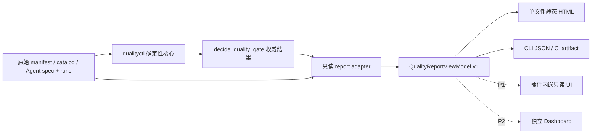

# Quality Gatekeeper 测试质量可视化 MVP Spec

版本：0.1（探索结论）

日期：2026-08-11

状态：待评审

## 0. 结论先行

下一阶段应先交付**由同一份只读 View Model 驱动的单文件静态 HTML 报告**，而不是直接建设独立 Dashboard。报告由 `qualityctl` 在同一进程内调用现有确定性核心、生成版本化 View Model，再渲染为无外部依赖的 HTML；CLI、CI 报告和未来插件 UI 都消费同一 View Model。

推荐顺序：

1. **MVP：单文件静态 HTML**。覆盖发布门禁、风险与回归、Agent 评测三个核心视图；可离线、可打印、可作为 CI artifact，预计 15–19 人日。
2. **P1：插件内嵌只读 UI**。复用同一 View Model 和组件语义，不引入新的状态计算；在静态报告验证使用价值后再做，增量约 7–11 人日。自动化 ROI 视图也进入 P1，约 2–3 人日。
3. **P2：独立质量 Dashboard**。只有在多项目历史趋势、集中审计和跨版本比较成为已验证需求后才建设；从零总投入约 35–55 人日。

无论使用哪种载体，最终 Gate 和 `release_allowed` 都只能复制自 `decide_release_gate` 的确定性结果。可视化层不得根据图表、通过率、用户操作或 LLM 解释重新判定，也不得提供“改为 PASS”“批准发布”或“执行豁免”的能力。

---

## 1. 目标用户与关键决策

### 1.1 目标用户

| 用户 | 首要问题 | 需要看到的证据 | 目标用时 |
|---|---|---|---:|
| 发布负责人 | 当前版本能否发布，首要阻塞是什么？ | 最终 Gate、`release_allowed`、三个必需域、阻塞证据、规则版本、最小解阻动作 | 30 秒内 |
| 测试负责人 | 风险是否盘全，回归范围是否足够且可解释？ | 八维风险、覆盖缺口、测试入选原因、CP0/smoke/历史逃逸/关键副作用覆盖 | 2 分钟内 |
| 开发负责人 | 哪个变更或依赖造成阻塞，先修什么？ | 变更组件、上下游、失败域、关联用例、owner/证据引用 | 2 分钟内 |
| Agent 评测负责人 | 失败属于 Agent、工具、runner 还是语义复核，统计把握有多大？ | 冻结身份、fingerprint、运行计数、失败域、逐 case 区间和 hard-fail | 3 分钟内 |
| 自动化负责人（P1） | 哪些测试值得建设、保留、修复或退役？ | 月净节省、回收期、成本、数据基础、policy 版本和建议原因 | 3 分钟内 |

### 1.2 关键决策与成功定义

| 决策 | 权威来源 | 可视化的作用 | 不允许做的事 |
|---|---|---|---|
| 是否可发布 | `decide_release_gate.gate` 与 `release_allowed` | 优先显示并解释阻塞证据 | 从子域、百分比或人工选择推导 Gate |
| 先解哪个阻塞 | `blocking_checks` 及各领域错误/缺口 | 排序、分组并给出最小下一步 | 在 UI 中关闭阻塞或创建豁免 |
| 风险是否覆盖 | risk disposition + selection coverage gaps | 建立风险维度到测试目录的追溯 | 用“选中测试数量多”替代覆盖判定 |
| 为什么选这些测试 | `selected[].reasons` | 减少逐条阅读 JSON 的成本 | 前端自行增加或移除测试 |
| Agent 失败属于哪里 | Agent 结果中的分域计数和 run outcome | 分开展示并支持定位 | 把 runner invalid、技术失败和业务失败合并 |
| 统计把握是否足够 | `planned/observed/evaluated` 与 `wilson_95` | 暴露样本量和区间宽度 | 只显示平均通过率或把重试当作覆盖失败 |
| 是否投资自动化（P1） | `assess_automation_roi` / `automation_review` | 排序和解释经济性 | 前端重算 ROI 或让 ROI 影响 MVP Gate |

成功不是“图表数量”或“页面访问量”，而是用户能更快、正确地做出上述决策，同时不产生任何错误 PASS。

## 2. 方案比较与推荐

以下人日均以已有 `qualityctl` 核心和示例数据可用为前提，不包含业务团队整理测试目录、治理历史数据或建设可信策略中心的成本。

| 评估角度 | 单文件静态 HTML | 插件内嵌交互式 UI | 独立质量 Dashboard |
|---|---|---|---|
| 初始开发投入 | **低，15–19 人日** | 中，静态基础上增量 7–11 人日；若从零约 22–30 人日 | 高，从零约 35–55 人日 |
| 维护成本 | **低，0.5–1.5 人日/月**；浏览器兼容面小 | 中，1.5–3 人日/月；受宿主 UI/API 变化影响 | 高，3–6 人日/月；含服务、存储、认证、升级和运维 |
| 数据接入复杂度 | **低**；本地 JSON/JSONL 进入同进程 adapter | 中；需插件桥接、生命周期和宿主权限 | 高；需采集、存储、项目隔离、数据迁移和一致性处理 |
| 跨项目复用性 | **高**；只要输入契约一致即可生成 artifact | 中高；可复用 View Model，但绑定插件宿主 | 潜在最高；前提是先解决多租户和数据治理 |
| CI 集成能力 | **最佳**；直接上传 artifact、PR/流水线链接 | 中；适合本地查看，不天然沉淀为 CI artifact | 高；可接 CI API，但建设成本显著 |
| 权限和安全风险 | **最低**；无网络、无写接口、可用严格 CSP | 中；需要控制宿主桥接和证据深链 | 最高；集中敏感数据、账号权限、跨项目隔离和攻击面 |
| 离线使用能力 | **最佳**；单文件、无 CDN/字体/脚本依赖 | 取决于宿主；通常可用但不是独立 artifact | 弱；离线需额外缓存/导出设计 |
| 预计节省人工时间 | **25–40 人分钟/报告**，约覆盖目标收益的 70%–85% | 30–45 人分钟/报告；入口更近但比静态报告只多节省约 5 分钟 | 35–50 人分钟/报告；额外收益依赖历史趋势和项目规模 |
| 未来演进成本 | 中低；View Model 与组件语义可复用 | 中；可渐进增强，但受宿主能力约束 | 当前最高；成熟后跨项目演进能力强 |

### 2.1 明确推荐

选择“**单文件静态 HTML + 版本化只读 View Model**”作为 MVP。它与当前仓库的本地 stdio MCP、CLI 和软门禁定位一致，最快覆盖高频的 JSON 阅读与证据追溯，同时把网络、账号、数据库、审批操作和多租户风险排除在首版之外。

插件内嵌 UI 不是另起一套产品：P1 只作为同一 View Model 的第二个 renderer。独立 Dashboard 也不是“静态报告做大”；它必须等到以下条件同时满足后再立项：

- 至少 5 个项目或每月 200 份报告持续使用同一契约；
- 连续 8 周证明单次报告能节省人工阅读/汇总时间；
- 出现静态快照无法满足的跨版本趋势或集中审计需求；
- 静态报告的分发、历史检索或人工汇总额外消耗至少 4 小时/月；
- 预计增量收益能够覆盖 3–6 人日/月的服务维护成本。

## 3. 信息架构

MVP 是一份单页报告，使用页内锚点，不设计多级导航。信息按“先裁决、再证据、后细节”组织：

```text
报告头：change ID / 生成时间 / 数据来源 / 版本与指纹 / 兼容性
  ├─ 1. 发布门禁总览          0–30 秒：能否发布、被什么阻塞、下一步是什么
  ├─ 2. 风险与回归覆盖        30–120 秒：风险如何映射到组件与测试、缺口在哪里
  ├─ 3. Agent 评测            1–3 分钟：冻结身份、失败域、样本量与不确定性
  └─ P1. 自动化 ROI           2–3 分钟：建设/保留/修复/退役建议
```

全局固定信息：

- change ID、版本类型和报告生成时间；
- `schema_version`、`core_version`、Gate `policy_version`；
- Agent evaluation fingerprint（适用时）；
- 输入摘要、数据来源和兼容性状态；
- “此报告只读，不能批准、豁免或执行发布”的明确提示。

展示采用渐进披露：首屏只放结论、三个域和最多 3 个主要阻塞；完整错误、证据引用和逐 run 详情使用原生 `<details>` 展开，但打印时全部展开。

## 4. 页面与组件说明

### 4.1 发布门禁总览（MVP，P0）

组件顺序：

1. **Gate Hero**：大号文本显示 `PASS / FAIL / BLOCKED / REVIEW_REQUIRED`、中文含义、图标和 `release_allowed`。`PASS` 之外一律写“不可据此发布”；不得用“接近通过”等弱化措辞。
2. **三个必需域状态行**：risk、regression、agent-evaluation；显示原始状态、简短原因和到证据区的锚点。`READY` 只表示该领域就绪，不等于最终 PASS。
3. **主要阻塞与缺失证据**：按照 Gate 的 `blocking_checks` 顺序展示；每项含领域、状态、摘要、source path/evidence ref、owner/期限（存在时）。
4. **最小解阻动作**：从结构化缺口机械映射为“补证据/补测试映射/完成剩余运行/完成语义复核/修复输入并重跑”之一。它是导航提示，不是新的裁决。无法安全映射自由文本错误时，显示“修复首个列出的证据错误并重新运行 Gate”，不猜测解决方案。
5. **决策身份条**：change ID、`core_version`、Gate `policy_version`、input schema versions、evaluation fingerprint、输入摘要。

支持的决策：是否可发布、先处理哪个阻塞、处理后需要重新运行什么。这里不放趋势图、通过率图或 ROI，以免稀释最终裁决。

### 4.2 风险与回归覆盖视图（MVP，P0）

#### 4.2.1 八维风险—测试追溯矩阵

主视图选择**语义化表格矩阵**，不使用热力图。每一行是一个固定风险维度，列为：

| 列 | 内容 | 来源 |
|---|---|---|
| 风险维度 | business flow、exception、boundary、permission、consistency、dependency、side effect、recoverability | 固定八维枚举 |
| disposition | affected / unknown / not affected / not applicable | manifest，经 risk core 校验 |
| 证据或原因 | affected 的 evidence/scenario，或 not affected/not applicable 的 reason，或 unknown 的 owner/resolve_by | 原始 manifest 的允许字段 |
| 关联组件 | changed/upstream/downstream 中与测试目录关联的组件 | 原始 manifest + catalog 只读 join |
| 入选测试 | test ID、优先级和自动化标记 | selection `selected` + catalog 元数据 |
| 覆盖结论 | 已覆盖或 coverage gap 的 severity/reason | selection `coverage_gaps`，不得由矩阵自行裁决 |

矩阵直接支持“哪个风险没覆盖、应回到哪个测试目录条目”的决策。热力图不进入 MVP，因为 disposition 是类别而非连续强度，颜色深浅会错误暗示风险大小，也不利于打印和无障碍读取。

展开 coverage gap 时还应列出：对应风险证据/场景、catalog version、已选测试，以及“声明映射该维度但未入选”的目录项和 `excluded` reason。这样用户能区分“目录中根本没有用例”和“目录有用例但选择规则未命中”。这仍然只是按 test ID/dimension 做追溯 join；adapter 不得据此删除 core 已给出的 gap。

#### 4.2.2 组件与依赖条

使用小型方向流程条，而不是可缩放拓扑图：

```text
[上游组件]  ──>  [本次变更组件]  ──>  [下游组件]
 customer-profile   quote-agent      pricing-engine / quote-api
```

当任一方向超过 6 个组件时自动退化为分组列表。该组件只支持判断回归扩散范围；不计算依赖风险、不做运行时调用链分析。

#### 4.2.3 回归测试表

每条入选测试显示 test ID、priority、自动化状态、suite/label，以及 `selected[].reasons` 原文。理由以文本列表呈现，不只用标签颜色。顶部单独显示四项覆盖摘要：

- CP0 core；
- smoke；
- historical escape；
- critical side effects（permissions、data consistency、side effects、recoverability 中 affected 项的覆盖）。

四项摘要只是对已选目录元数据的分组展示；实际缺口始终使用 `coverage_gaps`。不使用 Sankey、气泡图或“测试数量仪表盘”，因为它们不能更好地回答“为什么选、缺在哪里”。

### 4.3 Agent 评测视图（MVP，P0）

组件顺序：

1. **冻结身份表**：Agent、Prompt、model ID + parameters、toolset、knowledge snapshot、dataset、runner、threshold profile、evaluation fingerprint。任何缺项显示“未提供”，不能填默认值。
2. **证据完整性横幅**：样本不足、fingerprint 混跑、threshold 未审批、未知 case、额外运行等必须在通过率之前出现。
3. **运行计数表**：planned、observed、evaluated attempts、valid outputs、passed 分列；runner invalid 不计入 evaluated，技术失败计入 evaluated 但不计入 valid output。字段含义以 tooltip 之外的常驻帮助文本说明。
4. **失败域表**：PASS、技术失败、runner invalid、确定性断言失败、语义复核失败、语义复核缺失分别显示数量和关联 case。不得合并成“失败总数”后隐藏分域。
5. **逐 case 不确定性表/区间图**：risk、status、planned/observed/evaluated、各失败域、pass rate、Wilson 95% 数值区间、min pass rate、`hard_fail_on_any`。区间图只作为数值表的辅助；打印或无 CSS 时仍保留完整数值。
6. **高风险一次失败横幅**：只要 core 给出的高风险 case 为 FAIL，就在聚合比例之前显示“高风险有效失败：1 次即触发 FAIL”。即使总通过率很高也不得折叠或下移。

当前示例中 3/3 通过的 Wilson 95% 区间约为 `[43.85%, 100%]`。因此首版不使用“100% 成功率”大号卡片，也不使用只有平均值的折线/仪表盘。

case 默认排序为：非 PASS 在前，其次 high risk，最后按 case ID。不得只按 pass rate 排序。fingerprint 可在首屏短显，但详情、复制和打印必须保留完整值。

### 4.4 自动化 ROI 视图（P1，首版不交付）

已完成设计但延后实现。主组件是可排序表格，而不是二维象限图：

| 字段 | 说明 |
|---|---|
| decision | CANDIDATE / KEEP / REPAIR_OR_RETIRE / DO_NOT_AUTOMATE_YET / INSUFFICIENT_DATA |
| monthly_minutes_saved | 已由确定性工具计算的月净节省 |
| payback_months | 已由确定性工具计算的回收期 |
| setup / maintenance / residual review / flaky / execution / data maintenance | 成本构成，来自原始候选输入的允许字段 |
| data_basis / observation_window_days | ESTIMATED 或 OBSERVED 及观察窗口 |
| policy_version / reasons | 审批策略与建议理由 |

默认先按 decision，再按月净节省降序、回收期升序。ESTIMATED 必须带“估算”文字，不能与 OBSERVED 使用同一种无文本标识。ROI 始终标注“投资建议，不参与发布 Gate”。

当前 selection 的 `automation_review` 只包含已选中的未自动化测试；它不足以产生 `KEEP` 和 `REPAIR_OR_RETIRE` 全量视图。P1 若覆盖已有自动化资产，report adapter 必须对目标 catalog 项逐一调用现有确定性 `assess_automation_roi`，前端仍只展示结果，不实现 ROI 公式。

### 4.5 图表准入规则

每个可视组件在实现前必须填写一句“它支持什么决策”。若只能表达“看起来更直观”，不能明确改变用户的判断速度或准确率，则不进入 MVP。首版准入如下：

| 组件 | 支持的决策 | MVP |
|---|---|---|
| Gate Hero + 三域状态 | 是否可发布、哪个域阻塞 | 是 |
| 八维风险—测试矩阵 | 哪个风险缺测试或证据 | 是 |
| 上游—变更—下游流程条 | 回归范围扩散到哪里 | 是 |
| 回归测试理由表 | 为什么选这些测试 | 是 |
| Agent 分域计数表 | 失败属于哪个域 | 是 |
| Wilson 区间图 + 数值 | 样本量是否足以支持稳定性判断 | 是 |
| ROI 表 | 建设/保留/修复/退役哪个测试 | P1 |
| 趋势折线、饼图、仪表盘、Sankey、词云 | 当前没有必须由其支持的 MVP 决策 | 否 |

## 5. 低保真线框图

### 5.1 发布门禁总览

```text
┌─────────────────────────────────────────────────────────────────────────┐
│ Quality Gatekeeper | Change QUOTE-2026-08-11 | 只读报告                 │
│ schema report-view@1 | core 0.1.0 | policy mvp-v1 | fingerprint …v1     │
├─────────────────────────────────────────────────────────────────────────┤
│  ⛔ BLOCKED — 不允许发布                         release_allowed: false  │
│  主要原因：Agent 评测样本不足（2/3 evaluated）                           │
├──────────────────┬──────────────────┬───────────────────────────────────┤
│ Risk             │ Regression       │ Agent evaluation                  │
│ ✓ READY          │ ! REVIEW_REQUIRED│ ⛔ BLOCKED                         │
│ 8/8 已处置       │ 1 个覆盖缺口     │ 样本不足 / runner invalid 1       │
├─────────────────────────────────────────────────────────────────────────┤
│ 主要阻塞（2）                                                         [↓]│
│ 1. [BLOCKED] Agent / CASE-HIGH / 计划 3、有效评测 2 / evidence://…       │
│ 2. [REVIEW_REQUIRED] Regression / permissions 无入选测试 / catalog:…    │
│ 最小下一步：补齐 CASE-HIGH 的冻结运行，并为 permissions 关联测试后重跑。│
└─────────────────────────────────────────────────────────────────────────┘
```

### 5.2 风险与回归覆盖

```text
┌─ 影响范围 ──────────────────────────────────────────────────────────────┐
│ [customer-profile] → [quote-agent] → [pricing-engine] [quote-api]       │
└─────────────────────────────────────────────────────────────────────────┘
┌────────────────┬──────────────┬────────────┬────────────────┬───────────┐
│ 风险维度       │ disposition  │ 证据/原因  │ 入选测试       │ 覆盖结论  │
├────────────────┼──────────────┼────────────┼────────────────┼───────────┤
│ Business flow  │ ● AFFECTED   │ 报价规划…  │ SMOKE-001 CP0 │ 已覆盖    │
│ Permissions    │ ○ NOT_AFFECT │ 鉴权未变…  │ AUTH-001 CP0  │ 已覆盖    │
│ Side effects   │ ● AFFECTED   │ 防重复写…  │ IDEMPOTENCY   │ 已覆盖    │
│ Recoverability │ ? UNKNOWN    │ owner/date │ —              │ GAP HIGH  │
└────────────────┴──────────────┴────────────┴────────────────┴───────────┘
覆盖摘要：[CP0 文本✓] [Smoke 文本✓] [历史逃逸 文本✓] [关键副作用 文本!]

入选测试（5）
┌──────────────────────┬──────┬────────┬─────────────────────────────────┐
│ Test ID              │ Pri. │ Auto   │ 确定性入选理由                  │
├──────────────────────┼──────┼────────┼─────────────────────────────────┤
│ API-IDEMPOTENCY-001  │ CP0  │ 是     │ impacted: quote-api; side_effect│
└──────────────────────┴──────┴────────┴─────────────────────────────────┘
```

### 5.3 Agent 评测

```text
┌─ 冻结身份 ──────────────────────────────────────────────────────────────┐
│ Agent quote-agent@… | Prompt @7 | Model … | Tools @4 | KB 2026-08-10  │
│ Dataset quote-core@3 | Runner @1 | Threshold @2 APPROVED               │
│ Fingerprint sha256:…v1                                                    │
└─────────────────────────────────────────────────────────────────────────┘
┌─ 证据警告 ──────────────────────────────────────────────────────────────┐
│ ⛔ 样本不足 / 指纹混跑 / 高风险一次有效失败（适用时置顶）               │
└─────────────────────────────────────────────────────────────────────────┘
│ Planned 9 │ Observed 9 │ Evaluated 9 │ Valid 9 │ Passed 8              │
┌────────────────┬─────┬────────┬────────┬────────┬────────┬──────────────┐
│ Case           │Risk │Status  │P/O/E   │失败域  │Pass    │Wilson 95%    │
├────────────────┼─────┼────────┼────────┼────────┼────────┼──────────────┤
│ EXTRACT-001    │HIGH │FAIL    │3/3/3   │Det 1   │2/3     │20.8–93.9%    │
│ RECOMMEND-001  │MED  │PASS    │3/3/3   │—       │3/3     │43.9–100%     │
└────────────────┴─────┴────────┴────────┴────────┴────────┴──────────────┘
失败域：PASS 8 | 技术失败 0 | runner invalid 0 | 确定性失败 1 | 语义失败 0
```

## 6. 数据流和接口契约

### 6.1 数据流与模块边界



依赖方向只能从 renderer 指向 View Model、从 adapter 指向确定性核心。renderer 不得导入 risk、selection、agent-eval 或 gate 规则，也不得接受用户提交的新状态。

建议新增两个报告模块，保持领域核心不变：

```text
src/qualityctl/reporting/view_model.py   # 调用一次最终 Gate，做 allowlist join 与版本校验
src/qualityctl/reporting/html.py         # 纯渲染，不含领域规则
```

### 6.2 现有输出与视图映射

当前 CLI 只有 `risk-check`、`select` 和 `agent-eval`，最终 Gate 与完整 ROI 只通过 MCP 暴露。CI/静态报告若分别拼接多次 CLI 结果，可能把不同输入或不同版本的结果混在一起；这也是新增单次只读聚合接口的直接原因。

| 视图 | 主要消费的现有输出 | 需要的只读补充输入 | 前端禁止重算的字段 |
|---|---|---|---|
| 发布门禁总览 | `decide_release_gate` 全量结果，尤其 `gate/release_allowed/checks/blocking_checks/policy_version` | package `core_version`、输入 schema versions、fingerprint、source descriptors | Gate、release_allowed、三个域状态、blocking 集合 |
| 风险与回归 | Gate 内嵌 `results.risk` 和 `results.regression` | manifest 的证据/场景/依赖；catalog 的 suite/label/dimensions，用 test ID 只读 join | risk status、selection status、selected/excluded、coverage gaps |
| Agent 评测 | Gate 内嵌 `results.agent_evaluation` | spec 的 execution profile 和 fingerprint；默认不读取原始 output 正文 | case status、failure-domain counts、pass rate、Wilson 95%、hard-fail |
| ROI（P1） | `results.regression.automation_review`，或逐项 `assess_automation_roi` | 候选成本构成的 allowlist 字段 | decision、monthly saving、payback、reasons |

当前 `agent_eval` 权威输出没有返回 execution profile 和 evaluation fingerprint，最终 Gate 也没有 `schema_version`/`core_version`。这些是**展示和溯源缺口**，不应为了 UI 把身份规则复制到前端；report adapter 从同一次调用的原始输入复制允许字段，并从已安装包读取 `qualityctl.__version__`。

### 6.3 新增只读聚合接口

MVP 建议新增一个深接口，而不是让三个 renderer 分别拼装：

```python
build_quality_report_model(
    manifest,
    catalog,
    *,
    agent_spec=None,
    agent_runs=None,
    source_descriptors=None,
    redaction_profile="default",
) -> QualityReportViewModel
```

契约：

1. 接收与 `decide_release_gate` 相同的原始领域输入，不接收调用方自填 Gate 或子域状态。
2. 在同一进程内只调用一次 `decide_quality_gate`，其返回值作为唯一 authority。
3. 只做 allowlist 字段复制、ID join、格式化所需计数和版本兼容校验；允许计算“planned - evaluated”的显示差额，但该差额不得改变任何状态。
4. 无网络 I/O，不读取策略中心，不写审批/发布系统，不修改原始文件。
5. 返回版本化 JSON。CLI `qualityctl report` 使用同一函数输出 `html` 或 `view-json`；P1 可增加同名只读 MCP tool，但不新增第二套映射逻辑。
6. HTML 文件写入只是生成 artifact，不是业务写操作；MCP 聚合工具本身不写文件。

### 6.4 View Model 顶层字段

```json
{
  "schema_version": "report-view@1.0",
  "core_version": "0.1.0",
  "renderer_version": "0.1.0",
  "generated_at": "2026-08-11T12:00:00+08:00",
  "compatibility": {
    "status": "VERIFIED",
    "warnings": []
  },
  "provenance": {
    "change_id": "QUOTE-2026-08-11",
    "input_schema_versions": {
      "manifest": "1.0",
      "catalog": "1.0",
      "agent_spec": "1.0"
    },
    "policy_version": "mvp-v1",
    "evaluation_fingerprint": "sha256:…",
    "input_digests": {},
    "decision_digest": "sha256:…",
    "data_sources": []
  },
  "authority": {
    "decision_source": "decide_quality_gate",
    "gate": "BLOCKED",
    "release_allowed": false,
    "checks": [],
    "blocking_checks": []
  },
  "report_health": {
    "status": "VALID",
    "errors": []
  },
  "views": {
    "release_gate": {},
    "risk_regression": {},
    "agent_evaluation": null,
    "automation_roi": null
  }
}
```

`generated_at` 是报告生成时间，不是 Gate 裁决时间；MVP 不虚构当前核心尚未提供的 decision timestamp。`input_digests` 和 `decision_digest` 用于发现输入/裁决的意外变化，`generated_at` 不进入 decision digest；这些摘要不参与 Gate，也不是签名或身份认证。

所有可追溯条目建议统一带 `source_pointer`（例如 `/results/regression/coverage_gaps/0`）、`data_origin`（`CORE_RESULT / RAW_INPUT_CONTEXT / DISPLAY_DERIVED`）和 `redaction_state`。这样 renderer 能明确区分权威状态、展示上下文和仅供显示的派生值。

### 6.5 各视图 View Model 字段

#### release_gate

| 字段 | 类型 | 规则 |
|---|---|---|
| gate | enum/string | 原样复制 authority.gate |
| release_allowed | boolean | 原样复制并验证与 gate 的不变量 |
| domains[] | name/status/evidence summary | 原样来自 Gate `checks` |
| blockers[] | status/domain/summary/evidence refs/source path | 来自 `blocking_checks` 和结构化领域缺口 |
| missing_evidence[] | kind/target/owner/due/source path | 只从 errors、unknown dimensions、coverage gaps、manual review missing 中映射 |
| minimal_unblock_actions[] | action kind/target/text/derived_from | 展示提示；不得携带“approve/override/pass”动作 |

#### risk_regression

| 字段 | 类型 | 规则 |
|---|---|---|
| dimensions[] | id/disposition/evidence/reason/scenarios/owner/due | 固定 8 行；缺行显示缺失，不补默认 disposition |
| components | changed/upstream/downstream | 原始 manifest allowlist |
| selected_tests[] | id/priority/automated/suites/labels/reasons/dimensions | selection 结果与 catalog 按 test ID join；reasons 原样保留 |
| gap_traces[] | dimension/catalog version/selected tests/mapped-but-excluded tests/excluded reason | 只做追溯；不得据此修改 coverage gap |
| excluded_summary | count | 使用 selection summary，不在 UI 重选 |
| coverage_gaps[] | dimension/severity/reason | 原样来自 selection |
| coverage_markers | CP0/smoke/historical_escape/critical_side_effects | 仅对已选目录元数据分组；不得代替 coverage_gaps |

#### agent_evaluation

| 字段 | 类型 | 规则 |
|---|---|---|
| identity | agent/prompt/model/parameters/toolset/knowledge/dataset/runner/threshold/fingerprint | 来自同一次 raw spec；敏感参数按 allowlist/脱敏策略 |
| run_counts | planned/observed/evaluated/valid/passed + failure domains | 复制 core；`evaluated` 为 case evaluated_attempts 汇总 |
| evidence_warnings[] | code/text/source path | 来自 errors、case errors、approval 和计数状态 |
| fingerprint_check | expected/observed set/mismatched run IDs | expected 来自 spec，observed 来自 raw runs；只展示混跑证据，不据此计算 Gate |
| cases[] | id/risk/status/counts/failure domains/pass rate/Wilson/threshold/hard-fail | status 和统计值复制 core |
| failed_runs[] | case ID/run ID/outcome/safe reason/evidence ref | 默认只保留非 PASS 元数据，不嵌入 Agent 原始输入/输出或 assertion actual value |

#### automation_roi（P1）

| 字段 | 类型 | 规则 |
|---|---|---|
| items[] | test ID/decision/saving/payback/data basis/window/policy/reasons/cost breakdown | decision 和计算结果复制 core；成本为 allowlist 原始字段 |
| summary | 各 decision 计数 | 只用于分组，不影响 Gate |

### 6.6 版本与兼容策略

版本职责必须分开：`schema_version` 描述 Report View Model 结构；`input_schema_versions` 记录 manifest/catalog/spec 自身版本；`core_version` 是实际执行裁决的 `qualityctl` 版本；Gate `policy_version` 逐字保留但不由 UI 解释；`renderer_version` 标识 HTML/插件显示实现。Agent threshold profile 和 ROI policy 各保留自己的 version/source/approval，不合并为同一个 `policy_version`。

| 情况 | 行为 |
|---|---|
| `report-view` 同 major、较新 minor | 忽略未知可选字段，`DEGRADED` 警告，保留权威状态 |
| 有版本、且是显式支持的旧版 | 使用有单元测试的 legacy adapter；状态码原样保留，标记 `DEGRADED` |
| 无版本旧输出 | `LEGACY_UNVERIFIED`，只允许历史查看和原始数据下载；即使 token 为 PASS 也不得显示“可发布” |
| 输入或 report schema major 不支持 | `compatibility=UNSUPPORTED`；只显示原始 token/下载入口和“不可据此发布”，不做语义图表 |
| `core_version` 缺失或不在支持矩阵 | `report_health=INVALID/UNSUPPORTED`；不得显示“可发布”文案 |
| Gate `policy_version` 缺失 | 显示权威 Gate token，但报告标记“规则溯源不完整，不可作为发布依据” |
| 可选展示字段缺失 | 显示“未提供”，不显示 0、空字符串或推断值 |
| 关键字段 `gate/release_allowed/checks` 缺失 | 报告状态为 INVALID；不得发明 BLOCKED 或 PASS，只显示“报告无法验证” |
| 未知状态值 | 显示 `UNKNOWN (<原值>)` 与文字警告；不得映射为 PASS/READY |

当前 core 并不以 `schema_version` 参与 Gate 判定。MVP 的兼容性拒绝属于“报告是否可解释”，不是新的领域 Gate。升级为生产硬门禁前，应把输入 schema 校验放入确定性核心或可信入口，而不是只依赖 renderer。

### 6.7 保证 UI 不重新计算 Gate

必须满足以下不变量：

- `authority.gate` 与顶部 Gate 文本逐字符一致；
- 只有 `gate == "PASS"`、权威 `release_allowed == true`、`compatibility == VERIFIED` 且 `report_health == VALID` 同时成立时，报告才可显示“可发布”；
- 对 `FAIL/BLOCKED/REVIEW_REQUIRED` 或未知值，任何组件、打印页、标题、摘要和导出都不得出现“可发布”；
- renderer 只能根据 status 选择文案、图标和 CSS token，不允许根据 counts、gap 数量、pass rate 或 Wilson 区间设置 status；
- Wilson 区间、ROI、selection、coverage gap 均复制 core 输出；前端不实现其公式；
- 若 `gate` 与 `release_allowed` 不一致，`report_health=INVALID` 并显示“报告完整性错误—不得据此发布”，同时保留原始值供排查；这不是把领域 Gate 改成另一个 Gate。
- URL query、表单、localStorage 或 DOM 中出现的 `gate=PASS` 一律忽略；所有导出从不可变 View Model 生成。下游发布/审批系统只能消费确定性 JSON 或 CLI exit code，永远不能消费 HTML、截图或 DOM 状态。

本地 HTML 的 DOM 可以被浏览器开发者工具修改，因此“不允许伪造 PASS”的真实安全边界是：产品不提供修改入口、报告携带版本和 digest、任何状态回写被禁止、下游系统拒绝 UI 状态。SHA-256 只能发现意外变化；可信发布者身份需要 P1/P2 的 CI artifact attestation 或签名。

## 7. 状态、颜色和严重度规范

### 7.1 Gate/领域状态

| 状态 | 固定中文 | 图标/形状 | 建议前景/背景 | 发布语义 |
|---|---|---|---|---|
| PASS | 通过 | ✓ 圆形 | `#166534` / `#DCFCE7` | 仅当 authority PASS、`release_allowed=true`、兼容性 VERIFIED 且报告 VALID 时可发布 |
| FAIL | 失败 | ✕ 八角/实心 | `#991B1B` / `#FEE2E2` | 不可发布 |
| BLOCKED | 阻塞 | ⛔ 方形 | `#9A3412` / `#FFEDD5` | 不可发布；证据或执行条件不足 |
| REVIEW_REQUIRED | 需要复核 | ! 三角形 | `#854D0E` / `#FEF3C7` | 不可发布；等待人工/证据复核 |
| READY | 已就绪 | ✓ 菱形 | `#155E75` / `#CFFAFE` | 仅代表子域就绪，不等于发布通过 |
| NOT_APPLICABLE | 不适用 | — 圆角矩形 | `#374151` / `#F3F4F6` | 必须同时显示审批人和 evidence ref |
| UNKNOWN/UNSUPPORTED | 未知/不兼容 | ? 虚线框 | `#111827` / `#E5E7EB` | 不得作为发布依据 |

所有状态必须同时包含英文 token、中文文字和非颜色图标。正文对比度达到 WCAG 2.2 AA（普通文本至少 4.5:1）；打印为灰度时仍可依靠文字、边框和形状区分。

### 7.2 风险 disposition 与严重度

`affected` 表示“受影响，需要覆盖”，不是 FAIL；使用蓝紫色信息样式，不使用失败红。`unknown` 使用 REVIEW_REQUIRED 的琥珀样式；`not_affected` 与 `not_applicable` 使用不同文字和图标，即使共享中性色也不能混为一类。

coverage gap 的 `high/medium` 严重度原样显示；UI 不根据风险维度自行升级或降级。高风险 Agent case 的 `hard_fail_on_any` 使用固定文字“任一有效失败即 FAIL”，不能只放一个红点。

## 8. 可访问性与打印/导出策略

### 8.1 可访问性

- 使用 `header/main/nav/section/footer`、有序 heading 和跳转到主内容链接；首个 `h1` 后立即提供 Gate 文本摘要。
- 数据使用真实 `<table>`、`caption`、`th scope`；不使用由 `<div>` 模拟的矩阵。
- 键盘可访问全部锚点和 `<details>`；焦点样式清晰，目标尺寸至少 44×44 CSS px。
- 不把解释只放在 hover tooltip；缩写、planned/observed/evaluated 定义在页面常驻帮助文本中。
- 区间图提供可读文本，例如“3/3，95% Wilson 区间 43.85%–100%”；SVG 若存在需带 `<title>` 和文字替代。
- 支持 200% 缩放、窄屏单列和 `prefers-reduced-motion`；MVP 不使用动画。
- 以屏幕阅读器顺序验证 Gate、阻塞、证据、行动，不能让视觉卡片顺序与 DOM 顺序冲突。

### 8.2 打印与导出

- 单文件 HTML 内嵌 CSS，无 CDN、外部字体、图片或运行时网络请求；核心内容在禁用脚本时仍完整。
- `@media print` 让 Gate 总览单独占第一页，三个视图按 section 分页；移除 sticky、阴影和交互控件，展开全部证据详情。
- A4 与 Letter 均可读；长 ID、fingerprint 和 evidence ref 允许换行，不截断状态。
- CLI 支持 `--format html` 和 `--format view-json`。JSON 是经 allowlist/脱敏后的同一 View Model，供 CI 和后续 renderer 复用。
- P1 可增加 selected tests/ROI CSV；MVP 不导出原始 Agent output、Prompt 正文或知识库内容。
- PDF 通过浏览器打印生成，不在 MVP 引入服务端 PDF 引擎。

## 9. 安全与只读边界

### 9.1 只读边界

- 报告中不出现表单、可编辑状态、批准/豁免/发布按钮或写 API。
- “去审批”“去修复”“查看流水线”只能是标注为“外部系统入口”的链接；MVP 默认仅显示引用文本，不执行任何动作。
- 生成报告后数据是快照；页面显示生成时间和输入摘要，不轮询、不自动刷新、不暗示它代表当前生产状态。
- adapter 和 renderer 不持有发布凭据，不连接部署平台，不写 risk manifest、catalog、Agent spec/runs 或策略数据。
- ROI 建议不进入 `checks`，不影响 release_allowed。

### 9.2 敏感数据最小化

默认允许展示：标识符、版本、枚举状态、计数、经过结构化的选择原因、风险摘要、owner、期限和经过清洗的 evidence ref。

默认不嵌入：Agent 原始输入/输出、完整 Prompt、知识库正文、用户 PII、令牌/密钥、HTTP headers、stack trace、数据库内容、未脱敏文件路径和 URL query/fragment。model parameters 使用字段 allowlist；未知参数只显示键名或被省略。

evidence ref 默认作为文本，不自动变成可点击链接。若团队启用深链，只允许审批过的 scheme/host，并去除凭据、query 和 fragment。CI artifact 的访问权限应不低于源流水线，默认保留不超过 30 天。

### 9.3 静态 HTML 防护

- 所有外部字符串做上下文相关 HTML attribute/text escaping，禁止 raw HTML 注入；增加 `<script>`, `onerror`, `javascript:`、超长 Unicode 和公式注入测试。
- 首版优先无 JavaScript，使用锚点和原生 `<details>`。CSP 至少为：`default-src 'none'; img-src data:; style-src 'unsafe-inline'; script-src 'none'; connect-src 'none'; form-action 'none'; base-uri 'none'; frame-src 'none'`。
- 不加载遥测、分析 SDK、远程图表库或字体；不向网络发送 report data。
- `input_digests` 使用 SHA-256 内容摘要，但不得把摘要误称为数字签名或可信审批证明。

## 10. MVP / P1 / P2 范围

### 10.1 MVP（P0）

- 版本化 `QualityReportViewModel` 和一个只读 adapter；
- `qualityctl report` 的 HTML / view-json 输出；
- 发布门禁总览、八维风险与回归追溯、Agent 评测三个视图；
- Gate/域状态、阻塞、缺失证据、最小解阻动作；
- 组件依赖条、回归理由表、coverage gap、CP0/smoke/历史逃逸/关键副作用摘要；
- Agent 冻结身份、fingerprint、运行计数、失败域、逐 case Wilson 区间和 hard-fail；
- 版本降级、报告完整性校验、脱敏、CSP、无障碍、打印；
- PASS/FAIL/BLOCKED/REVIEW_REQUIRED/legacy/未知 schema 的 golden fixtures 与 renderer 安全测试；
- CI artifact 使用说明和 8 周影子试点指标。

### 10.2 P1

- 自动化 ROI 表和 ESTIMATED/OBSERVED 对比；
- 插件内嵌只读 UI，消费同一 View Model；
- 只读筛选、排序、证据深链和 selected tests/ROI CSV；
- 结构化 issue code/remediation code，逐步替代自由文本错误映射；
- PR/CI 摘要链接和报告过期提示；
- 经过评审的本地缓存，但不执行批准或发布。

### 10.3 P2

- 独立多项目 Dashboard、历史趋势、基线比较和集中检索；
- SSO/RBAC、项目隔离、审计日志、保留策略、加密和备份；
- 可信只读策略注册中心、签名/摘要校验、远程 MCP；
- 跨版本 Agent 统计比较和数据质量监控；
- 经单独授权的审批/发布系统深链。即使 P2 也不允许 Dashboard 自己生成 PASS。

### 10.4 明确不做清单

- 不在 UI 中计算或修改 Gate、子域状态、coverage gap、selection、Wilson 区间或 ROI；
- 不做 PASS override、在线豁免、审批、部署、回滚或发布按钮；
- 不做测试执行器、环境编排、缺陷自动修复、压测/故障注入或生产操作；
- 不做 LLM-as-judge 单独放行、Agent 多数投票或“置信度替代证据”；
- 不做测试用例编辑器、通用测试管理平台、缺陷管理平台或自动化率大盘；
- 不在 MVP 做数据库、账号系统、多租户、趋势仓库、告警/通知中心；
- 不做复杂拓扑、Sankey、饼图、词云、3D 图或可自定义图表；
- 不嵌入原始 Prompt、Agent output、知识库正文或生产敏感数据。

## 11. 实施拆分与预计人日

| 工作包 | 产出 | 人日 |
|---|---|---:|
| A. 契约与安全基线 | View Model schema、状态不变量、redaction profile、PASS/非 PASS/legacy fixtures | 1–2 |
| B. 只读 adapter | 一次 Gate 调用、raw input allowlist join、版本/完整性校验、view-json | 3–4 |
| C. 报告壳与 Gate 总览 | 单文件 HTML、导航、三域、阻塞与最小动作 | 2 |
| D. 风险与回归视图 | 八维矩阵、依赖条、回归理由、gap trace | 3 |
| E. Agent 视图 | identity、分域计数、case 表、Wilson 区间、高风险横幅 | 3 |
| F. 可访问性/打印/安全 | WCAG 检查、A4/Letter、CSP、XSS/长文本测试 | 1.5–2 |
| G. CLI/CI、集成验收与文档 | `qualityctl report`、跨载体 golden、mutation tests、artifact/试点手册 | 2–3 |
| **MVP 合计** | 允许复用组件和部分并行 | **15–19** |

建议由 1 名熟悉 Python/契约的工程师和 1 名前端/设计系统工程师协作，日历时间约 1.5–2.5 周。若只由一人实施，优先保持无 JavaScript 和三视图范围，不以赶工为由删除状态安全测试。

增量估算：ROI 视图 2–3 人日；插件内嵌只读 UI 7–11 人日；Dashboard 在已有 View Model 基础上的增量约 22–36 人日，从零总投入约 35–55 人日。若宿主没有稳定的 UI/webview 扩展契约，应暂停内嵌实现，而不是建设私有消息桥。

## 12. 投入产出假设和停止条件

### 12.1 可验证假设

可视化只计算“阅读、汇总和沟通已有 JSON”的增量收益，不把现有 risk/selection/agent/gate 核心已经节省的时间重复计入。

单份报告当前人工基线假设：查找 Gate/阻塞 10–15 分钟，阅读风险与回归 15–25 分钟，拆分 Agent 失败域 10–20 分钟，跨角色整理/转述 10–15 分钟，总计 45–75 人分钟。静态报告目标降至 20–35 人分钟，保守净节省 25–40 人分钟/报告（40%–60%）。

规模敏感性：

| 月报告量 | 月节省 | 15–19 人日建设成本的仅人工时间回收期 |
|---:|---:|---:|
| 12（单一低频团队） | 5–8 小时 | 15–30 个月，不建议产品化 |
| 30 | 12.5–20 小时 | 6–12 个月 |
| 60（多团队复用） | 25–40 小时 | 3–6 个月 |
| 120 | 50–80 小时 | 1.5–3 个月 |

这些数字是产品假设，不进入 `assess_automation_roi`，也不参与发布 Gate。质量缺口提前发现是重要收益，但单独计数，不能折算成未经验证的工时。单项目、低发布频率场景的回收可能超过 12 个月，因此“跨项目复用”是推荐静态报告而不是定制 UI 的核心前提。

### 12.2 8 周试点指标

选择 2–3 个发布频繁且测试目录较完整的团队，目标收集至少 40 份真实报告，其中至少 8 份非 PASS、8 份含 Agent 评测，并覆盖旧 schema、缺字段、fingerprint 混跑和样本不足样例。

- 首次看到报告后正确说出 Gate 的中位时间；目标 ≤30 秒；
- 正确说出第一阻塞域/证据的比例；目标 ≥95%；
- JSON 阅读、人工汇总、会议解释总人分钟的前后差；
- 报告覆盖的目标发布比例；目标 ≥70%；
- 由报告在执行前暴露的覆盖缺口数量及有效率；
- 因渲染歧义产生的错误结论、额外复核和返工时间；
- 月维护时间与月节省时间之比；目标 ≤30%；
- 报告大小、生成耗时、打印成功率和脱敏事件。
- 相对两周人工基线，单报告决策与转述时间降低至少 30%，且绝对节省至少 15 人分钟。
- 报告生成成功率至少 95%，生成时间 p95 不超过 10 秒；试点不加入隐形遥测，使用观察或工作日志抽样。

### 12.3 停止/退回条件

立即停止作为发布依据并退回影子模式：

- 任一 `FAIL/BLOCKED/REVIEW_REQUIRED` 被任何载体显示成 PASS 或“可发布”；
- Gate 与 `release_allowed` 不一致却未被报告完整性校验拦截；
- 高风险一次有效失败被汇总比例掩盖；
- 敏感数据泄漏、XSS、未经批准的深链或 UI 出现可执行豁免/发布能力。

暂停扩面并复盘：

- 连续两个迭代中，Gate 识别中位时间仍超过 30 秒或首要阻塞识别准确率低于 95%；
- 8 周后目标发布覆盖率低于 50%，或每项目月节省少于 5 小时；
- 8 周内不足 30 份真实报告或不足 2 个团队使用；证据不足时不进入插件 UI/Dashboard 投资；
- 维护时间超过节省时间的 30%，或报告前置数据整理时间抵消节省；
- 只有一个低频项目使用且预计回收期超过 12 个月；
- 没有可验证的历史趋势需求，却开始引入数据库、账号或 Dashboard 运维。

## 13. 验收标准

### 13.1 决策与状态一致性

- [ ] 用户测试中，至少 95% 参与者能在 30 秒内正确识别最终 Gate 和首要阻塞项。
- [ ] 在 1366×768 首屏且不滚动时，可见 Gate、`release_allowed`、三个必需域和至少一个首要阻塞项。
- [ ] 同一组原始输入经 CLI Gate、静态报告和 P1 插件 UI 得到逐字符一致的 Gate、`release_allowed` 和三个域状态。
- [ ] View Model 和打印页可见 `schema_version`、`core_version`、`renderer_version`、Gate `policy_version`、输入 schema versions、decision digest 和 fingerprint（适用时）。
- [ ] `FAIL/BLOCKED/REVIEW_REQUIRED` 在页面标题、首屏、打印、view-json 和无 CSS 模式下都不出现“可发布”。
- [ ] Gate 与 `release_allowed` 矛盾、关键字段缺失、未知状态或不支持 schema 时，报告 fail-safe 为 INVALID/UNSUPPORTED，不生成 PASS。
- [ ] UI 无状态编辑、审批、豁免、发布、POST/PUT/PATCH/DELETE 或写 MCP 调用。

### 13.2 风险与回归

- [ ] 八个风险维度始终各占一行，并以文字区分 affected、unknown、not affected、not applicable。
- [ ] 每个 coverage gap 可追溯到风险维度、selection reason 和 catalog test ID/缺失位置。
- [ ] 每条 selected test 保留 core 给出的全部入选 reasons；UI 不增删测试。
- [ ] CP0、smoke、historical escape 和关键副作用覆盖均有文字状态；它们不覆盖权威 `coverage_gaps`。
- [ ] 组件关系明确区分 upstream、changed、downstream；超过阈值退化为表格而非不可读图。

### 13.3 Agent 评测

- [ ] Agent、Prompt、model/parameters、toolset、knowledge、dataset、runner、threshold 和 fingerprint 可见或明确标为未提供。
- [ ] planned、observed、evaluated、valid outputs 和 passed 含定义且不混用。
- [ ] PASS、技术失败、runner invalid、确定性失败、语义复核失败和语义复核缺失分别显示。
- [ ] 每个 case 同时显示 pass rate、Wilson 95% 数值区间、risk、threshold 和 hard-fail。
- [ ] 样本不足、混跑、threshold 未审批和高风险一次失败在聚合百分比之前显示。

### 13.4 可访问性、打印、安全和性能

- [ ] 所有状态均使用英文 token + 中文文字 + 图标/形状，不只靠颜色；对比度达到 WCAG 2.2 AA。
- [ ] 键盘、屏幕阅读器、200% 缩放和灰度打印可完成三项核心决策。
- [ ] A4/Letter 第一页包含 Gate、release_allowed、三个域、主要阻塞、版本/指纹；长 ID 不截断。
- [ ] HTML 无网络请求、外部依赖和可执行表单；严格 CSP 生效，恶意证据文本不能注入 HTML/JS/URL。
- [ ] 默认报告不包含原始 Agent output、Prompt、知识库正文、凭据、PII 或 URL secrets。
- [ ] 在 500 个入选测试、200 个 Agent cases 的验收 fixture 下，报告生成 ≤3 秒、HTML ≤5 MB、普通办公电脑离线打开首屏 ≤2 秒。

### 13.5 防止“失败渲染成通过”的测试矩阵

至少包含以下自动化测试：

1. PASS、FAIL、BLOCKED、REVIEW_REQUIRED、READY、NOT_APPLICABLE、未知 token 的 golden HTML 快照；
2. mutation test：逐个把 Gate、domain status、release_allowed、case status 和 compatibility 字段改成矛盾值，断言页面不出现可发布文案；
3. property/invariant test：`gate != PASS => rendered_release_allowed != true`；
4. DOM 测试：状态文字位于 `h1` 后首个摘要区域，阻塞项存在可访问名称和 source path；
5. print DOM/CSS 测试：非 PASS 文字和阻塞证据不会被 `display:none`；
6. 同输入跨 adapter/CLI/MCP renderer 的状态等价测试；
7. XSS/注入、超长字段、缺字段、旧 schema、未知 major、混跑、样本不足和高风险单次失败 fixtures。

## 14. 已知风险与产品化路线

### 14.1 已知风险

| 风险 | 当前影响 | 缓解 |
|---|---|---|
| 当前 Gate 输出缺 report schema、core version、fingerprint/execution profile | 单独保存 Gate JSON 时溯源信息不足 | MVP adapter 从同次 raw input/package 生成完整 View Model；P1 再考虑权威输出 envelope |
| 仓库 `output/*.json` 已与当前函数输出字段漂移 | 历史 artifact 缺少新增的风险策略和 ROI 溯源字段 | `LEGACY_UNVERIFIED` 降级；CI 由当前 core 自动重生成样例并做 schema diff |
| core 当前不校验输入 schema_version | 新 major 数据可能被旧 core 部分理解 | 报告兼容层拒绝解释；升级硬门禁前将 schema 校验放入确定性入口 |
| 错误多为自由文本 | 最小解阻动作映射脆弱 | MVP 只做少量安全通用映射；P1 增加稳定 issue/remediation codes |
| 包版本分散在 pyproject、`__init__`、MCP 和 plugin manifest | core_version 可能漂移 | 报告读取运行时版本并检测不一致；后续集中为单一版本源 |
| 静态报告会过期 | 用户可能把旧快照当当前状态 | 显示生成时间、input digest、change ID 和“快照”提示；不自动刷新 |
| evidence ref 可能含敏感信息或失效 | artifact 泄漏/断链 | 默认文本化、allowlist、去 query/fragment、短保留期和访问控制 |
| 小样本的高 pass rate 易被误读 | 过度乐观 | 区间和 n 紧邻显示，高风险失败置顶，禁用成功率仪表盘 |
| 大目录导致信息过载 | 关键阻塞被表格淹没 | 首屏最多 3 个主要阻塞、锚点和渐进披露；性能 fixture 设上限 |
| 插件宿主 UI 能力可能变化 | P1 返工 | 先稳定 View Model 与 HTML；宿主层保持薄 renderer |

### 14.2 产品化路线

1. **M0：15–19 人日**完成静态报告和安全/一致性测试，用示例及四种 Gate fixture 验收。
2. **M1：8 周影子试点**，在一个发布频繁、目录完整的项目中记录识别时间、缺口有效率和净节省；同时验证至少第二个项目的无定制复用。
3. **M2：P1**，在达到停止条件反面阈值后增加 ROI 表和插件内嵌只读 renderer；推动结构化 issue code 与统一版本源。
4. **M3：生产软门禁**，接入只读可信策略源、版本化 JSON Schema、签名/摘要、artifact 访问控制和审计；仍不在 UI 执行发布。
5. **M4：条件式 Dashboard**，只有多项目趋势与集中审计收益被证明后，引入存储、SSO/RBAC、数据保留和远程 MCP。

整个路线中，领域核心始终是 Gate 的唯一来源；View Model 是跨载体的显示契约，不是第二套质量规则。
